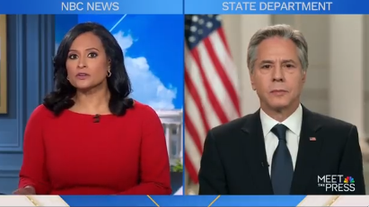
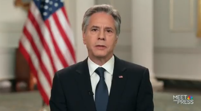

# 公开敦促？布林肯接受采访称“以色列需考虑哈马斯之后谁来控制加沙”

【环球网报道】据《以色列时报》报道，美国国务卿布林肯22日接受美国全国广播公司（NBC）“与媒体见面”节目采访时表示，在结束巴勒斯坦伊斯兰抵抗运动(哈马斯)对加沙地带的控制后，以色列应该已经正在制定一项战略，考虑这之后谁来控制加沙的问题。此外，布林肯还宣称，以色列“绝对没有意图和意愿”自己统治加沙。

_当地时间22日，美国国务卿布林肯（右）接受美媒节目采访，称“以色列需考虑哈马斯之后谁来控制加沙”视频截图 图源：“与媒体见面”X账号_

报道称，被问及冲突结束后以色列希望谁来控制加沙的问题，布林肯说，“有一点是可以肯定的：以色列不可能回到如今的现状。再说一遍，没有哪个国家能够接受这一点。没有哪个国家愿意重回（现状）......”

“但有明确的战略吗，国务卿先生？一旦这场战争结束，谁将控制加沙，现在清楚了吗？”主持人随即问道。

对此，布林肯回答称，“我想我们知道两件事。我们不能再回到现状了。他们不能再回到被哈马斯控制的现状，就其对加沙的控制而言，不能再重蹈覆辙。与此同时，我从以色列人那里听到的是，他们绝对没有自己占领加沙的意图和愿望。几十年前，他们单方面、无条件地撤出了加沙。”

_当地时间22日，美国国务卿布林肯接受美媒节目采访，称“以色列需考虑哈马斯之后谁来控制加沙”视频截图 图源：“与媒体见面”X账号_

布林肯表示，因此需要找到一些办法，确保哈马斯不再控制加沙，但也不能恢复以色列对加沙的占领。“关于接下来会发生什么，有不同的想法，但我认为所有这些（想法）都需要付出努力。即使以色列正在应对当前的威胁，也是需要（付出）努力的。”他称。

此外，据《以色列时报》报道，布林肯还在采访中谈及加沙人道主义援助，称美国希望看到以色列扩大对加沙地带的供水。

对于布林肯上述表态，《以色列时报》称，这似乎是美国方面第一次公开敦促以色列对新一轮巴以冲突考虑“更广泛的战略”。报道称，有匿名官员表示，拜登和其他美政府官员私下曾敦促以色列总理内塔尼亚胡和他的助手们考虑一项战略，以避免和美国犯同样的错误。自2001年“9·11”恐怖袭击事件后，美国便陷入中东战争泥潭。值得注意的是，当前巴以冲突之际，以色列官员曾公开表示，他们目前的重点是铲除哈马斯，并没有考虑接下来会发生什么。

据此前报道，当地时间22日，新一轮巴以冲突进入第三周，截至当天，已造成双方超过6000人死亡，其中包括1700多名儿童和近1000名妇女。目前，以色列仍在持续空袭加沙地带，并继续为地面军事行动做准备。哈马斯也不断向以色列发射火箭弹。对人道主义危机不断加剧，以及战争风险外溢的担忧令众多国家迫切希望通过和平手段解决当前问题。21日，由埃及发起的巴勒斯坦问题峰会（又称“开罗和平峰会”）在开罗附近的埃及新行政首都举行，此次峰会邀请了30多个国家的元首、政府首脑、特使以及联合国等国际组织负责人参会。遗憾的是，由于以色列和美国高级官员的缺席，各方未能发表联合声明。美国《纽约时报》21日称，在大部分伊斯兰国家，西方国家对以色列空袭加沙平民的反应被视为虚伪和双重标准——有批评声音认为，俄罗斯对乌克兰发起军事行动时，西方国家是用“战争罪”来指责莫斯科的。与此同时，亲巴勒斯坦和亲以色列团体的声援浪潮已经蔓延至全球各地。

