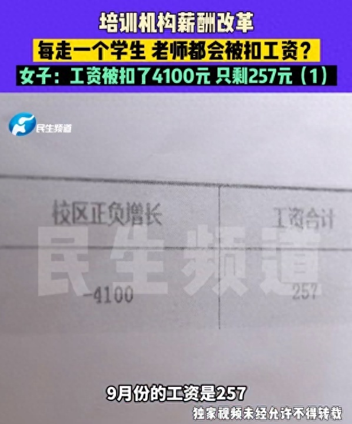
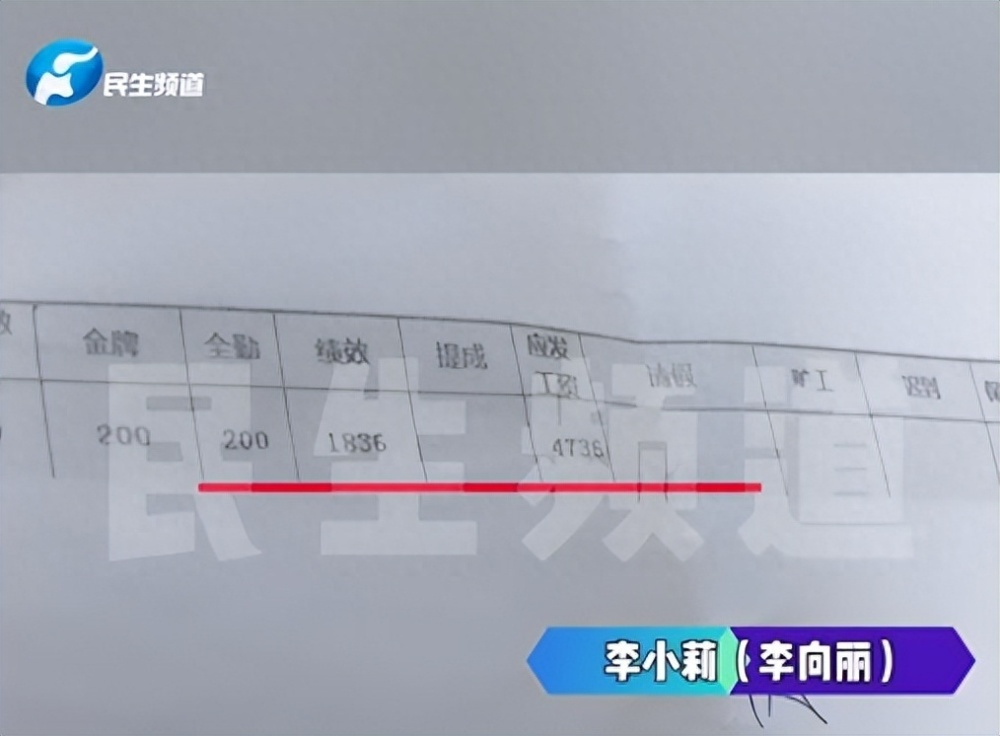

# 女子称在培训机构全勤1个月工资仅257元，机构回应：为调动老师积极性

10月23日，据小莉帮忙报道，近日，新乡炎女士反映，自己是一家培训机构的前台，9月份公司薪资改革后，全勤工作1个月竟然只发了257元工资。

炎女士称自己在该校担任前台已经4年半了，今年7月工资是3871元，8月份工资是3521元，结果到了9月份，学校薪酬改革，自己直接被扣了4100元。

工资单显示，炎女士绩效、全勤等各项加起来，应发工资为4736元，但是校区正负增长这一项就扣掉了4100元。

炎女士表示：“有些学生，不想学了就走了，每走一个学生，我们老师都会被扣工资，走的前3个是每人扣50，走4到6个是每人扣100，6到9每人扣150，从第10个开始每走一个就扣200。我做好了自己本职工作，学生流失跟我没有关系，我也不任课，不教学生舞蹈，所以我觉得非常不合理。”

对此，该公司工作人员解释称工资改革也是为了调动老师积极性，让老师拿到更多工资，并且已经在会议上进行公示，并非一言堂，全员奖金扣罚一致，正增长也会奖励。并非平白无故扣钱，确实校区流失了很多学生。

当地劳动监察大队调查后认为，企业可以有自己的奖罚制度，但不能低于当地最低工资标准，新乡为2000元/月。目前该公司已接受调查并要求整改。

**【来源：小莉帮忙】**

