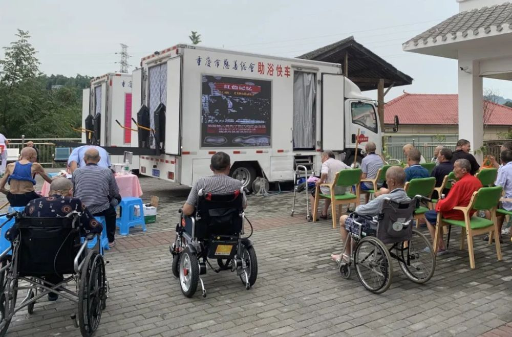
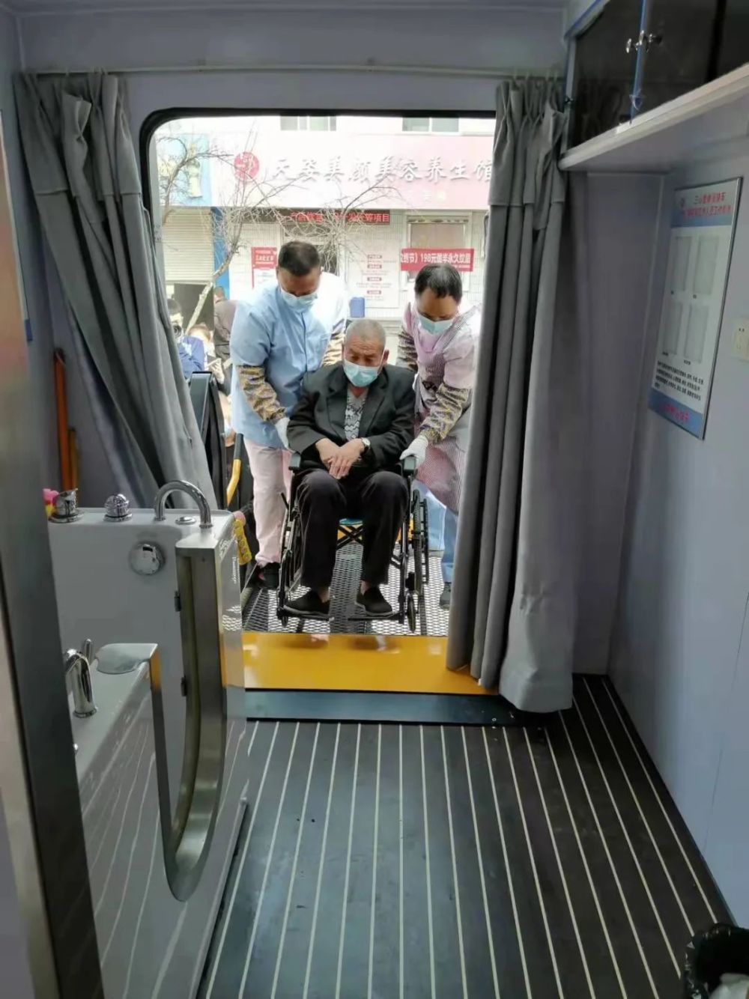
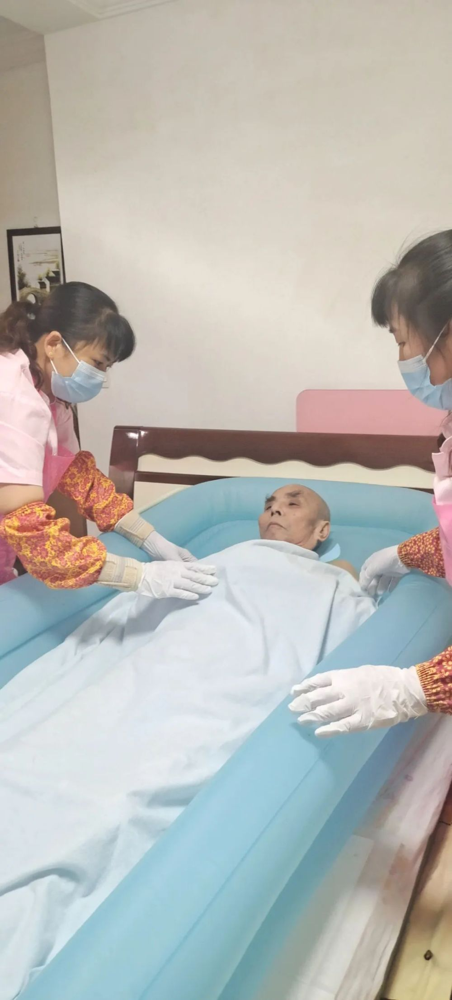

# 当“助浴车”开进乡村，很多人一边洗澡一边哭

**老龄化社会，乡村的处境如何，洗澡只是一个切面。**

 _在“助浴快车”前排队等候助浴的农村老人们。_

老人的背上已经结了厚厚一层黑痂，疾病消磨掉了肌肉，突出的骨骼似乎要戳破薄薄的皮肤，隆素荣不敢用力搓，只能等泡软一点，再用搓澡巾轻轻擦拭，一次一点，就这样，15分钟的泡浴时间内，隆素荣还是觉得没有完全给洗干净，“下次吧，再洗一次，应该就好了。”

在重庆市南岸区广阳镇塘坎村五保家园里，45岁的助浴师隆素荣正在给一位老人助浴。洗完澡，隆素荣帮助老人穿衣服、修剪指甲，然后和另一位助浴师一起小心翼翼将老人扶上轮椅，送回那张她已经躺了3年的床上。4年前还经常红眼圈的隆素荣说：“现在好多了。”

随着老龄化社会的来临和社会大众对养老服务更精细化的要求，最近几年，像隆素荣这样，带上专业设备，上门为失能、半失能老人提供泡澡、理发、剪指甲等服务的助浴师开始在我国出现，并成为一门新兴行业。

中国老龄科学研究中心今年发布了《中国老龄产业发展报告（2021-2022）》：截至2022年末，我国60岁及以上老年人达到2.8亿，其中失能、半失能和失智老人大约4400万。该中心的研究数据近一步显示，在穿衣、吃饭、如厕、上下床、室内活动、洗澡等6项日常生活自理活动中，最困扰老年人的便是洗澡。老人因为洗澡跌倒，加重病情甚至死亡，成为很多家庭的噩梦。而北京大学一项人口学研究预计，到2030年，我国失能老人规模或将超过7700万，这些失能老人平均将要经历7.44年的失能期。

当洗澡这件“小事”成为很多家庭的难题和隐痛，助浴师们的出现，助老年人干干净净走完人生最后一程。更为庆幸的是，我们看到这一新兴服务的触角竟也深入到了乡村。

**01**

**被困在“黏糊糊”的身体里**

王强与隆素荣同为重庆市九龙坡区三心堂助浴快车队的助浴师，前不久，他才开着一辆“助浴快车”从四川省德阳市旌阳区的孝泉镇敬老院回来。一辆助浴快车由三人负责，一般一男两女。男助浴师在助浴之外，还要负责开车、接通水电路、背抬老人等。在隆素荣和另一位女助浴师帮助老人洗澡的时候，他得以休息片刻，给记者分享了一些这次去四川的经历。

“有一位73岁的陈大爷好犟，问了好几次，大家都洗，你为撒子不洗？他就说才洗了，不需要。他肯定说谎嘛，身上都有味儿了。有些老人很害羞，敬老院院长也说，那位大爷虽然坐轮椅，平时每次需要洗澡了，也是让工作人员把所有东西都准备好，把他移到淋浴间的椅子上，然后关起门来自己洗。”

“那你们还给洗吗？老人都不愿意了。”我问道。

“我们肯定会尊重老人嘛，但是也会先让他们先参观参观我们的洗浴条件，让女同志们做做工作，她们都蛮会做思想工作的。”说完，王强朝隆素荣笑笑。

王强说，这些年他服务的老人很多都会经历一个从抗拒到欢迎的过程，农村老人思想相对更保守，不愿意在陌生人面前暴露身体，还有就是因为不了解，担心安全和费用问题。“我们都会申明，不收老人费用，然后介绍助浴流程，让老人看到安全是没有问题的。”

“有些养老院我们服务了好几次，第一次去人家都犹犹豫豫，再去，都要打抢哦。有些老人还早早就抱好衣服等我们。其实老人就跟孩子一样的，平时怎么在家哄自己的爷爷奶奶开心，我就怎么哄他们。”隆素荣确实是面相亲切的人，和记者说起话来也是爽朗地很。

少数老人需要助浴师直接把轻便的设备拿到房间洗，大部分老人，还是会让他们上车里洗。“车里暖和，设备更好。”王强给我讲了讲助浴车的服务细节：洗澡前，帮老人测量血压、体温、心率，符合标准后进入车里的更衣室。助浴车里有空调、通风系统，维持恒温、透气。在洗浴的过程中，浴缸里的水温一般会保持在38度左右，助浴师也会遵循一套规范的流程，将老人全身淋湿后，再洗澡、洗头。洗完进入车里的更衣室，他们会帮老人把头发吹干，然后理发、刮胡须、剪指甲等。一般，全套服务下来大概需要40分钟左右。

_助浴师推老人进入助浴车内。_

记者看到“助浴快车”配有专门的升降台，按下按钮，老人就能和轮椅一起进入车内。车内空间宽敞，淋浴、步入式浴缸可以提供多种洗浴方式选择。关上门，车里就是一个独立的、设施齐备的、温暖的小型沐浴房。

王强说，助浴毕竟会涉及隐私问题，大部分老人愿意接受女性的助浴护理，但也有一些男性老人更希望得到同性的帮助。

“农村五保老人都是可怜人，我们给他们洗了澡，太感激了，很多一边洗一边哭。还有一些老人有智力问题，就跟小孩一样，还打水呢。”隆素荣出外打工多年，之前不是在工厂与机器打交道，就是在后厨与油污奋战，现在这份工作虽然脏点，但让她感受到了实实在在被人需要的感觉，“有一种价值感吧，谁还不会老呢？”

隆素荣说，她的爷爷因为脑梗卧床，儿子、女婿们都忙着在外挣钱，家里的姑姑们谁也抬不动老人到卫生间淋浴，每次只能用毛巾帮他擦擦身。去世前长达几年的时间里，临到擦洗就只能爽快5分钟、10分钟，她知道爷爷的感受——水一干，身上照样黏糊糊的。“重庆的夏天好闷热你应该也晓得，如果那时也能有这样的条件，该多好！”

北京大学曾做过一个关于中国健康与养老的追踪调查，在他们访问的13641名全国45岁以上的中老年人中，有7.01%的受访者无法独立完成洗澡活动，而他们中又有10.87%无人协助洗澡。这意味着每十个洗澡需要协助的老人里，就可能有一个被困在“黏糊糊”的身体里。

孝泉镇敬老院院长肖大姐告诉记者，孝泉镇敬老院共有95位老人，有生活自理能力的只有40多位。天气热起来后，洗澡还相对方便一点。一到冬天，她和护工们就不敢帮老人们洗澡了，怕老人感冒引发更严重的疾病。还有一些多年卧床的老人身上有压疮，更不敢接触水，平时她们就用毛巾帮老人擦洗，清理污秽，时间一长，难免会有气味。

这次，助浴快车在敬老院待了10来天，帮全体老人都好好洗了个澡，她感觉整个敬老院都神清气爽了。

**02**

**助浴师的困难**

和其他护理服务一样，隆素荣觉得对于助浴师来说，首先要克服的是对气味与脏的耐受度。

长期卧床的老人，如果不定期清洗，身上和房间就会有气味——一种混杂着汗味、大小便、饭菜、中西药的气味。刚开始闻到时，隆素荣常常会感到强烈的不适。

“一些老人因为长期穿纸尿裤，已经失去了对大小便的控制力，洗浴中常常大小便失禁，老人们自尊心很强，会感到羞耻，难过得哭。”她们就赶紧帮老人清理完排泄物，告诉老人，“没关系的，这有啥子，很正常的。”隆素荣觉得有爱心和有耐心是助浴师需要具备的基本品质。

_隆素荣（左）上门为老人助浴。_

隆素荣所在的助浴车队目前有16名助浴师，“现在还在干的，都是干得下来了，也有一些干了两天就走了。”

除了日常助浴之外，如果老人们有褥疮、外伤、携带医疗辅助设备等情况，对于助浴师来说，又是更大的挑战，需要更专业的培训后才能应对自如。

北京、上海等大城市目前在深度助浴上走在全国前列，记者也采访了部分助浴师，从中了解到了更多关于深度助浴的细节。

北京的助浴师小唐回忆他第一次上门助浴，就是为一位因疾病右边头颅整个凹陷的老人服务。在接受采访时，这位身高近1米9、看起来阳光帅气的年轻人用夸张的语气说，当时心理冲击之大以至于他觉得之后的工作都没有那么困难了。

天津助浴师小敏经过专业的护理培训，前不久刚给一位90多岁的大娘助浴。大娘长期卧床，背后生有褥疮，体外还插有导尿管，需事先处理尿袋，整个洗澡过程中她都要小心不让尿袋倒流或透水。在助浴前，她会给老人的压疮部位贴上压疮贴，然后再进水。过程中，她和同事一直小心翼翼，不能牵拉导尿管，以免造成老人受伤。

小敏说她有一个习惯，就是在手机里下载很多老人爱听的歌曲，一边放着音乐，一边助浴，“让老人放松，其实也是让我自己放松，不用刻意找话说，避免尬聊。”这位“95”后小女生有她的小妙招。

聂积燕是上海的一位助浴师，她曾经有过一次胆颤心惊的临终助浴经历。她记得那是一位肺癌晚期的老人，医院下了病危通知后，两位女儿为老人预约了临终助浴，想让老人干干净净地走。

助浴前老人的生命指标已经很不好，聂积燕担心老人在洗浴中死亡，给家属说明了情况，让家属做好心理准备，并在意外免责协议上签了字。

聂积燕回忆，在洗浴的过程中，老人的心率一直往下掉，她的心一直吊在嗓子眼，但只能逼自己沉住气，以最快的速度给老人洗完了澡，就在她们刚洗完，把老人抬回床上后的两分钟，老人就没有了呼吸。

虽然她经验丰富，但这也是她第一次遇到老人刚出浴缸就死亡的情况，在女儿们崩溃的哭声中，她在一旁发呆。虽然在预期之中，家属对她也没有任何苛责，但她依然会检讨，是不是自己哪里做得不对。

隆素荣说，洗浴过程中出现意外是她们最害怕的，除了搬运老人要格外小心外，风险可能还隐藏在老人的身体里。对于长时间没有洗澡的老人来说，再次入水的时刻也是对身体和心理巨大的冲击，如同久处黑暗之中的人适应突如其来的光。

接触热水后血液循环加速，会给心脏增添负担，特别是患有高血压、心脏病等基础病的老人，更可能在洗澡过程中出现突发的身体状况。隆素荣说，很久没有洗澡的老人躺进浴缸，身体碰到水的那一刻，手都会“不停哆嗦”。老人害怕，其实她们更害怕。

隆素荣清楚地记得，一次一位老人一入水，就开始喊烫。隆素荣的心一下子紧张了起来，她用温度计试水，38摄氏度，水温正好啊？！还接着洗吗？当时，幸好一旁的师傅冯正林有多年老年护理师的经验，比隆素荣冷静，她一边安抚老人，一边观察老人的状态。因为在入水之前的血压测量中，老人的血压虽然在正常值偏高一点，但还是可以助浴的，她们开始的决定是如果一旦发现老人出现脸色变化、呼吸急促，助浴就及时终止。但好在只是虚惊一场，老人只是因为过于紧张。在隆素荣放慢加热水的节奏后，老人的身体就慢慢适应了。

隆素荣说，洗浴过程中，一些老人会自己说头晕，她们会及时终止助浴，帮老人擦干身体。但最怕的其实是，很多老人并不会自己觉察到不对，而是突然就“睡着”了。所以，在助浴的过程中，保持与老人聊天，让老人一直处于清醒状态，也是助浴师们的必备技能，“你得会聊天”。

隆素荣很感概，虽然一直在学习，但依旧感觉自己不够专业。和隆素荣一样，在采访中，记者发现，很多助浴师都迫切希望能有一套高水平的行业操作手册和规范的专业培训系统，让他们可以从容应对一切可能的意外。

**03**

**行业健康发展亟需规范化**

遗憾的是，助浴师们纷纷反映，国内目前并没有统一的助浴师培训，也没有相应的助浴师资质证书，公司或团队都是自己组织培训，不仅培训的内容五花八门，助浴师的入行门槛也是有高有低。很多人甚至是靠自学，就像成都的助浴师俊奇。

“那些PPT上的字都是我一个个敲上去的。”俊奇说。这位新闻专业出身的“90后”看中了养老服务行业的前景，几年前辞去工作创业，回成都组建了一个助浴团队。现在他除了每天上门帮老人洗澡，也做直播科普养老行业知识。

回顾入行前的学习经历，他直言全靠网络搜索自学。互联网上的科普小视频是他获取信息的主要途径，看到一个视频，然后根据视频给出的线索，再搜索下一个，就靠这样不停地链接再链接，虽然很零碎，但他总算对这个行业有了相对清晰的认识。

一边学习，一边搜集资料，因为很多资料都是外文的，他先找朋友把它们翻译成中文，再整理成文档，自己学习，也给新入行的人培训。他介绍，日本的助浴行业有一套完整的法律——《介护法》，服务人员必须持证上岗，为老人服务也有很多细节要讲究，但目前中国没什么现成的统一的操作规范。就拿持证上岗来说，有些公司要求必须要考取国家养老护理证，有些要求就没有那么严格。

与此同时，价格也是无法回避的问题。北京的助浴师小唐介绍，他所在的助浴团队，每次上门助浴的价格是400元，五环外再加收50-100元不等的交通费，这是团队创始人参考上海的价格制定的。但一次上门助浴收费400元，许多家庭还是表示接受不了。

“这400元一单的上门洗浴，贵吗？每次上门助浴的小组是三个人工，此外还有开车的汽油、购置的器械和专用设备等，这些费用都是可视、透明、能计算的。”

如今，小唐所在的团队创始人仍在往项目中贴钱，但因为坚信行业的前景，所以给助浴师的工资都还不错，“不然未来不会再有人愿意来做这个工作。”

小唐说他曾经在机场做地服工作，如今的工资其实还是低于在机场的日子，但他仍然选择了坚持，“我有一个5岁的女儿，等我老了，动不了的一天，我不能想象是她来给我洗，希望有专业的人来帮我吧。现在第一代独生子女的父母已经进入老年了，这个行业的市场肯定会越来越好的。”

北京大学社会学系教授陆杰华认为，助浴师既然在中国已经成为一个新兴的行业，就应该有标准有规范，这个需要政府部门的关注；第二个方面就是毕竟是对失能、半失能老人的服务，可能会产生一些安全的问题，事先要有预防，比如适当地引入保险等，这也是对助浴师的保护。“总之，需要各方去关注才能助推这样一个产业的有序发展。”

**04**

**惠及乡村老人，目前主要还是靠慈善**

按说助浴师这样新兴的助老服务职业才刚在一、二线城市兴起，很多三、四线城市目前尚没有，更不用说乡村了。事实上，在采访的众多助浴师中，大多数确实以服务城市居民为主，像隆素荣和王强这样，以农村老人为服务对象的，确实少见。

隆全明是三心堂助浴快车的创始人，他告诉记者，目前他们公司提供的上门助浴的市场价格是186元/人/次，绝大多数乡村老人和家庭是负担不起这个费用的，而且因为乡村居住的分散性，助浴师单次上门服务，时间成本将更高。

现在助浴快车之所以能让农村老人也享受到和城里老人一样的服务，一是他们得到了重庆市慈善总会的支持，老人洗澡全免费；二是助浴快车的灵活性，可以开到任何只要通水通电的地方形成流动助浴点。他们会提前跟村委会联系，统计需要助浴的老人，然后集中时间去给老人们助浴。

隆全明说，截至2022年底，他们的10台助浴快车已经开到了重庆27个区县的乡镇敬老院、农村养老互助点、五保家园，为农村老人提供了1100余场免费助浴服务。去年底，他们又获得了四川省慈善联合总会的支持，从重庆走进四川，未来一年，他们将为四川6个市（区）的乡村失能、半失能、孤寡、空巢、独居、残疾老人，提供4000人次的免费助浴服务。

记者了解到，在上门助浴的发源地日本，助浴服务已被纳入长期护理险范畴，老人只需自费承担相当于人民币10-20元的费用。按照隆全明公司的定价，如果一次专业的助浴服务，个人只需花费不到20元，那么很多农村家庭也将消费得起。

我国已从2016年开始试点长期护理险，目前已经有两批共49个试点城市，但目前大部分试点地方的长期护理险，政策覆盖区域主要是城市，服务对象主要为城区居民与参保职工，只有极少数地区覆盖到了乡村，比如首批试点城市青岛，去年探索实施了“农村护理保险提升计划”，经评估为失能三、四、五级或重度失智的农村居民，可以与城区参保职工一样享受医疗服务和生活照料服务。但专业的助浴服务并不在保险承认的范畴内。

隆全明认为，在对养老服务的需求上，城乡是一致的，虽然现在他们对乡村老人的助浴是靠慈善力量在坚持，但如果能借助保险的形式，降低助浴服务的购买费用，农村居民也将可以主动购买服务，而不是像现在这样，只能被动地等待公益的资助。

国家统计局数据显示，截至2022年末，我国60岁及以上人口占全国人口的19.8%，其中65岁及以上人口20978万人，占全国人口的14.9%。我国已经进入深度老龄化社会。而据第七次全国人口普查显示，2020年我国农村60岁及以上老年人口规模达到1.21亿，占农村人口的23.81%，比城镇高出7.99个百分点。

老龄化社会，乡村的处境如何，洗澡只是一个切面。

去年，国务院印发《“十四五”国家老龄事业发展和养老服务体系规划》，明确指出应支持社区助浴点、流动助浴车、入户助浴等多种业态发展，以及推动助浴服务相关产品的研发。

既然衰老与死亡谁都无法避免，我们应该努力让人生的最后阶段尽量有质量、有尊严。

采访结束后，王强经过短暂的休整，将再次启程前往四川，这次他们将至少要跑6个乡镇。虽然，孝泉镇的肖大姐希望助浴师们能再去一趟，但王强还得服务更多一次也没有享受过专业助浴服务的乡村老人们。

（应采访对象要求，本文部分受访人为化名）

**作者：农民日报·中国农网记者 周涵维**

原标题：当“助浴车”开进乡村 老人、尊严与困境

