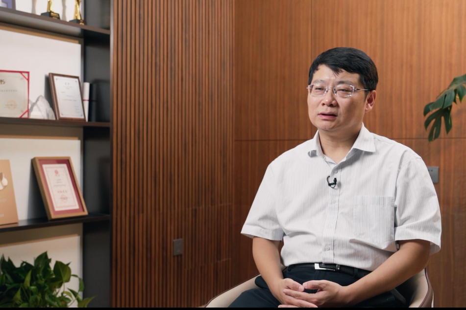

# 经济学家管清友：拆解三架马车，为什么普通人钱不好赚了？

作者|叶蓁

编辑|康晓

出品|深网.小满工作室

学者梁漱溟先生曾发出世纪之问，这个世界会好吗？

在经济学家管清友看来，答案是肯定的，“未来会好的，但是过程会比较曲折，现在我们确实处在一个百年未有之大变局中，大国之间的博弈冲撞会很频繁，而我们每一个个体都很渺小。”

管清友一直希望做“对而有用”的经济学研究，对各方都有参考，对市场和政府都有一定的借鉴作用。管清友在宏观政策与改革、金融市场、世界能源格局等方面具有独到见解。

2018年，管清友创办了如是金融研究院，他担任首席经济学家，成为一名“独立研究者”。

**无论是企业还是个人，当下都处于管清友所谓“百年未有之大变局”之中。在这种大背景下，腾讯新闻《深网》对话管清友，分享其对“中国经济恢复、三架马车结构性变化带来的影响、企业和普通人如何应对时代巨变”等话题的观点和建议。**

**管清友的核心观点包括：**

1、谈经济复苏：短期看，复苏很曲折，既有疤痕效应，又有积累问题比如债务和高杠杆；长期看，盘子大，韧性很强，很扛造；

2、谈房地产：下滑过程还没有结束，平衡点是人口和城镇化水平有支撑那个点，但平衡点是什么我们不知道；

3、谈人口：越富裕越不生，这是国际经验，老龄化少子化是不可逆的趋势；

4、所谓日本失去的30年，对中国究竟是否有借鉴意义？

5、谈三驾马车：消费在微弱地恢复，投资还比较萎靡，大基建时代过去了，房地产依然在消化，而出口出现了结构性、趋势性的变化，普惠性变差了。这种普惠性变差，对普通人来说，意味着钱不好挣了。

6、谈新贸易结构：我们对欧美日的出口在下滑，但中国出口占全球出口的比重是在提高。成品油也好，机电也好，汽车也好，跟大部分普通人没什么关系。贸易结构发生变化，绝大部分产业的企业是升不了级的，对很多原来的很多群体冲击很大。

7、谈年轻人：过去时代的红利，现在年轻人没有享受到，如果站在一个上升的电梯上，然后告诉年轻人说你现在爬楼梯爬的太慢了，这样的专家年轻人一定会反感。

**以下是《深网》对话管清友实录整理，在不改变其原意的基础上有所删减：**

**“复苏艰难，韧性很强”**

**《深网》：在你看来，疫情三年后中国经济恢复的怎么样？**

**管清友：**
其实经济的恢复的怎么样跟参考基准有关系。如果按照6%-7%的年度GDP的增长速度，现在恢复的是比较微弱，如果按照4%的基准去思考，恢复的挺好，更何况疫情三年有严重的疤痕效应，跟大家感受繁荣的时候相比，肯定是微弱的。

一个是餐饮旅游，客单价都下来了，人数也增加了，总量也上去了。客单价的下降说明了一个问题，
**大家肯定是更注重性价比，花钱更保守，该花的要花，不该花的就不花了，原来是该花的花不该花的也是可以花一点的，现在开始追求极致性价比** 。

从整个消费的恢复来看的话，大宗消费让位于小宗消费，不买房不买车不行吗？老百姓发现不买房不买车，世界很美好。

经济的复苏，可以从短期和长期两个维度去看，短期我们面临的状态是什么？就是复苏很曲折，既有疤痕效应，又有原来一直积累的很多问题，比如说债务和高杠杆，比如说由于产业结构和产业政策导致的整个的收入增长放缓，以及大家对未来收入预期变差，所以经济恢复是挑战很大的。

最近出台了那么多政策，试图止住这种下行的态势。目前看来复苏非常艰难，非常曲折，好在我们 **盘子大，韧性很强，很扛造。**

**《深网》：今年房地产领域出台了很多政策，怎么看实际效果？**

**管清友：**
由于房地产的持续的下滑，整个经济下行的压力是非常大，因为它占GDP的比重大概1/7，而整个房地产行业正好处在一个行业大拐点上，销售面积、销售额已经天花板了，一定是要滑落的，平衡点是人口和城镇化水平有支撑那个点，但这个点是什么，我们不知道，因为我们没有经历过这个事情。

房地产市场化也才20多年的时间，目前这个下滑过程其实是没有结束的。房地产下滑它会带来一系列问题，对银行、对购房者、对开发企业、对建筑企业装修全产业链都有影响。

**《深网》：房地产之外，生育率在断崖式下降，是否有办法应对？**

**管清友：**
中国人开始不愿意买房，不生孩子了，这实际上是个挺奇怪的现象，因为中国的文化是什么？买田置地，然后“不孝有三，无后为大”，它是一种文化，因此这个现象本身就值得反思和探讨；

第二个从国际经验来看，越富裕越不生，这是个规律，而且人口结构的变化是不可逆的，所以我们很多人口学家其实也在呼吁鼓励生育，这个值得肯定，但是从现实来看，老龄化少子化是个不可逆的趋势。

**《深网》：所谓日本失去的30年，对中国究竟是否有借鉴意义？**

**管清友：** 首先日本是个特例，中国的房地产也好，经济也好，是不是会像日本那样，我们现在不知道；

第二，日本所谓失去的30年在学术界是有很大争议的，日本在上世纪90年代人均GDP水平已经超过美国了，到现在日本还有接近4万美元，复盘一下看，如果一个经济体的人口老龄化程度到日本这种状态，城镇化水平已经接近极限，能不能做到像日本这样社会安定，人均收入依然维持在发达国家水平，其实是很难做到的。

所以好多人说其实日本不存在失去的30年；这两年日本开始变化了，无论是安倍经济学三只箭，还是后来几任的日本银行的政策，坚定的实施超量化的宽松政策，日本经济现在在恢复。

**“三架马车之变：出口的普惠性不强了”**

**《深网》：宏观经济讲三驾马车，以这个维度来看当下的经济，有什么样的特点？**

**管清友：**
很多自由主义学者不大认同这种短期凯恩斯主义的这种分析，但它依然是一个分析方法。因为经济的繁荣，还是靠企业以及企业家精神，但是短期分析一个经济体的经济运行，三驾马车是一个粗糙的分析工具，它有可用之处。

**对中国而言，其实三驾马车都很重要，而且出口这驾马车对我们尤其重要，甚至在某些特定的阶段，其实只有一架马车，出口是这匹马，然后消费和投资是那两个轮子。**

今年呈现什么特点？消费在恢复，投资总体上比较萎靡，出口差强人意。但出口领域呈现了几个特点：第一，需求在缩水，我们去义乌，去广深地区，大家觉得当下做外贸和2020和2021年简直是天壤之别，那一时期中国的出口对欧美市场形成了所谓的替代效应。

2022年下半年出现了一个很有意思的迹象，2022年三季度，台湾地区、韩国、越南，包括中国大陆的出口，先行指标PMI指标都出现下降，这意味着未来出口的下降是个必然的趋势。

**果不其然，2022年四季度这几个经济体出口都出现了下滑，而且越南、台湾地区、韩国的下滑比中国大陆的出口下滑要大得多。**
到现在近2023年整个前8个月也是如此，就他们的出口下滑比我们要大，因为需求本身在缩水。

第二，国际市场真的在发生结构性的变化。欧洲在搞去风险化、去依赖化，美国在搞友岸外包、近岸外包，中国在搞国产替代，结果是什么？原来中国是美国最大的出口国，现在中国是第三，取而代之的是墨西哥成为了美国最大的出口国，第二位的是加拿大，友岸外包、近岸外包的策略发挥作用了。本来全球经济的现在外部是高利率，中国经济还在微弱的复苏，整个全球就不太景气，更何况在这个过程当中出现了一个结构性的变化，我们对欧美日的出口依然在同比都是下降的，是负增长，这个变化当然对国内的影响是很大的。

第三个特点是：从中国的出口占全球出口的比重去看的话，又发生了一个很有意思的现象，这个比重在提高。

**为什么我们对欧美日的出口在下滑，中国出口占全球出口的比重比例是在提高的？有几个原因？**

今年3-4月份有一个特点，对俄罗斯对东盟对非洲的出口，支撑了对欧美日出口的下滑，但是5月份之后就急转直下，那么我们大量的出口其实出口到东盟，非洲包括俄罗斯，那么从产品结构上又以成品油、机电设备等类目为主，尤其是汽车，汽车今年中国已经是全球最大的汽车出口国了，去年超过德国，今年超过日本，出口好像数据没有那么差，虽然对欧美日的出口在下滑，但出口数据其实没有下滑，比重还在提高。

为什么很多人都在说外贸不好做了，赚不到钱了，是因为出口结构变了，因为成品油也好，机电也好，汽车也好，跟大部分普通人没什么关系的。

**以三驾马车的维度来看比较复杂，总体来看规律是：消费在微弱地恢复，小众消费比大众消费要好，投资还比较萎靡，大基建时代过去了，房地产依然在消化，而出口出现了结构性、趋势性的变化，普惠性变差了。**

**《深网》：这种变化的长期效应是什么？**

管清友：产业链重新布局，贸易的来源地重新布局的过程当中，要保持出口的优势，呈现一个产业升级的状态，不可替代。从宏观层面讲，贸易易结构发生变化，产业在升级，绝大部分产业的企业是升不了级的，对很多原来的群体冲击是很大的。

**《深网》：企业是经济体的细胞，你经常一线调研很多企业，你觉得他们现在的状态是什么样的？**

**管清友：**
我觉得基本分成三种，一种就是它本身处在景气赛道上，像汽车，半导体，高端装备制造、还有一些已经崛起为跨国公司的所谓传统行业，这些行业相对来讲现在市场不错，当然也很卷，在国内卷完之后到国际上卷，争取国际市场。

第二种就是在产业变迁中败下阵来，被代替了，这个冲击面还是很大的，比如纺织服装企业；

第三类是竞争加剧，但还在苦苦支撑的，它们一方面在想办法加快产业升级的步伐，一部分去开拓国际市场，另一部分去挖掘国内市场的缝隙，非常吃劲。这是个新旧动能转换的关键时期，也是产业升级的关键时期。

**《深网》：普通人应该怎么做，来应对这种产业结构性的变迁？**

**管清友：**
当然我们也看到，在这场所谓的竞争当中，从不同的维度去看竞争的态势它是不一样的，有的产业已经跑出来，比如电动汽车这个领域，本身已经是第一梯队，而且很多领域遥遥领先，但也有些领域没有遥遥领先，可能是并驾齐驱。那么大部分领域我们看到的是什么呢？我经常举的例子，50年代60年代，美国的汽车产业工人是一个什么生活状态？中产家庭，一栋大的独栋别墅，有游泳池的，两辆汽车，老婆不用上班，孩子还好几个，他自己可以养活这个家庭。那再看看现在美国的汽车产业工人是什么状态。

这就是产业转移和变迁带给特定群体的具体的影响。普通人如何能够切入到汽车、电动汽车、半导体所谓的景气赛道，我用原来的专长成为这个产业大的生态当中的一个小的环节不就行了？

但从实际情况来讲，大部分人一定是会被产业的变迁、产业结构的这种变动甩开，这也是个残酷的扎心的现实。大部分是意识不到这个问题。

**《深网》：货币贬值，对普通人有什么影响？**

**管清友：**
大部分人没有什么应对之策，因为大部分人根本意识不到，这个社会很残酷，现实有点扎心。大部分人能做的是什么？有资产的人可以多币种的去做一个对冲，会避免一点点。但这也是个理想状态，大部分人说我连钱都没有，哪有什么流动性，你讲这么多说汇率贬值跟我月薪3000有关系吗？没有关系。

**《深镜》：从消费维度看，你觉得国货品牌真的崛起了吗？**

**管清友：**
其实国货品牌已经崛起了，有化妆品，也有纺织服装类的品牌，且已经是世界级品牌了。国货和跨国公司竞争过程当中，既存在公平也存在不公平。公平是大家同台竞技，但也不公平，跨国公司这么多年市场的积累，而本土品牌资本不大，品牌不算响……天然的不公平，拿着大刀长矛怎么跟人家端着冲锋枪竞争呢？

这种所谓的同台公平竞争意味着什么？一定会有很多企业被干掉，被淘汰掉。过去这些年我们被淘汰掉和干掉的品牌太多了，这是个产业安全问题。

有一些声音认为应该其实用行政力量限制一些跨国公司，然后扶持国内品牌，这是一种观点；另外一个观点就是同台竞争，在这个过程当中接受优胜劣汰，就看企业能不能跑出来。你同意哪种？这就是两种不同的观念了。

**《深网》：你怎么看当下支持国货的这种舆论？**

**管清友：这个已经是一种力量，也是一种大家的价值观，意识形态和商业上的这种不自觉的和国货品牌的捆绑**
。如果国货确实做得很好，我有什么理由不买它，为什么一定要用国外品牌？这里头我觉得达成的一个共识是——国货是很好的，但我们也不能因此否定说去买那些去买外资企业产品的人，不能非此即彼。

**《深网》：90后和00后正成为支持国货的主要力量，是短视频的平权放大了他们的爱国情怀吗？**

**管清友：** 首先应该看到，90后00后他们用实际行动支持国货品牌，是一种非常好的爱国形式。

第一，90后00后生活在中国经济成长最快的阶段，也就是改革开放的40年，同时也生长在中国国际地位快速上升的阶段，他们这个群体的视野里中国是平视世界，甚至是俯视世界的，而50后，60后和70后因为诸多因素，是仰视世界的。

第二个原因就是我想可能跟教育有关，他们接受的教育，跟70后80后当时的教育是不一样的。

第三，移动互联网的这种发展一方面是带来了平权，但算法也带来了流量的潮汐效应，它特别容易汇聚情绪，汇聚共识，汇聚群体。

**“百年变局，大国博弈不可逆”**

**《深网》：面对当下复杂的国际局势，你最大的担忧是什么？**

**管清友：**
我最大的隐忧，其实是人类社会的悲哀或者宿命，人类总是有自我毁灭的倾向。这个世界最大的挑战，从人类角度的确实是叫智力赤字。对我个人来讲，就是努力提高自己的修养，学习，然后用更从容的心态和更高维度的认知去看待世界、看待市场、看待经济，看待所有的一切。

**《深网》：你的担忧和技术变革有关系吗？**

管清友：我觉得跟技术演进没有关系，人类各个族群理想状态是什么？和平共处，但是现实世界不是这样的，现实世界是很残酷的，
**今天我们又进入到一个百年变局大国博弈的这样一个局面，这个不可逆。**

**《深网》：梁漱溟先生曾问，这个世界会好吗？你怎么看？**

管清友：梁漱溟先生所谓的世纪之问，未来会好吗？我想我们每个人心中都得有这个信念，未来会好的，但是过程会比较曲折。

**现在我们确实处在一个百年未有之大变局中，大国之间的这种博弈冲撞会很频繁，作为我们每一个个体都很渺小，都很微小。时代的一粒沙落到每个人头上，就是一座大山。**

**所以这种大的国际板块的动荡，它会影响到每一个人。未来好不好，真的是取决于大家怎么做。**

**“专家不要给年轻人建议”**

**《深网》：你为什么不喜欢给年轻人提建议？**

**管清友：**
建议专家不要建议，这是现在特别时兴的口号。其实我之前也经常被要求给一些建议，谈一些自己的看法。后来网上网络上有很多舆论，建议专家不要建议，我觉得也挺有道理。说明一个什么问题？每一个群体年龄段，它所处的时代背景经济周期都不一样，遇到的情况也不一样。

**过去时代的红利，现在年轻人没有享受到，你站在一个上升的电梯上，然后告诉年轻人说你现在爬楼梯你爬的太慢了，这样的专家确实不接地气，年轻人一定会反感。我经常说不要把时代的红利当成自己的本事，个人努力很重要，时代的大机遇也很重要。**

不要给年轻人建议，其实是一种态度，需要理解年轻群体面临的挑战和压力，以及他们这样选择的逻辑。另一方面也说明什么？时代的红利确实在消退，这一代的年轻人当然有他们的优势，受教育水平更高，很多都出国留过学，有国际视野，当然他们也更卷，面临的所谓时代的机会也更少。那么从公共政策这个角度来讲，得让年轻人的创造力能够发挥出来，对公共政策来说是个挑战。

**《深网》：部分专家坐在上升通道的电梯里，没有兼顾到时代变迁的复杂性，因此导致了公信力的丧失，如何看待这种现象？**

**管清友：**
我觉得分几种情况，第一种是站在那个时代背景之下，很多人上过山下过乡，吃过苦，然后千军万马竞争考上大学，他天然就觉得努力是一个很正常的状态，这个努力是融入于这个群体骨髓的，这些都跟这一代的年轻人是有代际差的，对这一代的年轻人来说，他们按照父母的要求，努力上学，考试，上985，留学，之后发现没什么好的工作机会，或者说工作机会的空间极其闭塞，那就不努力，不是我不努力，是时代不给我机会，这是一种状态。

第二种，移动互联网媒体和自媒体，天然的一个特点就是什么呢？你要短小精悍，要有金句，要流量。那么对于很多人所谓的建议，整个发言中抠出来其中一句话，很不接地气，其实是被误解了，或者说被黑化污名化了，我也会遇到这种情况，其实不是那个意思，但是真正暴露在社会大众眼前的就是那一句话。这种情况太多了。

第三种，大家对同样一个事有基于价值观的不同的看法和判断。很多时候似乎把另外一种观点就就压制了抹杀了，就导致舆论的不平衡，那么这就比较糟糕了。这就很容易出现什么呢？一边倒，或者说有很多议题里头的讨论，其实就是劣币驱逐良币。

《罗刹海市》里头，似乎每个人都可以找到自己的切面，每个人都可以说所谓“马户又鸟”皆有所指，所以这是这个歌的奇幻之处。当然也有很多专业人士有不同的观点，但是不同的观点其实是淹没的。

**《深网》：算法逻辑导致了这样的一个结果？其实大家并不在乎所谓的真相？**

**管清友：**
其实大部分人没有时间，也没有能力去看所谓的真相。我现在有一个感受，看到一个事情被网络引爆，先让子弹飞一会儿，因为有很多信息还没被曝光出来，一开始下结论肯定是错的，很多事情是有复杂性的，要多维度多角度去看一个问题。

