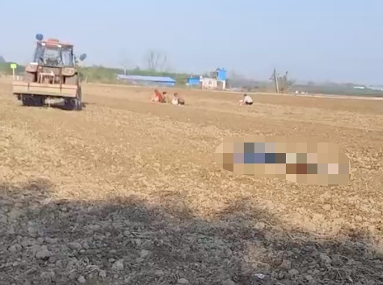

# 老人捡花生被卷进收割机身亡，村民：老人的儿子今年也因意外去世

据百姓关注报道，10月23日，河南周口郸城县巴集乡发生一起旋耕机伤人事故，一名捡拾花生的老人被卷进旋耕机当场身亡，现场另一名老人趴地痛哭。

据同村村民介绍，这名老婆婆当时正在捡花生，旁边的人是她的老伴。“已经报警，看了很心疼，老两口的儿子今年也因意外去世。”

记者向巴集乡人民政府询问相关情况，工作人员称已向主管领导反映，还不知道怎么处理。目前，警方已经介入此事。

一名在当地从事旋耕机驾驶的车主告诉记者，每年农耕季节很多村民会去地里捡拾农作物，司机在驾驶机器作业时存在一定盲区，所以驾驶员要注意观察。

**【来源：百姓关注】**

