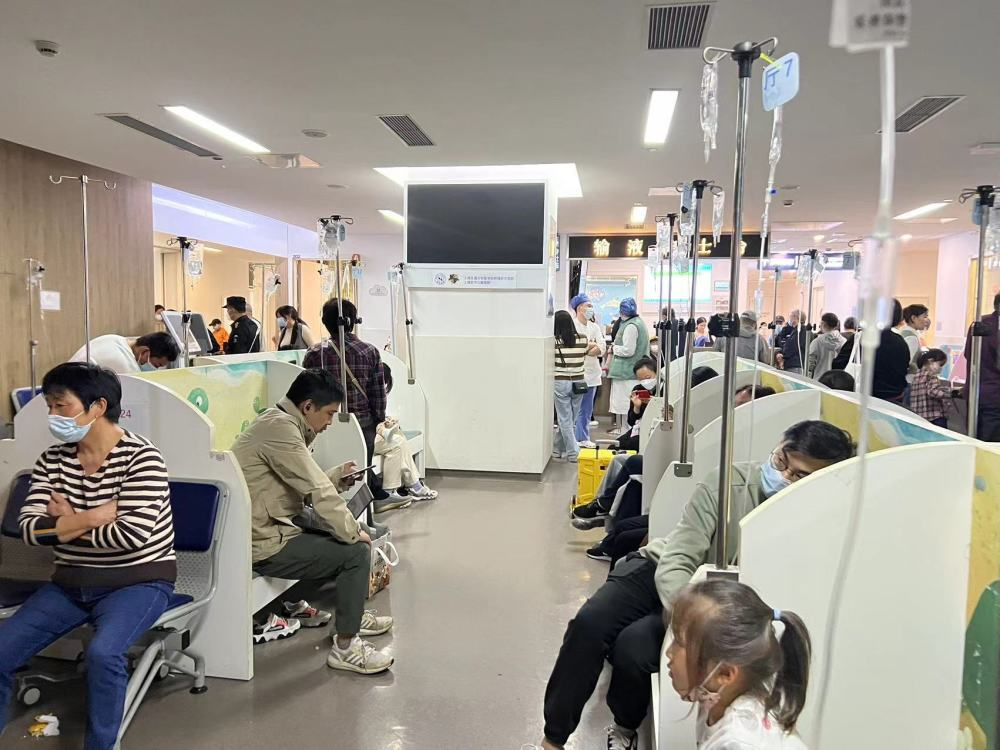
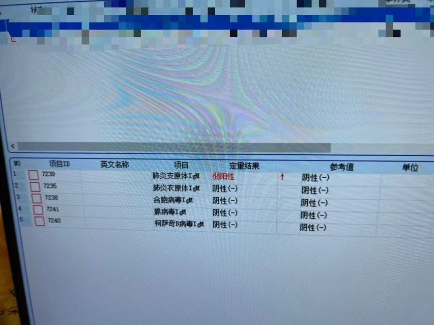
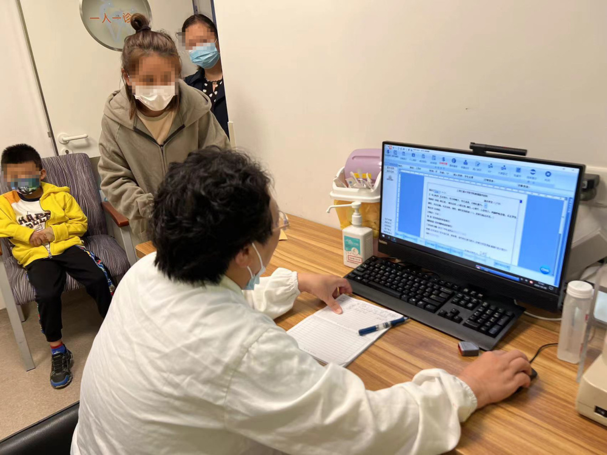

# 肺炎支原体流行下的儿科门诊：耐药但不难治疗，感染高峰或持续至寒假

_10月20日，下午4点半过后，新华医院输液区和雾化区仍有不少在患儿及其家属正在治疗。本文图片 澎湃新闻记者 陈斯斯_

作为一名感染科医生，来自上海交大医学院附属新华医院医生俞慧菊感慨，今年是她从业30多年来第一次遇到这么多的支原体肺炎患儿。

“肺炎支原体存在在大自然中，但由于新冠疫情三年来，习惯了戴口罩与居家的我们，对很多病菌失去了抵抗力。”俞慧菊说，在这个季节，如果出现咳嗽、发热等症状，从流行病学角度出发，我们常常考虑孩子感染的就是肺炎支原体。

俞慧菊坦言，早在今年9月底，不少呼吸、感染科医生就普遍感觉到今年的肺炎病人有增多趋势，为此医院已经加班加点，备足人手和床位，除了感染科、呼吸科基本收满了患儿，其他诸如血液科、风湿免疫科、心内科、神经科等也腾出床位，用于专治不断增多的肺炎患儿。

在俞慧菊的门诊中，10岁以下的支原体肺炎患儿占据多数，而在院治疗患儿中，有些在服药后病情仍无缓解的患儿发展为了重症肺炎患儿，甚至一些人还出现了“白肺”。按照医院规定，“白肺”患儿将会被送往抢救室，接受进一步治疗。

同样，在复旦大学附属儿科医院，最近主要面对两种感染性疾病的流行，一个是支原体肺炎和流感，一个是手足口病。其中，支原体肺炎处在流行高位。医院发热门诊、内科门诊10月以来的监测数据看，在送检的呼吸道标本当中，支原体的检出率大概占到了30%，处于检出高位。“往年一般处在5%-10%之间，10%已经比较高了，今年流行的水平更高。”复旦大学附属儿科医院感染科副主任曾玫表示。

支原体肺炎流行后，耐药问题也成为人们关注的焦点之一。对此，曾玫表示，早在2010年前后，支原体肺炎对阿奇霉素、红霉素等药物的耐药问题已经很明显，现在耐药率已经达到90%以上。“支原体感染虽然会引起肺炎，但临床的重症比例并不高，支原体肺炎的治疗没有太多困难，还是有不少药物依然是支原体肺炎的敏感抗生素。”

除了支原体肺炎，曾玫认为，公众还要对流感提高警惕。在俞慧菊看来，秋冬季节原本就是呼吸道疾病的高发季节，且呼吸道疾病大多具有传染性，但像肺炎支原体等并不一定会被列入传染病，但仍然需要我们引起重视，“预计这一波高峰将可能会持续到寒假。”

 _新华医院输液区。_

**门诊：有患儿不发烧，却感染了肺炎支原体**

10月20日下午4点半过后，是夜门诊时间。在上海交大医学院附属新华医院的儿科门急诊大楼挂号处，仍然不断有家长带孩子来就诊。就诊患儿中，多数存在发热、咳嗽等症状。而在雾化区、输液区，放眼望去也都坐满了患儿。

_上海交大医学院附属新华医院医生俞慧菊，正在出诊下午4点半后的夜门诊。_

接近傍晚5点，家长黄宇（化名）带着7岁孩子小轩走进俞慧菊的夜门诊。

小轩是一名复诊肺炎患儿。早在10月14日，他就出现了发烧，起初一家人给孩子吃了美林退烧，但未能“压”住。10月16日，小轩被带来医院就诊，做了检查，也拍了CT，一查发现是乙流，还感染了支原体。在此后的四天时间内，他反复发烧，退了又烧起来。

“已经反反复复发烧了一周多，阿奇霉素吃了5天了，前一天还在发烧，38摄氏度，已经挂了一天水了。”让家长黄宇担心的是，持续一周多的发烧，让孩子的体重从53斤掉到了51斤。

6岁的小希也是一名复诊患儿。10月16日他因为咳嗽，被诊断为急性下呼吸道感染，没有呕吐、没有腹泻，甚至没有发烧，但咳嗽了4天，做了雾化治疗，还吃了阿奇霉素、红霉素，原本的咳嗽症状一直没有好转。经检查，小希也被诊断为肺炎支原体IGM弱阳性。

“支原体抗体一般在发病后5天才出现，如果是重症的患者会在发病后10天才出现，越后出现代表病情越重。”俞慧菊表示。

记者观察下来，在俞慧菊的夜门诊中，5-7岁就诊患儿居多，被发现存在肺炎的比例很高，他们大多有发烧、咳嗽等症状，但也有一些是只有2、3岁的患儿，大部分经过药物治疗后能得到改善。俞慧菊表示，从流行病学角度出发，这个季节如果出现咳嗽、发热等症状，常常考虑孩子感染的就是肺炎支原体。

随着社会关注度的上升，“支原体肺炎”在家长圈中的知晓度也在不断提高。汪萌（化名）带着4岁患儿小昀来看诊时，就问医生：“我家孩子昨天下午从幼儿园回来就发烧了，最高烧到了40摄氏度。今年听说肺炎特别厉害，不知道是不是支原体肺炎呢？”

2岁半的小逸在10多天前就出现了发烧症状，随后被诊断出肺炎支原体抗体弱阳，服药治疗后烧退了，但咳喘一直没有停。前来就诊时，小逸的爸爸妈妈、爷爷奶奶也来了，“我们一家人都感染了肺炎，大人的症状不要紧，但偏偏就孩子一直喘气，一直看不好。”小逸的奶奶有些紧张。

 _在门诊里，多名患儿被检测出肺炎支原体IGM弱阳性。_

针对发烧、咳嗽等患儿的病原体检测，俞慧菊表示，往往会开具一个呼吸道五联检，其中涵盖肺炎支原体IGM、肺炎衣原体IGM、合胞病毒IGM、腺病毒IGM和柯萨奇B病毒IGM。

**引起重症比例不高，患儿预后情况都比较好**

俞慧菊表示，当前在上海交大医学院附属新华医院的感染科，10岁以下患儿是肺炎支原体感染的高发人群，有一些重症病例，但目前没有死亡病例。学校教室、不通风的居家环境等一些密闭空间，是导致肺炎支原体传播的一大途径。此外，也有一些年龄在2-3岁之间的学龄前患儿，主要是在家族感染的原因居多，“支原体肺炎尽管不被定义为传染病，但它有一定的传染性，老人、家长都会传染给孩子。”

复旦大学附属儿科医院最近主要面对的是两种感染性疾病的流行，其一是支原体肺炎和流感，其二是手足口病。其中，支原体肺炎处在流行高位。

曾玫表示，从该院发热门诊、内科门诊今年10月以来的监测数据看，在送检的呼吸道标本当中，支原体的检出率大概占到了30%，处于检出高位，“往年一般处在5%-10%之间，10%已经比较高了，今年流行的水平更高。”

而在综合性医院，成人感染肺炎支原体的病例并不高，老年人则较少。同济医院呼吸与危重症医学科执行主任徐镶怀表示，该院只接诊12岁以上患者，在接诊的支原体肺炎感染者中，12-18岁青少年居多，体温一直不退，但重症很少。

曾玫还表示，支原体感染虽然会引起肺炎，但重症比例并不高，通常以发烧不退、肺部有症状为主，很少出现呼吸困难。医院在总体应对支原体肺炎患儿上，除了工作量大、门诊负荷量大，患儿的预后情况都比较好。

俞慧菊指出，其实，肺炎支原体感染好发于任何季节，北方地区秋冬季更多，南方地区则是在夏秋季更为流行，儿童和青少年是感染肺炎支原体的高危人群。

“当肺炎支原体入侵我们的身体时，可以导致喉炎、支气管炎、肺炎等呼吸道感染，并不是都会发生肺炎的情况。”俞慧菊表示，判断儿童是否感染肺炎支原体，更多地需要依赖医生的综合分析，包括年龄、症状、实验室检查、影像学检查等信息来最终作出判断。肺炎支原体感染的临床表现也因个体差异而有所不同，有些儿童可能只表现出轻微的症状，有些症状则会相对明显，如果孩子出现咳嗽、发热、流涕、喘息、头痛、耳痛、肌肉痛等症状，尤其是伴随呼吸急促或高烧时，应及时就医。

**耐药明显，但治疗没有太多困难**

支原体肺炎流行后，阿奇霉素上了热搜，耐药问题也成为人们关注的焦点之一，很多患儿久病不愈。

对此，曾玫表示，这实际上是一个“老问题”。早在2010年前后，支原体肺炎对阿奇霉素、红霉素等药物的耐药问题已经很明显，现在耐药率已经达到90%以上。

虽然有耐药现象，但曾玫也表示，支原体肺炎治疗没有太多困难，还是有不少药物依然是支原体肺炎的敏感抗生素。比如，近年来新一代四环素类等药物依然能产生出敏感性，且该药物很安全。另外，氟喹诺酮类药物也有效，短程使用，它也不会对患儿造成明显负面影响。“包括联合短程的激素治疗，总体上治疗效果还是很好，希望大家不要太紧张，虽然支原体肺炎流行，但危害有限。”

_在俞慧菊的门诊中，近段时间以来发现肺炎支原体抗体阳性的病例不少，年龄大部分在10岁以下。_

俞慧菊同时坦言，在她的门诊中，虽然阿奇霉素是诊疗指南中首选药物，但是确实存在一部分患儿服用阿奇霉素未见好转，“通常情况下，我们会针对一些服药仍然没有好转的住院患儿开展耐药基因检测，目前门诊也在开展这项检测，但需要2-3天才能出报告，且并不是人人都需要这类检测。”

俞慧菊进一步表示，虽然耐药率有所上升，但大环内酯类抗生素仍然是针对小儿支原体肺炎的首选用药，若使用一段时间后临床效果不佳，应及早去做耐药检测，考虑改药。

“如果出现大环内酯类耐药肺炎支原体，还可以尝试新型四环素类抗菌药物，包括多西环素和米诺环素，这也是治疗耐药肺炎支原体肺炎的替代药物。虽然这类药物可能导致牙齿发黄或牙釉质发育不良，推荐用于8岁以上儿童，但在临床上用下来还是比较安全的。此外还有喹诺酮类抗菌药物，包括左氧氟沙星、莫西沙星等，这些是治疗耐药肺炎支原体肺炎的替代药物。”俞慧菊说。

上述专家进一步指出，由于喹诺酮类抗菌药物可能导致关节和肌肉发育不良，在18岁以下儿童中属于超说明书用药，如果需要超年龄段使用，则需要在与家属沟通基础上再使用，这类药物往往用在耐药患儿身上较多。

**预计感染高峰将持续到寒假过后，还要警惕流感**

除了支原体肺炎，曾玫认为公众还要对流感提高警惕。

从复旦大学附属儿科医院今年8月下旬以来的数据看，流感患儿一直处在中等水平流行，患儿没有出现下降趋势，预期流感还要持续到冬春季。曾玫建议家长提高流感疫苗接种意识，及时为孩子接种疫苗。

一些家长疑惑，为什么接种了肺炎疫苗，孩子还会得支原体肺炎？曾玫表示，没有一种疫苗能够预防所有肺炎，引起肺炎的病原体多种多样，包括流感病毒、肺炎链球菌、麻疹等。“家长通常理解的肺炎疫苗是肺炎链球菌疫苗，但它不能预防所有肺炎。而且，特别是支原体肺炎到目前也没有疫苗出现，是无法通过疫苗预防的。”

“预计这一次的感染高峰会持续到孩子寒假过后。”俞慧菊表示，除了肺炎支原体感染处于高峰外，流感病毒、呼吸道合胞病毒等在冬春季节也可能会进一步流行起来，同时也可能存在细菌病毒合并感染的情况，因此，这波呼吸道疾病感染高峰并不会那么快过去。

针对如何预防呼吸道疾病，俞慧菊坦言，其实大家经过了新冠疫情，已经有了很全面的认知，“戴口罩肯定是预防呼吸道疾病最好的方式，也是最有效的。同时，保持手卫生、室内多通风，特别是老人和孩子避免去人员密集的地方，这些手段都可以达到很好的预防传染性疾病的效果。”

此外，上述专家建议，对于孩子来说，要预防呼吸道疾病，要保持充足的睡眠和适度的锻炼、均衡的饮食，这些有助于建立起更强大的免疫力。

