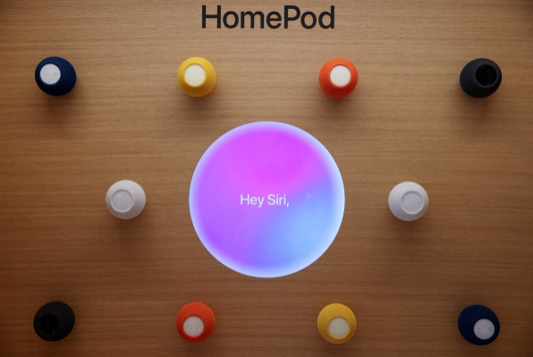
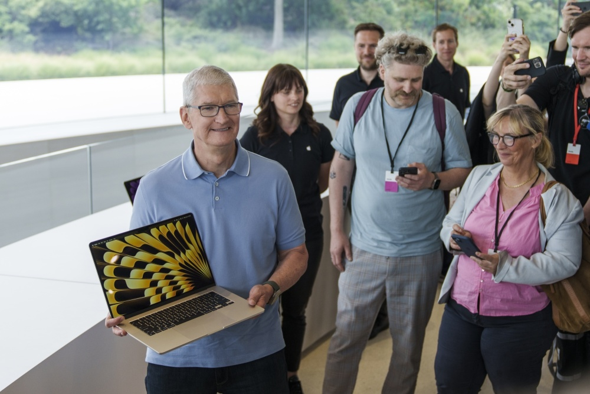
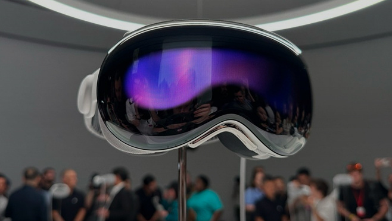

# 苹果的AI计划：每年砸10亿美元，要把生成式人工智能塞入全系设备

**划重点：**

  * _1_ 苹果对AI热潮措手不及，3位高管被选为生成式AI项目执行发起人，每年有10亿美元预算支出。
  * _2_ 苹果团队正用AI技术改版Siri，新版本Siri有望在明年正式推出。
  * _3_ 苹果有可能采用组合方式，在本地和云端部署生成式人工智能功能。
  * _4_ 苹果零售店员工在2024年初接受Vision Pro培训，具体上市时间仍未确定。

腾讯科技讯
10月23日消息，据外媒报道，今年年初，当ChatGPT和其他人工智能工具席卷科技行业时，苹果有点措手不及。可以毫不含糊地讲，苹果高管对科技行业突然出现的人工智能热潮措手不及。从去年年底以来，苹果一直在努力弥补失去的时间。时至今日，该公司已准备好作出回应，并计划为全系列设备开发人工智能功能。

每年投资10亿美元

苹果目前的主要精力都用于应对席卷科技行业的人工智能狂潮，他们必须迎头赶上。去年，当OpenAI的ChatGPT像火箭一样起飞时，苹果基本上是在袖手旁观。它目睹谷歌和微软等科技巨头推出搜索引擎的生成式人工智能版本，对用户的查询做出令人信服的类似人类的回答。微软推出了带有更智能助手的更新版Windows，亚马逊则推出了人工智能增强版Alexa。

一直以来，苹果唯一值得注意的人工智能发布是iOS 17中改进的自动更正系统。该公司首席执行官蒂姆·库克（Tim
Cook）现在表示，苹果多年来一直在研究生成式人工智能技术。

知情人士透露：“ **苹果内部之前非常焦虑，认为这是一个相当大的失误。**
”今年7月，苹果建立了自己的大型语言模型Ajax，并推出代号为“苹果GPT”的内部聊天机器人，用于测试Ajax的功能。关键的下一步是确定这项技术是否符合竞争标准，以及苹果将如何将其应用到现有产品中。

苹果负责人工智能和软件工程的高级副总裁约翰·詹南德雷亚（John Giannandrea）和克雷格·费德里吉（Craig
Federighi）负责牵头这项工作。在库克的团队中，他们被称为推动生成式人工智能项目的“执行发起人”。据悉，苹果服务主管埃迪·库伊（Eddy
Cue）也参与其中。上述三人当前 **每年在该项目上可支出约10亿美元。**

詹南德雷亚目前负责新的人工智能系统的底层技术开发，他的团队目前正在用新技术改版Siri。这款更睿智版本的Siri最早可能在明年，但人们仍对苹果的新技术感到担忧，认为苹果的人工智能功能可能需要更长时间才能完全部署到其产品线。

与此同时，费德里吉的软件工程团队正在把人工智能功能添加到下一版本的iOS（iOS
18）中。在新版本的iOS中，有一项命令要求在其中加入基于该公司大型语言模型（LLM）运行的功能，该模型利用大量数据来磨炼人工智能能力。新功能应该会改善Siri和Messages应用回答问题和自动完成句子的方式，与竞争对手服务的最新变化类似。

苹果的软件工程团队也在考虑把生成式人工智能集成到Xcode等开发工具中，此举可能有助于应用开发者更快地编写新应用。这将使它与微软的GitHub
Copilot等服务保持一致，后者在开发人员编写代码时向他们提供自动完成的建议。

库伊的团队正在推动尽可能多的应用添加人工智能功能。该团队正在探索苹果音乐（Apple
Music）和生产力应用的新功能，包括自动生成的播放列表（Spotify在今年年初与OpenAI合作推出了类似功能)。此外，库伊的团队正研究如何使用生成式人工智能来帮助人们在Pages等应用中写作，或在Keynote中自动创建幻灯片。同样，这类似于微软已经推出的Word和PowerPoint应用。之前有报道称，苹果还在其AppleCare部门测试用于内部客户服务应用的生成式人工智能功能。

苹果内部正在进行一场辩论，讨论如何部署生成式人工智能：作为一种完全在设备上的体验，生成式人工智能服务应当完全在设备上本地运行，还是采取基于云的设置，亦或者是介于两者之间。在设备上本地运行响应速度更快，有助于保护隐私，但通过云部署苹果的大型语言模型将允许更高级的操作。基于设备的战略也让苹果更难更新技术，难以适应快速变化的行业。考虑到这一点，苹果更有可能会采用组合方式：某些功能采取设备本地处理，而部分更高级的任务则使用云处理。

要把这件事做好，风险很大。生成式人工智能很快变得不仅仅是一个时髦词，而且将成为未来几十年计算的核心。苹果深知自己决不能退居二线。

本月底发布新款Mac

苹果上一次更新iMac是在2021年4月，当时推出了一款配置M1处理器的标志性一体机。从那以后，关于后续型号的消息就像PowerBook
G5一样难以捉摸。在苹果自主开发芯片的时代，Mac如此长时间不升级确实非常罕见。自上一款机型首次亮相以来，iMac的粉丝已经等待了900多天。

按照苹果原先的计划，该公司曾考虑在24英寸iMac发布后不久发布一款更大、更专业的iMac。根据最初的路线图，先会是配置M1的24英寸iMac，然后是配置M2的iMac
Pro，最后是更新版24英寸iMac。

有消息称，由于成本问题，苹果不久前搁置了iMac Pro计划。因此，苹果不得不做出调整。包括把Mac Studio和Studio
Display组合定位为高端iMac替代品。但是任何热情的iMac用户都清楚，这不是苹果设备之间的比较。幸运的是，新款iMac终于要上市了。正如今年3月的报道，苹果已准备好更新24英寸iMac
--这款机型可能很快就会上市。有消息称，苹果计划在本月底举办一场以Mac为主的产品发布会。在这场活动中，苹果有可能会发布新款24英寸iMac。

另一个线索是：iMac、13英寸的MacBook Pro和高端MacBook
Pro目前在苹果零售店供不应求。如果试图从苹果官网订购相关产品，有几种配置要等到11月中旬才能到货。若干星期的延迟是一个明显的迹象，表明有事即将发生。

考虑到苹果会在11月2日发布截至9月末的第四财季财报，该公司又可能在本月30日或31日举办新产品发布会。这将是该公司自2018年以来首次在11月发布季报（通常会在10月下旬）。上一次出现这种情况，是因为该公司在10月30日先举办了iPad和Mac发布会。

最近有报道称，虽然采用M3处理器的下一代MacBook Air机型要到2024年才会推出，但苹果在新款14英寸和16英寸MacBook
Pros上取得了进展。苹果在今年1月已经发布了新款MacBook Pro，所以今年再次发布新款MacBook Pro会是不同寻常的事情，但绝非不可能。

值得注意的是，iMac
Pro虽然被搁置，但从未取消。这款更大型号的iMac仍然准备跟随24英寸的型号，将于2024年底或2025年推出。它将拥有32英寸的显示屏，成为苹果推出的最大的iMac。

Vision Pro上市时间未定

苹果将在2024年的“前几个月”开始对零售店员工进行Vision Pro培训。Vision
Pro的发售日益临近，苹果开始让零售店员工为该设备正式上市做准备。据悉，苹果已向零售店员工发送了一份备忘录，要求他们申请参加在加州库比蒂诺举行的秘密的“产品培训活动”。这次培训将在2024年的前几个月举行。当然，此次活动旨在向零售店员工介绍Vision
Pro，并对他们进行相关复杂销售程序的培训。

“选定的团队成员将于2024年前几个月前往加州库比蒂诺参加活动。回到苹果零售店后，他们将为团队成员提供培训和持续支持。对于那些热衷于展示苹果产品和教授他人的成员来说，这是一个参加集体活动的机会，”苹果在备忘录中表示。想要加入的苹果零售店员工，需要通过申请和面试程序。

换句话说，苹果希望从美国的每家零售店找几个人对他们进行Vision Pro培训，然后让他们回店把相关知识传授给同事。这告诉我们关于Vision
Pro的发布时间了吗？也许不多。备忘录没有说明该产品何时上市，也没有说明培训将持续多长时间。但这可能是一个信号，表明Vision
Pro不会在新年伊始就正式发售。苹果只是说Vision Pro将在2024年“早些时候”上市，这一措辞给了该公司很大的回旋余地。

Vision Pro预计将是该公司最复杂的发售活动。苹果旗舰店将增加专门的演示区，其他零售店将有一至两个演示展位。该公司还计划在店内为客户组装Vision
Pros，就像对Apple Watch所做的那样--安装适当的头带、光密封和可选的处方镜片。（译/无忌）

