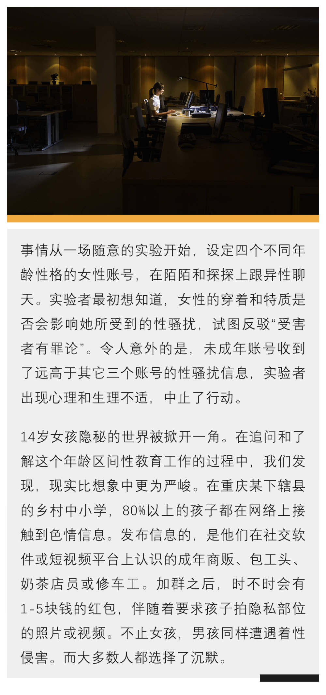
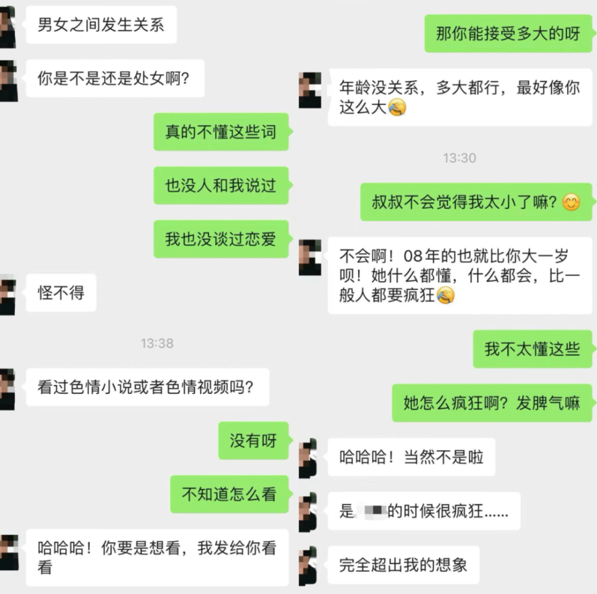
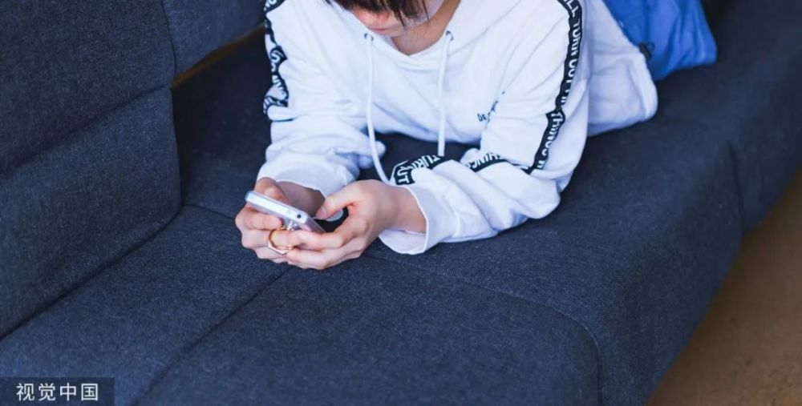
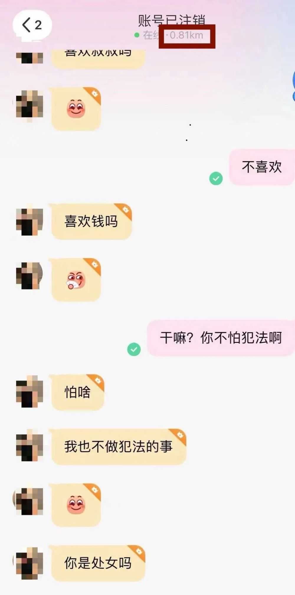

# 一个14岁女孩的社交账号：3天收到108个打招呼，近一半涉及性骚扰

**文|** 魏荣欢

**编辑|** 陶若谷

**一个14岁女孩的社交账号**

一周之内，「小雨」在交友软件上遇见了各种各样的叔叔。

夜里十一点多收到信息，“看看你的胸呀”，对方年龄显示50多岁，头像是一张穿普通T恤的照片。搬出生物课老师推辞，他劝说，“没事的呀，看看也不会缺什么。”搬出妈妈推辞，对方没有理会，直接发来生殖器照片。注册账号两三天，「小雨」就收到108个打招呼，近一半涉及性骚扰，其中一类是像这样引导拍照。

另一类是提出包养。年龄显示为32岁的一个叔叔约「小雨」吃饭，“给你点零花钱”。听说她未满14岁，说等她过了生日再说。然而，这位叔叔不断提起另一个未成年网友，形容她“很疯狂”，让「小雨」觉得性是正常甚至美好的。

还有一位叔叔会充当“保护者”，以退为进。听说有人提出包养「小雨」，叫她删除这些人的联系方式。先以好意接近，再以人生导师的姿态洗脑——控制，是“保护者”的另一特点。叔叔以担心「小雨」遇到坏人为由，要求检查微信通讯录。大概聊了一周后，他问「小雨」：要不要玩一个养成类游戏？

屏幕这端的「小雨」没再回复，巴望实验尽快结束。自今年6月30日开始，37岁的周雅薇和朋友用AI合成图片，设置了四个不同的女性形象，分别是性感富婆、个性拽姐、邻家女孩和未成年女孩「小雨」，后两位装束普通，不强调身体曲线。实验者在社交平台上开通四个账号，想看看女性的穿着和特质是否和受到的性骚扰有关，试图反驳“受害者有罪论”。

实验的开始是随意的，没有严谨的设计思路，也没有预想在什么情况下会停止，只简单规定了几条聊天规则，比如“不主动邀约，只回应”。尤其是未成年人账号，要频繁强调自己是未成年，或初三、初二等相关信息。

「小雨」的资料设定起初是16岁，齐刘海，丸子头，粉红色T恤，双手托腮。账号由一位19岁女孩运营。第一天48条打招呼，她回复了20条，有一半都是性骚扰，其中一位显示仅距离自己100米。“邻居，可能就住在楼上，曾经擦身而过”，「小雨」后来在媒体采访中描述自己的恐惧，这种恐惧在梦里变成具象的陌生男子，不停追赶她。第二天，她退出了实验。

其他三人的性骚扰回复率相对稍低，性感富婆和邻家女孩在1/6到1/8之间，个性拽姐最少，约为1/8。实验成员推测，可能是因为拽姐的攻击性强，会直接拒绝，遇到性暗示也会直接回怼。相比拽姐和富婆，邻家女孩的反抗较为婉转，反而会激起对方更露骨的挑逗。

完全在意料之外的是未成年账号。周雅薇和同伴们开始从自己身上找问题，怀疑这个年龄设置有些暧昧，于是把资料改为14岁——在包括中国在内的大多数国家，与不满14周岁的女性发生性关系需要负刑事责任。

第二位「小雨」交给30岁的潘辰运营。她申请了一个微信号，用来加想进一步聊天的男性。一开始她并没有完全沉浸角色，随时分享「小雨」和叔叔们的聊天截图给周雅薇，跟她讨论。直到那位“保护者”叔叔出现，用微信转账试探姓名，又提出要看「小雨」的微信通讯录。潘辰突然觉得要全神贯注进入实验，以防被发现。她把周雅薇的微信备注改成“妈妈”，尝试进入一个14岁女孩的世界。

就在这时，50多岁的大叔发来要看胸的信息。话语拉扯中，潘辰版「小雨」不断提醒对方自己的年龄，“潜意识里期待这个人就算性骚扰，至少是有点良知”。然而这些都被忽略，生殖器照片彻底撕裂了潘辰的安全感。

年龄下调为14岁后，「小雨」所遭遇的性骚扰并没有下降，反而增长到50%，超过了前三种人设的总和。像是打开了潘多拉魔盒，实验渐渐走向失控。

“保护者”叔叔提出养成类游戏的时候，账号背后已经是第三个「小雨」周雅薇。“你不愿意也就算了。”叔叔的言语没有明显的攻击性，但模凌两可。周雅薇细思极恐，“一个14岁女孩是绝对分辨不出来这是什么意思”。这远远超出预期。周雅薇的男朋友一开始不相信，认为性骚扰只是少数情况，不断看到聊天截图，他不得不相信并变得愤怒，“快点骂他”。

_●提出包养的叔叔与「小雨」的部分聊天记录。讲述者供图_

除了骂回去，还能做什么？实验成员们感到无力，“即便我们依旧觉得震撼，但事实上也无法完全共情到14岁女孩的感受”。一位看了实验的网友提出，角色为扮演者提供了缓冲带，经历通过转述，伤害和冲击再次缓冲递减，侵害真正发生时，一个女孩的感受要比做实验的成年人所共情到的深得多。

「女童保护」组织的一份性侵儿童案例的调查报告显示，2021年全年，仅媒体公开报道的案例就有223起，受害人数569人（注：未表明具体人数的案例中，“多人”按3人计，“十几人”按15人计，“几十人”“数十人”按30人计），年龄最小的为2岁。这并不是全部，按照国际惯例的算法，1个公开案例背后一般有7个隐形案例。

周雅薇和同伴把她们的实验经历放到当时只有几百听众的播客上，结果引发了近2万人收听。评论区里，很多人分享了自己的经历——网络骚扰不局限于交友软件，有人童年时在QQ上收到过陌生人骚扰，有人在少儿游戏上遇到性骚扰。还有听众回述了来自熟人作案的痛苦回忆，时隔多年，那种痛苦仍在影响现在的生活。而分享经历的听众里，没有人寻求过帮助。

**一万个沉默的理由**

在播客上跟听众探讨性骚扰时，周雅薇脑子里浮现出儿时的一段记忆：在夜晚行驶的轿车里，四五岁的周雅薇被妈妈的一位男同事抱在怀里，坐在后排。妈妈坐在一臂距离的副驾驶。叔叔的手抚摸她的肚子和屁股。周雅薇无法分辨那是什么，觉得“不太舒服”，但最终归类于一种自己熟知且愉悦的理由，“叔叔好喜欢我”。

“其实在正常社交情况下，孩子不愿意，成年人也总会说，叔叔阿姨摸摸你是因为喜欢你。”性教育志愿者齐悦说。她是《性侵害幸存者自助手册》的中文翻译者之一。这本由国外一家性侵与性虐待支持机构撰写的手册，详细列举出多种在遭受侵害后常见的情绪、思维、躯体反应。成年人认为的好意，实际上是没有尊重孩子身体的自主权，齐悦解释，“包括孩子在身体接触或是亲密接触中的意愿。”

是什么原因导致那些女孩选择沉默？在和实验组成员、心理咨询志愿者、性教育机构追问原因的过程里，每个人都提到的一个回答是：缺少认知。很多女性以为只有器官插入才算性侵害，实际上，性骚扰、猥亵、强奸行为都属于性侵害。

周雅薇播客的留言里，一位听众分享自己七八岁被男理发师亲脸，被表哥舌吻，19岁的她至今仍不知道这算不算性侵。甘肃农村学校一堂性教育课上，当讲到男女生殖系统时，有个女生突然情绪特别激动。她才明白小时候表哥对自己做了什么。

 _●资料图_

强烈的羞耻感也是令她们缄口的原因。“我觉得我做了错事”，第二位「小雨」潘辰回想自己曾经被一个男人骚扰。那时她上初二，没敢把这事告诉妈妈，觉得自己不该走那条背街小巷，“就像是父母要求我吃饭要把碗端起来，而我没有，我不想被爸妈发现，因为觉得会被骂。”

这与「你我伙伴」性教育公益项目的调研结论一致：很多孩子在受到性侵后首先会认为是自己做错了什么——一定是我没有保护好自己，一定是我衣服穿得太少，一定是我夜里很晚不回家，一定是我学习成绩不好，一定是我平常跟同学们关系不好……

“这从来不是我的错。”《性侵害幸存者自助手册》中文版导言里，这句话被加粗。手册的另一位翻译者陈烈在十余年志愿服务里，遇到过许多得不到家长信任的孩子。“你为什么当时没有拒绝？为什么当时不说？”通常家长第一反应是直接数落孩子。

这个话一旦出来伤害就造成了。陈烈说，孩子挺相信自己的感觉，但家长总会说“你想多了”，“你不应该这么想”。长期这样，孩子就不再相信自己的判断。陈烈还认为，家长不接受，是因为孩子受到侵害意味着自己失职，这也是一种对他们的控诉。

除了认为做错事，英国国家医疗服务体系NHS的网站上还列出保持沉默的其他原因：儿童可能受到施虐者的贿赂或威胁，或者被告知他们不会被相信；可能会关心施虐者并担心给他们带来麻烦。这是受到性侵害儿童的普遍心理。

而在国内，更普遍的情况是，父母出去打工的农村留守儿童更容易遭受性侵害。今年5月，在重庆走访乡村中小学的张耀华发现，几乎80%以上的孩子都在网络上接触到色情信息。

成年商贩、包工头，亦或是奶茶店员和修车工人，这些大人是孩子在社交软件和短视频平台上认识的，给他们买零食玩具，带他们玩，关怀他们像父辈一样。很多留守儿童因此信任他们，被拉进名为“xx地方”的交友QQ群。群里时不时会有1-5块钱的红包，伴随着要求孩子拍隐私部位的照片或视频。

 _●「小雨」收到的性骚扰信息之一，显示距离为810米。讲述者供图_

孩子们不觉得侵犯了身体权，觉得这只是拍了一张照片，没有多严重。他们还会介绍其他同学入群。一个12岁女孩就是这样认识了三十多岁的包工头怀孕了，女孩家人想要安排他们结婚，解决这桩丑事。而这个女孩也表明愿意，认为男方确实对她好。

眼前的现实令张耀华吃惊。他是「你我伙伴」的发起人，专注6-18岁农村孩子性教育已有12年。受人们观念认知、司法完善程度、媒介发展水平等因素影响，农村儿童遭遇性侵的案件更不容易被发现，更难进入司法程序。

女孩子在描述这些人时，不会喊“叔叔”或“哥哥”，而会说“我一个朋友”。这些“朋友”会在假期带她去游乐场，玩娃娃机，喝奶茶。张耀华记得，说起“朋友”，有位女孩松弛地趴在桌上，语调中带着炫耀。旁边的同伴插嘴说，那些人里面有她的男朋友，女孩又立马否认。

“能看出她享受那样的生活，分享的时候很快乐。”张耀华说，在学校禁止早恋的大背景下，其实无法回避两个事实：一是青少年越来越早进入青春期，有一些性需求得不到疏解；二是他们面临成长的剧烈变化，可能更需要家人和朋友的支持陪伴，对成年人的那种成熟感会格外着迷。在张耀华的统计中，成绩好或差、性格开朗或者孤僻的孩子都有可能遭受性侵害，而且不光是女孩。

做性教育调查的过程中，张耀华发现，男孩遭受性侵害的比例其实是高于女孩的，但家长不愿意承认，会觉得更难以启齿，或认为男孩遭受猥亵并没有女孩那么严重。

**点连成线，再连成面，形成“支持网络”**

「小雨」的实验结束后，扮演她的成年人至今仍困在其中。周雅薇还没有勇气去注销账号，她总是琢磨一位男性的话——他主动说自己有一个四五岁的女儿，所以很喜欢女孩子。“没有任何骚扰，洗脑也没有”，她问对方不嫌弃自己是小孩吗，对方答：“小孩才没有那么多功利心，相处简单。”周雅薇无法想象，14岁女孩究竟会如何思考这类信息。

第二任「小雨」潘辰收到生殖器照片那晚，把抱枕想象成男人的脸疯狂打。她整晚睡不着觉，回想起23岁在国外看到当地报纸上刊登的性侵害信息，而在国内，大人避而不谈性，这也导致她一直以为那是“非常邪恶的话题”。

大家在回避性，但又在想要孩子去正视性。这是张耀华在多年学校性教育中观察到的。以预防艾滋病为例，很多学校要求他不谈性传播，只讲要预防，“不要在不谈性的前提下去谈一些跟性教育相关的内容。”

联合国在2018年7月提出「全面性教育」的概念。调查研究结论显示，接受了全面性教育的学生，在未来的亲密关系中，比没有接触过性教育课程的人遭受性暴力的可能性低很多。而在联合国发布的教育纲要中，第一部分就是认知家庭、友谊、爱，知晓尊重、价值观和人权，这些内容分别在5
-8 岁、9 -12 岁、12 -15 岁和15 -18 岁及以上四个年龄段有不同的内容。

张耀华在设计课程时也遵循了这一纲要。他认为现在很多人把性教育更多的当成是一个“事后救火的工具”，其实应该尽早，前期就让孩子知道自己是有身体权的，不只是生殖器官和胸部，你的身体都应该被保护，只要感觉到不舒服都可以拒绝，还要教孩子怎样明确拒绝。

建立起整个社会的支持体系才是最关键的，陈烈说。她在美国学社工时了解了当地的支持体系。美国《1990年儿童虐待受害者法案》，里面明确规定了提倡在对受虐待儿童做调查时，需要多部门合作，其中包括社会工作者、卫生工作者、执法人员、检察官等等。

为了改进司法系统对儿童虐待及忽视案件的处理，法案还提出管理机构应向法院或司法管理机构提供拨款，以实施多部门参与的信息协调与调查程序。如果在工作中发现孩子受到性侵害，陈烈介绍，他们首先会报告给机构，会有儿童保护机构跟警方上门调查。如果发生在家庭里，会把这个孩子立刻保护起来。此外，孩子还会得到心理咨询方面的支持。不同的资源点连成线再连成面，形成“支持网络”。

指责、被嫌弃是受侵害者最容易遇到的问题，如果是熟人甚至家人就更为复杂。这很容易让他们产生不被理解的孤立感。陈烈在《性侵害幸存者自助手册》中文版后面附了一份长达7页的《如何寻找和识别倾述对象》，期待提供一些心理上的帮助。其中一名未成年时受过性侵害女性通过自我剖白，分享了自己越过创伤的经历和建议——

“我说不清楚我的沉默是为了拯救谁，可能是为了拯救别人，因为觉得这件事已经让我很痛苦，告诉别人可能会造成更多的痛苦，所以不能说。也好像是为了拯救自己，是害怕说出来也并不会有人相信我。但沉默让我窒息，真正使我感到解放的，最终仍然是那些聆听我的人和动物。”

“我当天下午打电话告诉了伴侣，我曾经不止一次，遭遇来自不同人的性侵害。说完之后，我有些自卑地加了一句，‘现在你知道了，我是这样的人。’对方的声音很坚定：‘你还是你啊，这又不影响’。”

_●资料图_

NHS的网站上列出了一些可能的迹象：孩子可能开始变得好斗、孤僻、粘人、睡眠困难、经常做噩梦或开始尿床；可能不喜欢或似乎害怕某个特定的人，并试图避免与他们独处；可能会做出不当性行为或使用露骨的性语言；可能会出现健康问题，包括生殖区酸痛或性传播感染，或者可能怀孕；可能难以集中注意力和学习，他们的成绩可能开始下降；可能会留下暗示和线索，表明虐待行为正在发生，但没有直接透露出来。

侵害者往往没有特定的画像，有的人性情温和，温文尔雅，还表现得非常喜欢孩子。其中不乏一些成功人士，有位曾经猥亵学生的校长，事业成功，平日里也家庭和睦。在「女童保护」发布的报告里，熟人作案的案例中，教师、教职工（含培训老师）作案比例是最高的。

该项目专家顾问、中国社会科学院大学少年儿童研究中心主任童小军在工作中就遇到过孩子讲哪个老师不要脸，朦胧地描述性行为，父母叫她不要瞎说。她建议家长哪怕再担心难过，也一定要温和地去跟孩子聊，把信息问全。

对性侵事件一票否决的考核机制也不够合理。童小军提出，目前教育系统对学校的普遍要求是，不能发生任何一例性侵害事件，否则会影响当年整体考评。老师们的工作在这种考评体系里，直接跟奖金挂钩，“这种事情摸排不出来的，需要专业的人去通过日常的工作和观察去发现痕迹，追踪痕迹，像破案一样”。

目前国家已经有了相关法律法规，搭建起了大框架，亟待建立包括防侵害在内的一整套工作机制。陈烈回国这两年，感觉到未成年保护逐渐向国际接轨，比如开始做“强制报告”——如果学校社工、医生等跟未成年有密切接触的工作者发现他们遭遇性侵，有义务去向上级报告甚至报警。然而整个网络里其它接口没有跟上，暴露出新的问题。

陈烈相熟的一位中小学班主任最近遇到一件难事。面对一名被监护人性侵的小孩，究竟该不该报警？如果监护人被控制，街道或民政系统愿意为这个孩子托底吗？如果不愿意，孩子还是要被送回监护人家里。

（应讲述者要求，文中周雅薇、潘辰、齐悦、陈烈为化名）

版权声明：本文所有内容著作权归属极昼工作室，未经书面许可，不得转载、摘编或以其他形式使用，另有声明除外。

