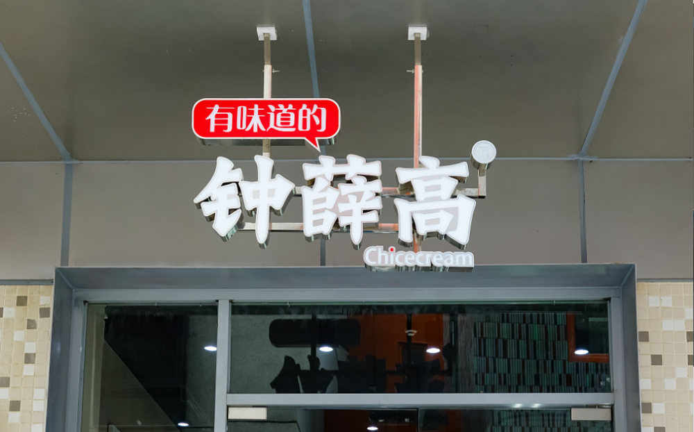

# 不要“刺客”要“菩萨”，钟薛高被爆欠薪，高价的新消费集体遇冷

_图源：视觉中国_

特约作者 | 刘煜荷

编辑 | 陈弗也

出品 | 棱镜·腾讯小满工作室

“雪糕刺客”代表钟薛高最终被高价反噬。

近期，多位自称是钟薛高员工的人发文称公司欠薪，要求林盛（钟薛高创始人）还钱。此事引发了市场对钟薛高经营状况的担忧。

事实上，不仅是钟薛高，今年夏天，整个雪糕市场都遭遇了寒冬，高价雪糕更是动销不畅。《棱镜》作者采访得知，钟薛高从7月开始打折消库存，价格甚至跌到3.5元/支。除了钟薛高，巧乐兹、梦龙、哈根达斯等在线下都面临不同程度打折。

早在今年8月13日，“杭州冷饮雪糕店生意比往年差了三成”的词条就曾登上热搜。

一位冷饮家批行业人士用“滑铁卢”来形容今年的行情，他告诉《棱镜》作者，今年冷饮行业集体遇冷，属于近10年行情滑铁卢的一年。有便利店老板甚至表示，今年是冷饮行业20年难遇的低谷期，销量比疫情期间还差。

与此同时，钟薛高的这一场“欠薪”风波，也折射出新消费品牌的集体困境。茶颜悦色降薪、喜茶裁员、奈雪降价，近期又有元气森林广州分公司被前员工爆料欠薪。

依靠营销起家的“高价新消费”，现在的路还好走吗？

**消费降级，雪糕打不赢“高端局”**

近期，一位钟薛高客服部门的“前员工”称，她和5位同事签了离职同意书，并获得公司的优化补偿，约定补偿金和工资10月15日发放，但最终没有收到。

一位钟薛高前员工告诉《棱镜》作者，今年7月，钟薛高已经在裁员了，有部门几乎被全员裁掉，如设备相关的部门，一些在职员工的工资也无法按时发放。而7月，正是雪糕销售旺季，但当时已有不少员工却在休假。

根据广州一位钟薛高经销商向作者的讲述，今年初，钟薛高大力推广线下渠道，但是几个月后，广州区却几乎找不到对接人。

启信宝信息显示，钟薛高因“赔偿金”、“接触劳动合同经济赔偿”等问题，已经收到2次劳动仲裁通知。

以营销、流量起家的钟薛高，官方微博也罕见地停更了近2个月，其官微留言中甚至还有供应商催款的留言。

今年夏季，由于消费降级，以钟薛高为代表的高价雪糕普遍卖不动，前期囤货太多的经销商在旺季来临时只能打折销售、以消库存。

“今年的‘高端局’都很惨，不止是钟薛高，只不过钟薛高受到影响是最大的。”一位雪糕行业人士透露。7月份，钟薛高的线上价格一路下降，线上渠道率先开始打折销售，不少店家推出买一送一的优惠活动，原价13元—18元的产品系列，最终以9.9元两支成交。

合肥钟薛高线下冻品经销商董凯（化名）告诉作者，当时钟薛高线上折扣太大，而线下店渠道还没有折扣，导致他们的线下销量直线下滑。

“前期还行，后面眼看着不行了。”董凯回忆称。此后，钟薛高降价潮流蔓延到线下，目前不少渠道钟薛高已经降到3.5元一支。

事实上，这场高端雪糕降价潮，几乎席卷了整个冰淇淋行业。

除了钟薛高，伊利的巧乐兹今年部分渠道也在5折售卖，哈根达斯在盒马渠道上甚至降价到3折；前几年，行业内经常断货的梦龙，也在今年“打骨折”。根据Food
Talks数据，今年第2季度，华中地区雪糕/冰淇淋销量表现较好的产品均集中在3-5元的价格区间。

**“先成为网红，再成为品牌”**

自2018年成立以来，钟薛高就曾多次以66元/支的高价登上热搜，同时由于与普通价位的雪糕摆放在同一个货柜，钟薛高成为“雪糕刺客”代表。

钟薛高创始人林盛是广告行业出身，他曾服务过大白兔、味全等快消品。在钟薛高之前，林盛就已经凭借广告营销才华，通过小红书等平台成功打造出马迭尔雪糕、中街1946两款“网红”产品。

林盛的思路非常清晰，他把小红书作为首要推广平台，先吸引年轻、注重品质的女性。2018年，正值小红书的流量聚集之时，林盛让小红书内部员工试吃，然后“种草”，再以KOL模式带动品牌传播。

很快，钟薛高成为林盛打造的又一个网红产品。

2018年双11，钟薛高推出“厄尔多尔粉钻雪糕”，天猫售价66元，不到10小时，2万片全部被抢完。钟薛高因此冲上热搜，自此之后，就贴上了“高价”的标签。

但水能载舟、亦能覆舟，依靠流量、舆论走红的产品，很容易被流量、舆论反噬。

去年7月，钟薛高一款海盐味雪糕，在31℃的室温下放置近1小时后仍然没有完全融化，从而引发了大规模负面讨论。市场上对于钟薛高售价30-40元成本只有几元钱的质疑，也一直没有消失。

林盛曾经在一次投资人集会上说，必须先成为网红，再从网红通往品牌。只可惜，钟薛高在成为网红之后，没有进一步成为品牌。

“得冰柜者得天下”，这是饮料和冰淇淋市场的一条铁律，冰柜也被行业人士称为是打造品牌的必争之地。但与伊利、蒙牛等相比，线上起家的钟薛高缺乏线下管控经验。

为了推广线下渠道，钟薛高从去年7月就开始布局冰柜。但从线下冰柜情况来看，他们的冰柜中常常放置其他品牌产品，他们对冰柜的管理管控能力并不强。在销量不佳的情况下，他们也无法采用“压货”的传统方式来度过危机。

**新消费集体遇冷**

作为代表品牌，钟薛高的“欠薪”危机折射出新消费品牌的集体困境。如今，墨茉点心局门前不排队了、完美日记卖不动了、花西子也因李佳琦的失言遭遇品牌危机……

新消费品牌大多以小红书等线上平台为营销重地，遵循着一套“爆款+讲故事+线上导流”的模版。但营销背后，往往因性价比不高、线下渠道不稳固而备受质疑。

2021年，茶颜悦色爆发出欠薪危机。当时，部分长沙员工因疫情减工时，到手工资由原本的5000元左右降低至2000元左右，他们在茶颜悦色内部的群聊引发了讨论。很快，茶颜悦色高管的不当发言，又为这场舆情添了一把柴，最终创始人吕良不得不下场道歉。

去年初，喜茶也被爆出裁员30%，信息安全部门几乎全部被裁，门店拓展部门也被裁50%。

在饮料圈引发农夫山泉、可口可乐围剿的元气森林，在气泡水之后，迟迟拿不出有竞争力的第二大单品。农夫山泉、东鹏特饮、统一、康师傅等传统饮料企业拥有稳健的利润和现金流，元气森林则缺乏这样的能力，业内人士预估元气森林至今还未实现盈利。

近期，元气森林广州分公司也被爆出拖欠员工工资。一位元气森林广州分公司前员工称，其7月份从元气森林离职后，工资压到10月份都没有发。

价格高是新消费的一个痛症。元气森林推出气泡水时，其对标的产品是可口可乐。但是气泡水风口过去之后，4元/瓶的气泡水下沉到线下渠道，与可口可乐2元/罐相比，完全没有价格优势。

一位娃哈哈前高层分析，元气森林目前所有产品价格都偏高，这是他们在市场动销慢的重要原因。

钟薛高如今一路跌到3.5元/支，这是定位高端市场的新消费品牌集体降价的思路。去年年初，喜茶、奈雪为了抢夺低价市场、降低消费门槛，相继告别30元的价格，甚至推出了9.9元低价产品。

事实上，在饮料、冰淇淋市场，除了“刺客”之外，还有不少“菩萨”的存在。在一些社交平台上，就出现了“雪糕菩萨”一词，主要是指老冰棍、布丁等口味好又平价的产品，消费者只需要花两三块钱，就能度过酷暑的一天。

在消费降级的大背景下，新消费行业或许需要活成蜜雪冰城、瑞幸的样子。

