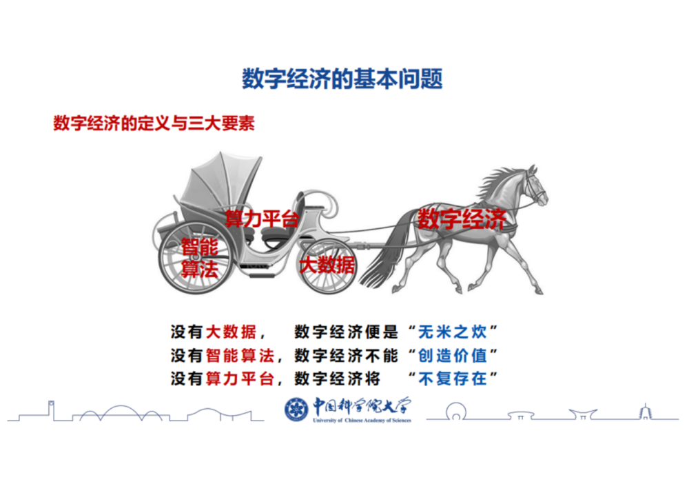
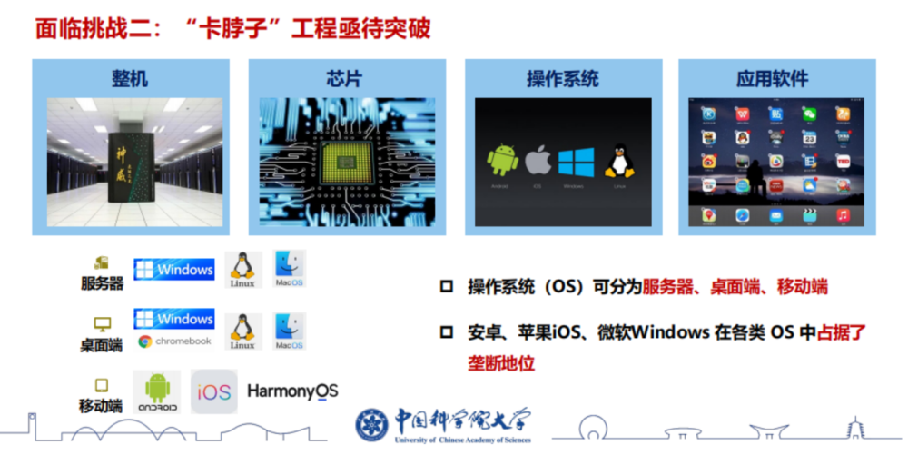
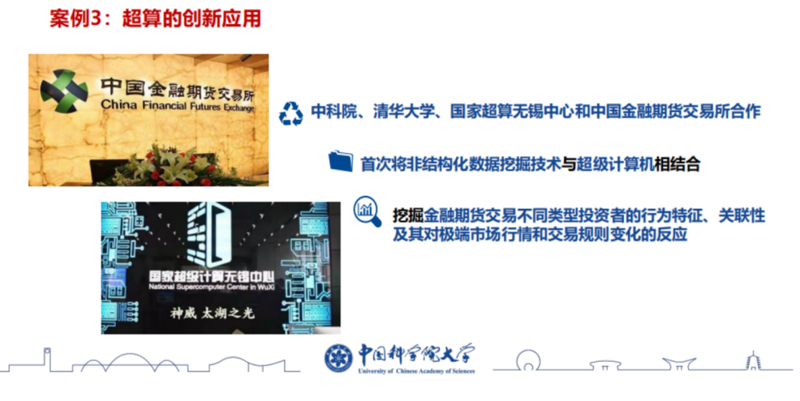
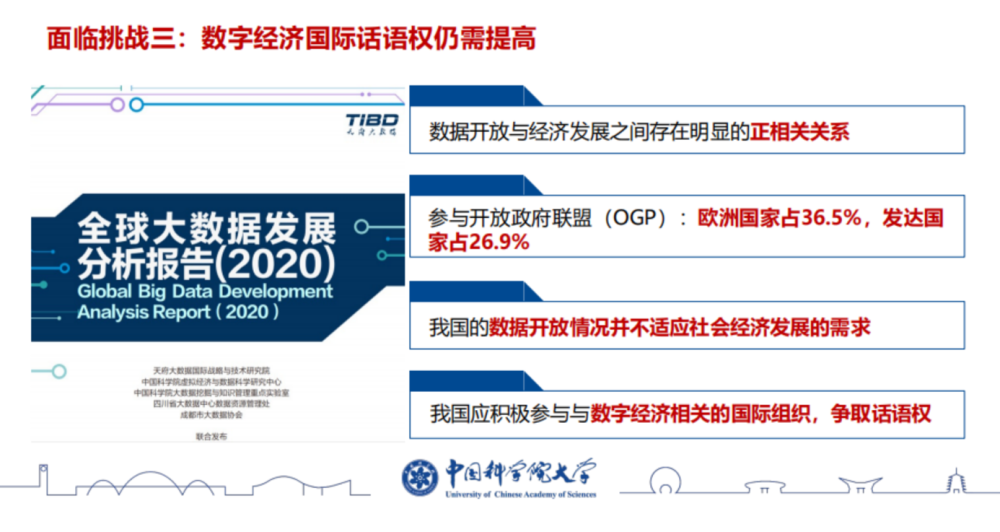
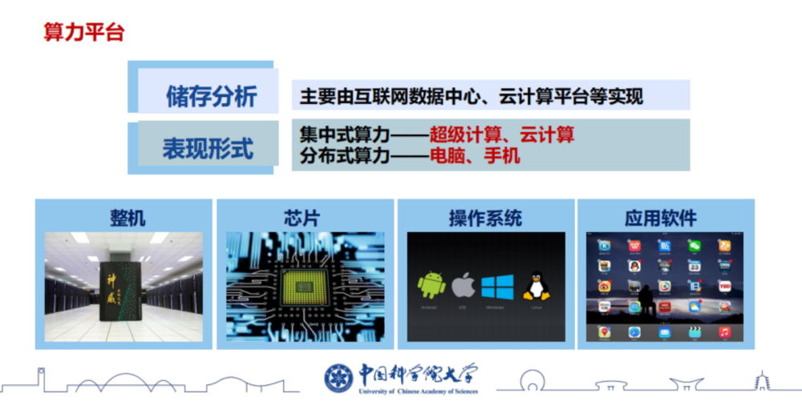
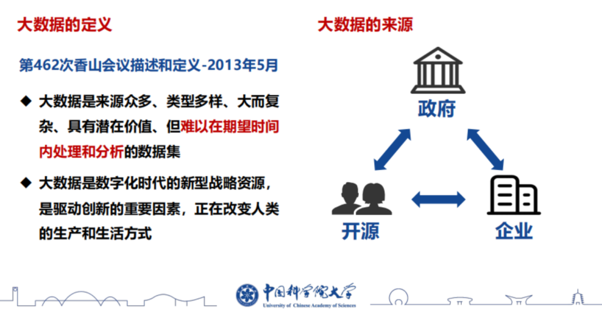
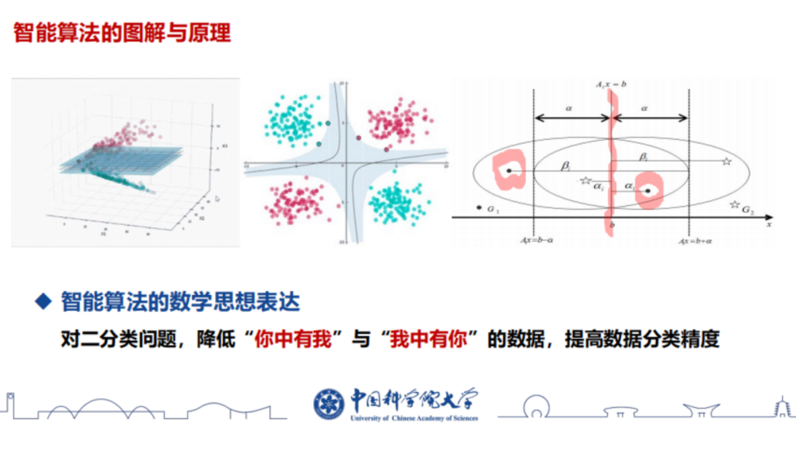
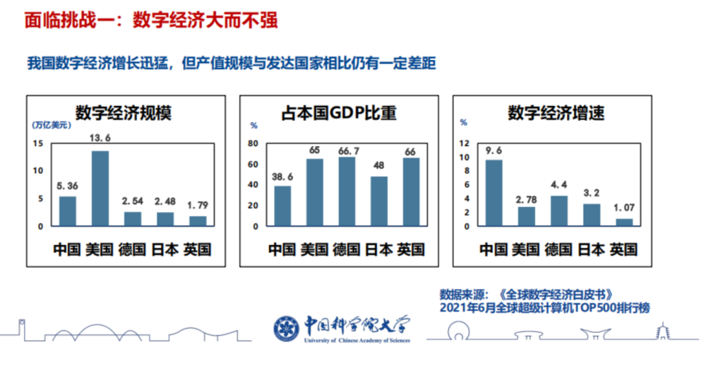

# 中科院专家谈AI：别只盯着芯片卡脖子，算法才是核心竞争力

文/ 腾讯科技 郭晓静

1956年，人工智能（Artificial
Intelligence，AI）概念被正式提出。在此之前一年，发生了件大事，图灵奖获得者赫伯特·西蒙（Herbert A.
Simon）和艾伦·纽维尔（Allen Newell）两位AI先驱成功编写了当时世界上第一个人工智能程序——Logic
Theorist，他们后来也在达特茅斯会议上展示了这个当时唯一可以运行、且能够模拟人类思考非数字问题的人工智能软件。未曾料想，这一成果为此后近70年人工智能领域算法的发展指明了方向。

2023年3月，OpenAI发布了人类AI算法的巅峰之作ChatGPT-4，OpenAI基于Transformer架构，在大量的无标签数据上进行预训练，然后在特定任务上加入RLHF，及一系列的工程化创新，让ChatGPT的表现惊艳世人。

人工智能领域的经验成果，都离不开核心算法的创新。自从ChatGPT火爆以来，业内就一直在讨论一个问题“在全球AI领域中取得领先优势，我们应该建立哪些方面的核心竞争力”，行业内的共识是，人工智能的快速发展依赖于三个核心要素：算法、算力和数据。

**国务院参事、中国科学院讲席教授、发展中国家科学院院士石勇教授**
在虚拟经济与数据科学发展领域有很多实践经验，先后主持多次国家重大课题、海外合作项目，并在近期深入走访调研了AI产业发展的最前线，长三角地区，及西部地区。近期在他的走访结束后，腾讯科技与石勇教授，就到底什么才是AI产业未来的核心竞争力展开了一次深度对话。

在对话中，他表达了对人工智能大模型算法核心竞争力的担忧：国内的“百模大战”，在中美竞争的大背景下， **关注焦点和讨论点一直没有离开对算力的竞争**
，甚至很多公司会把拥有多少张高性能的“卡”（用于大模型训练的高性能芯片）作为对外宣传的重点。而AI大模型背后的核心算法，因为先进大模型的开源、大模型应用场景的同质化，似乎并没有引起最高的重视。

“我们最近对我国主要芯片产业了进行实地调研，深刻体会到 **我们的芯片产业在发展中取得了许多可喜的的成就。其次，**
我国拥有庞大的互联网用户群体，数据也不是最大的问题。 **我认为起主要作用的还是人工智能的算法及工程应用。比如，**
ChatGPT的惊艳效果，其核心就是基于创新的算法和精益求精的工程化能力。”

石勇教授在与我们的对话中，逐一解析了人工智能三要素对于产业发展的作用，并反复强调大模型的核心竞争力，一定要聚焦在“算法”。

以下为对话精华：

**腾讯科技：人工智能三要素中，算法、算力、数据，哪个是最大的短板？**

石勇：我觉得最大的短板从结构上来讲，应该是算法。算法肯定是起关键作用的，没有算法，就不可能创造价值。目前的人工智能有三大要素，即数据、算法和算力。

看数据规模变化来看，我国可能很快超过美国。这是因为中国经济体量大，人口众多，它们正是产生大数据的主要动力。但是，
**如何把这些大数据采集起来并有效地应用是一个挑战。** 我国的算力发展得很快，不管是集中式（包括超算），
还是分布式都发展很快。由于数字经济的迅猛发展，将来的中国算力很可能超过美国。

大数据来源于社会，是以社会属性为基础对客观现实的反应；算力是数据转变为知识基础设施。相比之下，我认为起主要作用的还是人工智能的算法。

**腾讯科技：这和大家普遍的认知似乎不太一样？大家认为例如Llama2这种有先进算法的大模型都已经开源，在算法上追赶并超越似乎不是最大的问题？**

石勇：大家都知道通用的算法，但真正 **某一个通用模型到具体的行业和具体的场景中的应用，那是非常细的。** 同样一个模型应用到某一个场景中去是千变万化的，
**某个细节参数的调整都可能决定成败。这种对算法的深究以及细节落地的能力，是我们要加强的。**

大家可能认为我有了数据、有了算法的结构、有了算力，就可以进行训练。但是其实是十分复杂的过程。和造芯片一样，原理大家都懂，但是魔鬼在细节。我打个比方，大数据是食材，你想要做好的菜品，没有食材绝对不行；你要没有很好的厨房、厨具，就很慢、火候不好，这就是算力。
**但是菜做得好吃不好吃靠谁？靠厨师，厨师就是算法。**

所以在未来的大模型领域的竞争，拼的是对落地场景的理解、对核心的痛点的理解，根据场景去进行设计和实现，这些都体现在算法的核心竞争力上，要靠积累，一点一点扎实落地。

**腾讯科技：算力面临高端芯片卡脖子，且算力结构不均的问题（通用算力过剩但智能算力不够用），这个问题如何解决呢？**

石勇：据我们所了解的情况来看，短期来看算力压力确实比较大。咱们提供算力的企业可以大致分为三类：第一类是三大运营商、第二类是企业政府合作的一些算力平台、第三类是独立运营公司。

但是不管是哪类企业，都需要向智算结构去转型突破。这里面有一个问题就是，我们的芯片受到限制，是不是能突破？

大家都叫芯片“卡脖子工程”，我们最近在调研我国芯片产业，现在网上关于芯片的事、关于手机的事到处都是，我跟给大家讲，
**通过我们实地的调研发现，网上的报道好多都是不真实的，我们的芯片产业还是有底气地在发展。**
但是如果我们20年以前对芯片、对软件顶层的系统布局的话，不是今天这个情况了， **希望将来不要走弯路了** ，这是我们看到的一些问题。

另外就是，我们的超算是十分有优势的，超算的应用领域高大上，通常为最顶尖的科学研究服务，包括核聚变模拟、石油勘探、量子力学等等。在超算领域，有一个TOP500的排名，每隔半年都会重新评估一次。历史上这个清单曾一直被美国、日本、欧洲等国家的超级计算机霸占榜单。进入21世纪以来，多台来自中国的超级计算机开始夺得榜单第一。2019年的TOP500，排名第一的是美国能源局下属Oak
Ridge国家实验室的Summit，排名第二的是加州大学伯克利分校Lawrence
Livermore国家实验室的Sierra，排名第三的就是中国的神威太湖之光，第四是中国的天河。前五名，中国占了2名，美国占了3名。前十名其他超级计算机主要分布在欧洲和日本。我们的超算在应用上也有突破，比如说我们的团队和清华团队合作，把上海金融期货所的数据拿到无锡的神威太湖之光上去计算，首次将非结构化的数据挖掘技术和超级计算机相结合，挖掘金融期货交易不同类型投资者的行为特征、关联性及其对极端市场和交易规则变化的反应。用超算处理非结构化金融数据，这种应用在目前可以说是最知名的美国的芝加哥期货交易市场都没有做过。

虽然我们的超算发展不错，但是不能什么地方都搞超算，还是要加强分布式智算平台的建设。如果说国外的发展经验，几乎都是三部曲：法律法规、社会需求、社会形态。在这个方面我们也有自己的制度优势以及市场规模优势，这是底气，但是这些底气也需要跟进相关的政策驱动。科研队伍的建设也特别重要，承上启下如何解决，再过十年以后，不应该是我们还站在这个讲台上，应该让年轻人去讲，这是很重要的。

**腾讯科技：算力需求持续增长，超算价格太高，未来有没有可能超算上云上网，构建超算互联网？**

石勇：超算上云并构建超算互联网是一个前沿的概念，它涉及到超算资源的分布式部署和云计算技术的结合。当前，超算中心主要基于集中式的高性能计算资源，为大型工程项目提供强大的计算能力。而所谓的“超算互联网”则是指将这些分散在不同地点的超算资源通过网络连接起来，形成一个统一的、可动态调度的计算网络。

与欧美的模式不同，我们不仅仅是根据社会和企业的需求来发展，还需要政府的引导和政策支持。在超算互联网的构建上，政府不仅要制定相关政策，还需要积极引导和推动整个社会、企业和研究机构共同参与，形成一个健康、有序的发展生态。

**腾讯科技：人工智能三要素中还有一点是数据。**
过去其实一直在提大数据，然后现在的生成式人工智能所需要的大数据和过有什么样本质的区别？那我们自己，我们国家拥有大数据，其总体的规模是很大的。那在数据的处理包括流通，那我们未来还会面临哪些困难？

石勇：你刚才第一个问题是说生成式AI所用的大数据跟我们通常说的大数据有什么区别？这个很简单，就是生成式AI要用的大数据，是我们通常所说的大数据的一个子集，大数据是包罗万象的，就像我们现在说话就是产生数据的过程，我的语音、我的姿态、我的表情都是大数据。

但是目前的大语言模型所应用的大数据，基本还是以语义形式存在的。虽然现在已经在开始向多模态的方向来发展，包括图像、音频、视频，但是本质还是通过你和大模型的对话，然后生成你所需要的东西。

背后的技术会有些晦涩，我们不细讲，但是用最通俗的语言来讲的话， **ChatGPT 简单来讲是两个功能，一是比对，二是猜测。**
比对就是说你问我问题，我就要看我的数据集是否有这个东西，首先把它找到。然后，大模型找东西，是根据你问的问题去猜想，通过猜测，其实就是通过算法去看它们之间的关系，
**这关系就是通过概率来表示，用概率最大化，就找出一个最贴近的东西来回答你** 。

然后同时，我把你提出问题收编为我的数据集的一个部分，把它扩大。所以生成不是说你问我，我给你生成，这是一方面，当你问我的时候，我也把你问的东西放在我生成的一个部分去了，这样去扩大，所以说它通过交付方式去扩大它的数据量，这样的话数据库就越来越强。所以说生成式模型来讲，它越训练就越好，它的数据的量级越来越大。没有人去问它，它就没那么大，问的人越多越好。

**腾讯科技：那这样看来数据其实是源源不断的，前一段时间OpenAI的创始人说“人类高质量的数据快被AI训练用完了”，这个怎么理解？**

石勇： **我觉得他这个是他们的商业的一个战略，肯定到了下一次他还说要用完了，永远都快用完了。**

因为它（OpenAI）永远跑在前面，所以它就告诉你，“我要把它用完了，你们都不用多考虑”。你想怎么可能？
**我绝对不相信大模型可能把所有的知识，包罗万象地都给用进去。**

大数据不是我们想象的全体，我们没有全体数据，连宇宙也不是全部，它是 **大样本的分析**
，100万一定比10万好，10万比1万好，1万比1000好这个概念。越大的话，它的普适性越强。其次，大数据分析是从粗糙中要寻求精确。再之，更重要的是大数据分析追求预测的，它一定要探索因果关系，不管将来大数据即以大数据为基础的大模型怎么发展，这些科学原理都是存在的。

我刚才讲了三个要素中间我认为最重要的是算法，用一个非常简单的概念，算法就是把数据和数据分开，如果是两类数据的问题，就是要降低你中有我、我中有你的问题。你中有我叫第一种错误，我中有你叫第二种错误，不管任何算法要体现的都是这个价值。

**腾讯科技：我们国家是很重视人工智能三要素“数据”的发展的，数据20条的出台，和大数据局的建立，对数据产业的发展有什么重要作用？**

石勇：我们可以看，我们国家过去从十三五开始，进入十四五就经历了好几个过程。首先是十三五规划， **在做规划以前我们就做了大数据行动纲领**
，然后把大数据作为十三五规划的国家战略，也做了很好的布局，也完成了很多任务，比如说像政务数据的应用，就是十三五规划完成的。那么到十四五规划的数字经济，其实就是把大数据分析全面展开应用于社会的方方面面。

十四五规划中有 13
个方向都是跟数字经济有关。我国的数字经济发展从数字福建到数字浙江，再到数字中国，无论从历史的发展，还是从国家的战略需求，这是我国经济发展的正确方向。我们需要注意，我国十四五规划的
13 个方向是朝着2035年愿景目标去推进的。

现在大方向已经定了，我们向 **数字产业化和产业数字化发力** 。数字产业化是比较容易的，就是数字技术，诸如5G的应用。相比之下，
**产业数字化很困难，基本思想就是说把现在的所有企业，包括中小企业都要搬到数字孪生的空间去虚拟化，通过虚拟化去看现实的未来，推动产业的转型和升级**
。通过政府和企业的共同努力，我国的数字经济一定会快速发展。为了实现数字经济宏伟目标，我们要营造的是一个数据的文化。每个人、每个企业都靠数据说话，没有数据别做决策，决策一定是基于数据的。数字经济是未来中国经济发展的唯一的、正确的道路，没有第二条路。
**2022 年的时候我们的数字经济的规模已经达到 52.2万亿，占 GDP 的比重高达41.5%，目前这个体量和占比意味着**
中国的数字经济，发展的速度还比较快，尽管有疫情，我们数字经济成就显示了它作为国家战略定位的准确性。

**腾讯科技：您刚刚谈到，2022年我们的数字经济规模已经达到52.2万亿，占GDP的比重高达41.5%，但是，现在还有一个观点，就是说我们的数字经济其实是够大，登场速度也够快，但是还不够强，您怎么看？**

石勇：因为我们的技术相对数字经济发展比较快的欧美国家，起点比较低。在发展速度比较快的情况下，跟经济的结构性变化速度对比来讲还是有很大的差距。所以体量大是，到处都可以看着做，但是没有做到很细，也不是逐级渗透到各个行业。

这就是我们所说的大而不强，大而不强从几个方面可以具体去体会，一是数字经济对整个社会的影响，可能我们感觉像电商，这就是我们讲的数字产业化，这个是比较快的，但是产业数字化还是相对慢。特别是中小企业对数字技术的应用，跟欧美国家相比有几十年的差距，所以我们感觉就是说它的发展不均匀，大而不强。

社会的应用方面也是有差距的，虽然表面上看我们是发展很快的。比如说手机的应用，比欧美国家要快，但是制造业差距非常大。

**腾讯科技：刚才您提到我们的** 数字产业化其实是很快的，但是产业数字化这个是比较慢。产业数字化每家企业都有不同的个性化的需求阻碍了规模化的发展，生成式
AI 的爆发，是不是能改善这种状况？

石勇：任何新技术的出现都对社会都有推动作用。你说的非常对，尽管我们比方说像制造业、中小企业的数字化应用都比较薄弱，但是应用新技术门槛也比较高。

做新技术需要大量资金，小企业一般无法支付这种成本。而且付出的成本，一定要和回报的现实需求所匹配，所以，一般会把类似于做数字化的战略的优先级推后。

现在大模型的技术出现，肯定会对产业数字化起到推动作用，但是在现在阶段，投入成本大家都知道，门槛很高，仅仅是算力成本就很难承担，更不要说人才、研发等等。

所以每个企业都做通用模型的话，是不太可能的，但是先在一些有条件的地方做垂直领域的大模型应用，是完全有可能的。比如说制造业企业，诸如三一重工这样的企业，是完全可以做基于行业的大模型。也通过做大模型，迭代生产、交付、客服等等，通过数字化改造和市场联系更紧密。

但是，企业和企业之间是有竞争的，我建议一些大模型平台，尤其是针对中小企业的平台应该是政府为主导，头部企业共同参与去建立的公共平台。有的地方，如上海、杭州开始在考虑这个问题了。为什么呢？因为假设我是一个中小企业的一个负责人，我不一定愿意把我的很多的应用工作成果放在某一个跟我同行业企业的平台上去。这其中存在知识产权的问题、竞争壁垒的考虑等等，所以说政府的作用是一定不可轻视的。政府不可能直接做研发，但是与企业一起合作打造公共平台，打消小企业的顾虑，促进行业共同发展是有必要的。

特别鸣谢：数字开物、中卫市人民政府、中国通信工业协会数据中心委员会

