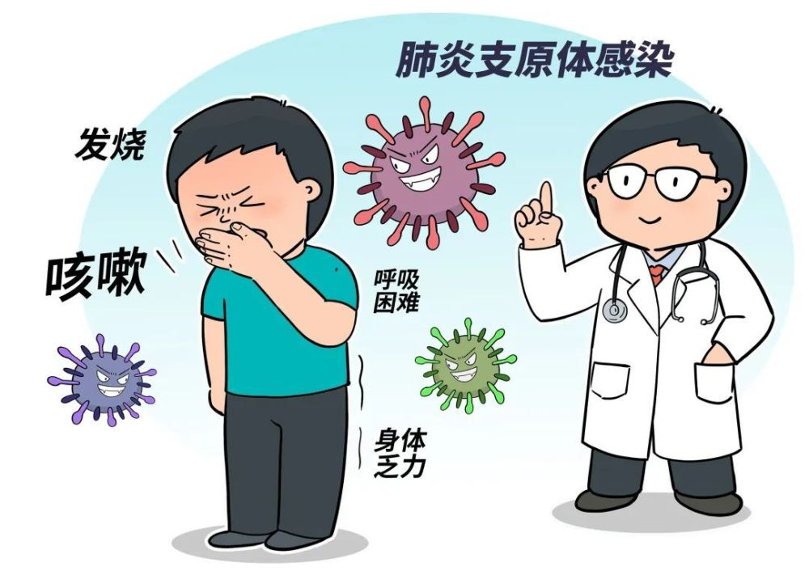
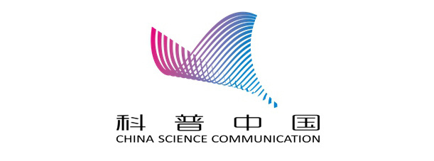

# 今年是肺炎支原体流行大年？阿奇霉素耐药了应该怎么办？

近期，支原体肺炎接连刷屏，北京、上海、重庆等地多家医院出现较多的肺炎支原体感染患者，多以儿童为主。一名宝妈称“儿童医院里的人很多，抽血都要排40分钟”。究竟肺炎支原体感染有何表现？跟流感等疾病有何不同？感染了会有后遗症吗？应当怎样防治呢？一起来学习解惑。

**肺炎支原体感染出现高峰？**

在中日友好医院儿科门诊内，不时有家长带着孩子前来就医。市民王女士的儿子今年10岁，咳嗽得厉害，经检测为肺炎支原体感染。据该医院儿科医生表示，“近来几乎每天都有孩子因为重症支原体肺炎住院治疗。”

医院的数据反映了市民的感受：很多北京市民确实感觉近期身边咳嗽生病的人有明显增多。而肺炎支原体正是北京地区急性呼吸道感染的重要病原体，其分为I型和II型共两种亚型，目前北京市主要流行亚型为I型。虽然大部分肺炎支原体感染者都是儿童，但其实人群对肺炎支原体普遍易感，成人也不能掉以轻心。

▲近期，在中日友好医院儿科门诊内，不时有家长带着孩子前来就医（图片来源/健康时报）

俗话说“对症下药”，要了解这个病症，首先要了解肺炎支原体。事实上，肺炎支原体既不是细菌也不是病毒，而是介于细菌和病毒之间的一种致病微生物，是一种非典型病原。肺炎支原体无细胞壁结构，像是没有穿“外套”的细菌。它有多厉害呢？根据国家卫生健康委发布的《儿童肺炎支原体肺炎诊疗指南（2023年版）》，支原体肺炎是我国5岁及以上儿童最主要的
**社区获得性肺炎** ，以发热、咳嗽为主要临床表现。

那也不对啊，既然是“5岁及以上儿童最主要的社区获得性肺炎”，为什么今年这么突然刷屏霸榜？以前难道没有吗？

答案是有的。肺炎支原体感染可全年发生，北京地区每年感染的高发期是在8月到12月，一般在每年11月左右达到高峰。但今年该肺炎提前来袭，且患者数量较往年明显增加。有儿科医生指出，“今年可能是肺炎支原体流行大年”。

浙江大学医学院附属儿童医院呼吸内科主任医师陈志敏表示：“目前全世界都没有把支原体肺炎列为传染病，但和感冒一样都具有一定的传染性，主要通过飞沫传播，相关的患者每年都会有，但每隔3～7年会发生一次地区性流行。而上一次引发关注的高发病率，是在2018年秋冬时期。”

而今年，从北京、上海等全国各地多家媒体报道可以了解到，从9月份开始，全国的肺炎支原体感染发病率在上升。北京儿童医院呼吸科主任徐保平介绍，自9月以来，北京儿童医院发热咳嗽门诊的日门诊量增加，其中约有20%患儿的肺炎支原体检测结果呈阳性。

关于为什么今年肺炎支原体感染人数激增，南方医科大学南方医院疑难感染诊疗中心主任彭劼认为，在新冠病毒流行期间，人们一直采取戴口罩、勤洗手、保持社交距离等方式防疫，并没有机会接触肺炎支原体，易感人群增加导致群体免疫变差。“过去三年出生的孩子，没有接触很多病原体，家长就要格外留意。”

此外，彭劼认为，今年人们感觉肺炎支原体感染似乎出现高峰，还可能与患者检测病原体意识增强以及医学检测手段增多等有关。

**如何区分肺炎支原体感染与新冠、流感？**

那么，如何判断是否感染了支原体肺炎呢？肺炎支原体感染以发热、咳嗽等为主要症状，一般咳嗽比较剧烈，而且在发热退烧后咳嗽还可能继续1～2周。

广州市妇女儿童医疗中心儿内科门诊主任、发热门诊主任李淑华提醒，肺炎支原体感染表现出多样性，有高热不退的，也有表现为中低热的，有肺炎、肺不张或胸腔积液的患者，也有表现为支气管炎的患者。由于肺炎支原体更容易对肺部造成不可逆损伤，它的治疗切忌拖延，孩子反复发烧三天以上不退，建议要到医院看诊、积极治疗。

李淑华表示，支原体肺炎症状上和普通感冒或流感十分相似，如果家长初期没有引起重视，自行购买感冒药或消炎药给孩子服用，不但不对症、没效果，还会耽误最佳的治疗时机。

但秋冬季节本就易发呼吸道感染性疾病，肺炎支原体感染的症状又容易与新冠、流感等疾病混淆，究竟应该如何区分辨别呢？

复旦大学附属华山医院感染科副主任王新宇表示，新冠病毒感染和肺炎支原体感染可以通过呼吸道标本的核酸检测鉴别，两者的潜伏期明显不同，肺炎支原体潜伏期较长。

北京佑安医院感染综合科主任医师李侗曾介绍，与普通感冒相比，支原体肺炎症状更重、持续时间更长。

北京儿童医院呼吸二科主任赵顺英介绍，除了结合临床和影像学表现以及病原学、血清学检查来判断之外，一个简单方法是观察患儿的咳嗽情况。“该病一般会出现阵发性、成串的咳嗽，早期为干咳，有时影响到吃饭和睡眠。如果患儿出现发憋、喘不过气的症状，家长可以用力拍其后背，清理气道，然后尽快到医院就诊。”赵顺英说。

“关键是及时识别、及时就诊。”专家建议，通过拍背排痰、药物祛痰等手段，必要时进行支气管镜治疗，肺炎支原体感染的患儿可以在较短时间内治愈，基本不会引发生命危险。

**阿奇霉素耐药了应该怎么办？**

北京市疾控中心此前发布提醒：青霉素和头孢对肺炎支原体完全无效，市民如果出现发热伴有剧烈咳嗽，应及时就诊，尽快查明病因、规范治疗，切忌自行盲目用药。

因为肺炎支原体没有细胞壁，而大家所熟悉的青霉素和头孢这类抗生素都是以细胞壁作为靶点，所以对肺炎支原体是完全无效的。肺炎支原体感染的首选治疗药物是大环内酯类药物，如阿奇霉素、红霉素、
**克拉霉素** 等。

但这类药物不可随便乱吃！对于儿童来说，阿奇霉素通常有两种服用方法：三日疗法和五日疗法，分别以3天和5天为1个疗程，在1个疗程结束之后需要停药，频率为“服3停4，服5停2”。

因为阿奇霉素的终末消除半衰期约为68小时，可以理解为该药在体内“滞留”时间较长，用药3天之后，仍有约一半药物留在体内。而且连续用药，易产生耐药。事实上，近年来随着大环内酯类药物在儿童呼吸道感染中的广泛应用，肺炎支原体感染的儿童耐药情况呈上升趋势。

在存在耐药的情况下，除了大环内酯类药物，还有新型四环素类抗菌药物可作为替代药物，主要包括多西环素和米诺环素，对耐药 **肺炎支原体肺炎**
有确切疗效。另一类替代药物为喹诺酮类药物，常用的为左氧氟沙星、环丙沙星、莫西沙星等，由于存在幼年动物软骨损伤和人类肌腱断裂的风险，我国18岁以下儿童使用属超说明书用药。

以上介绍的药物治疗均需在医生指导下完成。近期合并感染的患儿较多，也需要医生在诊断时加以鉴别，大家千万不要自行盲目用药，一定要及时就诊，遵从医嘱。

**支原体肺炎应该如何预防？**

由于现在处于儿童支原体肺炎发病的高发期，各大儿童医院的病房人满为患，首都医科大学宣武医院胸外科首席专家支修益建议，轻症的患儿家庭可以在三甲医院开输液的药，再去二级医院、社区医院等进行输液，等到复查的时候再去三级医院。这样可以有效避免交叉感染，同时在就近的乡村卫生院、社区服务中心等输液也会更加方便。

另一个备受关注的话题是后遗症问题，即支原体肺炎会导致“ **白肺** ”吗？有后遗症吗？

徐保平认为，有的支原体肺炎患者，肺部影像上显示有一片白色，大多是一个肺叶或肺段感染所致，这和医学上所说的“白肺”是两个概念。通常来说，“白肺”是指双肺弥漫性病变，主要发生在重症感染时，其症状和严重程度都与支原体肺炎有所不同。

北京儿童医院小汤山诊疗中心副主任护师张洁称：“支原体肺炎病程多在2周左右，一般预后良好，不遗留后遗症。少数可发展为危重症，常以呼吸困难和呼吸衰竭为突出表现。”

总的来说，如果孩子已经感染肺炎支原体，不要恐慌，不要害怕，及时就医，遵医嘱是最好的选择。而对于还没有“中招”的人群，由于肺炎支原体感染主要是经过飞沫传播，目前还没有针对肺炎支原体感染的疫苗，所以做好日常个人防护，养成良好的个人卫生习惯非常重要。

低龄儿童、免疫功能低下的老年人应尽量避免到人群密集和通风不良的公共场所，必要时戴好口罩做好防护。咳嗽、打喷嚏时使用纸巾捂住口鼻，或用手肘或衣袖等遮挡，将用过的纸巾丢入带盖垃圾桶中。注意手卫生和消毒。

另外，流行高发季节要注意室内通风，养成健康生活习惯，适量运动，增加身体抵抗力，注意保暖，避免受凉。学校、幼儿园等重点场所要注意通风消毒，做好日常的清洁工作，加强健康监测，避免出现聚集性感染。

**撰文/记者 赵玲 图文编辑/陈永杰**

**图片来源/视觉中国**

**审稿专家：**

**支修益（首都医科大学宣武医院胸外科首席专家）**

