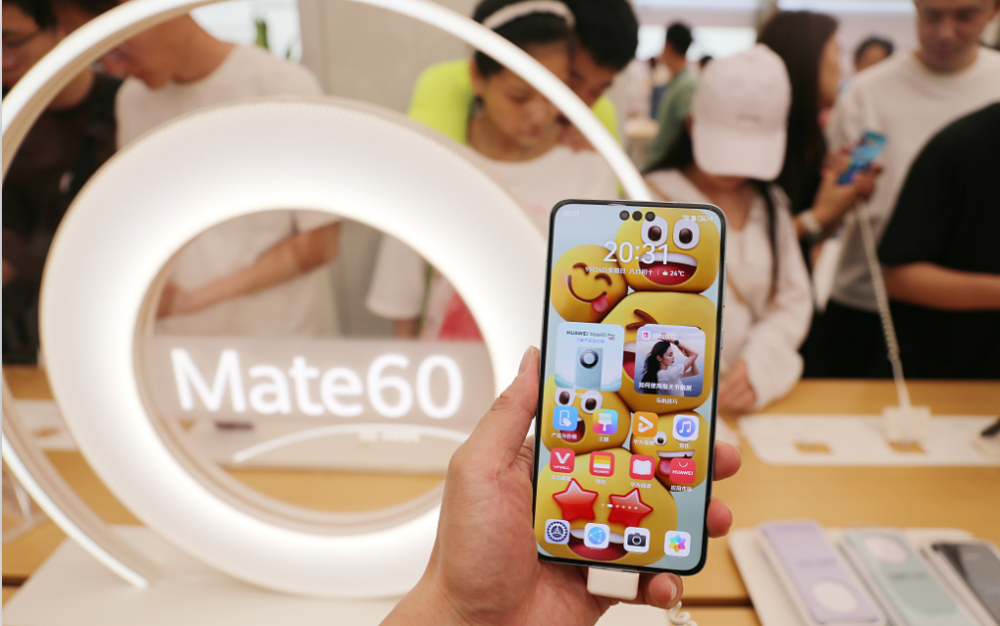
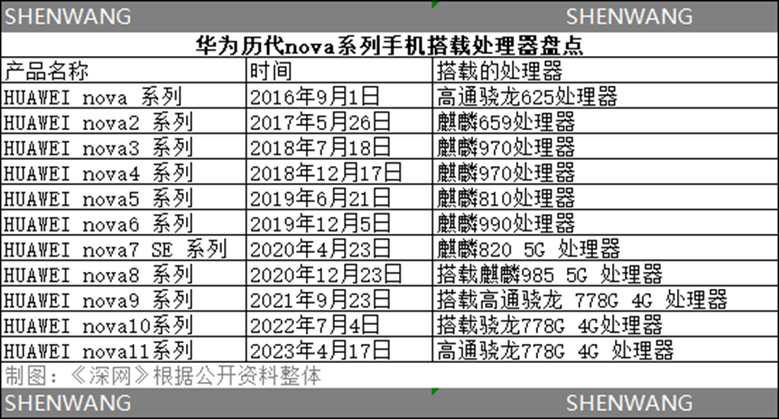
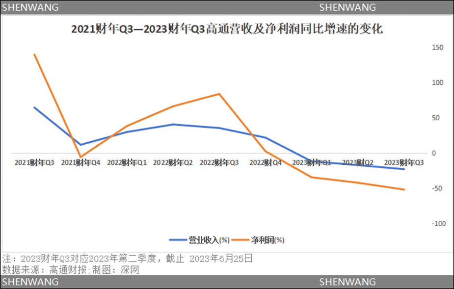

# 华为终止高通合作？紧随Mate 60系列，5G版nova也要来了

_来源：视觉中国_

作者|张睿

编辑|康晓

出品|深网.小满工作室

继华为Mate60系列手机带着5G速度回归后，已经连亏两年多的华为终端核心渠道商又看到了扭亏的希望。

“除Mate60系列搭载麒麟芯片之外，我们已经收到消息，下一代华为nova手机也是5G的，估计今年年底会推出。”知情人士对《深网》透露。

渠道商林烨首次听说华为nova也会出5G手机的消息是在8月底。彼时，华为手机某高管给全国的渠道商开了一次视频会议，会议内容有提到“下一代nova手机也会是5G的”。

把时间线拉回2020年下半年，因为众所周知的原因，华为削减了中低端手机产品线，主做Mate系列和P系列等旗舰手机。8月29日，华为Mate60系列手机带着5G速度回归。据Counterpoint的最新报告显示，在过去六个星期内，华为共售出了160万台Mate60
Pro手机。

如果华为nova能推出5G手机且保证备货量，这也能从侧面说明，华为手机供应链已经趋于稳定。除Mate系列外，nova等其他华为手机产品线或将陆续回归“5G速度”。

**华为中高低端产品线都会出5G手机**

“如果下一代nova手机是5G手机，那么华为中高低端整个产品线都会出5G手机。”某中部省份的华为大商对《深网》透露。

nova系列手机是华为7年前推出的中端手机。

为聚焦年轻消费人群，华为于2016年9月1日在IFA （德国柏林国际消费类电子产品展览会）上发布华为nova 和nova
plus，搭载高通骁龙625处理器，主打中端手机市场。

2017年5月26日，华为推出nova2系列手机，搭载自研的麒麟659处理器，自此开启了“一年两更”的新机发布节奏。2019年12月，nova系列发布第一款5G手机nova6。

但nova系列手机的这种发布节奏被迫停止在2020年底。

2020年下半年，因为众所周知的而原因，华为自研芯片无法得到海外代工生产。供应链危机下，华为不得不将nova的更新节奏调整为“一年一更”，且采用的芯片由麒麟芯片改为高通骁龙的4G芯片。

截至今年4月，华为发布的 nova11系列依然是4G手机，搭载了高通骁龙778G处理器。

8月29日，随着华为Mate60系列手机带着5G速度回归，证明华为“不得不采购高通骁龙芯片”的问题正在逐步解决。

除了旗舰手机Mate系列、P系列及中端手机nova系列外，华为还曾推出中低端价位手机：麦芒系列和畅享系列。在华为今年nova11
系列及全场景新品发布会上，华为畅享也发布了新机60X手机，售价 1799 元起，搭载高通骁龙680处理器。

有华为大商对《深网》透露：“华为在给部分渠道商分货Mate60系列手机时，会要求提货麦芒和畅享系列手机。由于主要是4G手机且知名度不高，提货麦芒和畅享系列手机即亏损。”

而据“手机中国”的消息称，华为正在清理老款机型的库存，它们正在为切换产品线做准备。预计在今年年底到明年年初，华为将会掀起“全线新品的洪流”。

此外，有爆料消息称，华为下一代小折叠手机也将搭载麒麟芯片。

**失去华为订单 高通扩大裁员规模**

nova或将推出5G手机、华为正在清理老款机型库存、华为下一代小折叠手机或将搭载麒麟芯片，一系列的迹象都在指向一点，华为手机正在全面回归。

天风国际证券分析师郭明錤上个月表示：“华为预计从2024年开始，新机型将全面采用新麒麟处理器。高通将成为华为采用麒麟9000S及新麒麟芯片的主要输家。高通不仅将失去华为订单，还要面临非华为中国品牌客户因华为手机市占率提升而出货量衰退的风险。”

郭明錤分析称，华为在2022年和2023年分别向高通采购了2300万至2500万颗和4000万至4200万颗手机SoC。由于华为采用新的麒麟处理器，预计2024年高通对中国智能手机品牌的SoC出货量将比2023年至少减少5000-6000万颗，并将逐年下降。

从业绩上看，高通的单季度营收增速从2022财年Q4就开始大幅下滑。

据财报显示，2023 财年第三财季，高通营收为 84.51 亿美元，同比下滑22.72%，净利润为 18.03 亿美元，同比下滑51.66%。

高通2023财年Q3营收大幅下滑主要受QCT部门营收下滑的影响。该季度，高通QCT 部门营收为 71.74 亿美元，与上年同期的 93.78 亿美元相比下滑
24%。

高通QCT部门主要销售智能手机、汽车和其他智能设备使用的处理器。其中，手机芯片是 QCT 部门的最大业务，2023财年Q3手机芯片营收为 52.6
亿美元，同比下滑 25%。

对于业绩的下滑，高通首席财务官阿卡什·帕尔希瓦拉（Akash Palkhiwala）曾在电话会议上表示，
**高通对今年剩余时间的预测假设华为没有“实质性收入”（material revenue）** 。“如你所知，我们拥有向华为供货的 4G 许可证。我们没有
5G 许可证，并且我们不假设未来会产生任何实质性收入。”

此外，受智能手机市场持续低迷的影响，高通正在扩大裁员规模。据高通向美国加州就业发展部（EDD）提交的文件显示，高通将在加州圣地亚哥总部和圣塔克拉拉裁减1258个职位，裁员将于12月中旬左右开始。

**中端手机市场面临洗牌**

随着华为Mate 60系列的推出，在国内高端智能手机市场，苹果已经率先受到冲击。

曾有黄牛对《深网》透露，iPhone 15开售后的几天内，除了Max版外，其他版本都跌破了官网价。“今年华为Mate 60系列和新款折叠手机Mate
X5太火了，抢了部分苹果手机需求。”该黄牛说。

如果华为nova系列也推出5G产品，这意味着国内中端手机市场或将重新洗牌。毕竟，从2016年9月推出首款nova手机至2019年底，华为nova系列手机已在全球累计售出了1.25亿台。

中端手机是国内手机市场的基本盘。Canalys分析师朱嘉弢曾公开表示，按照美元折算人民币价格来看，1500元-3500元档位内的手机在国内手机市场的占比大概50%。

**nova的历史售价集中在2000元至4000元之间，这恰恰是OPPO、vivo、荣耀等头部手机厂商竞争最激烈的区间市场。**

此外，据接近华为的人士透露，华为已将2024年智能手机的出货量目标定为6000万台至7000万台。

对于华为回归带来的行业竞争，OPPO和荣耀等品牌相关负责人也纷纷表态。

OPPO首席产品官刘作虎在接受《深网》等媒体采访时表示，“华为的回归，从长远看不会对OPPO产生本质的影响，回归自己的产品，其他的不用太关注。君子务本，市场永远靠产品和创新说话。”

对于华为的回归，荣耀CEO赵明在接受《深网》等媒体采访时表示，“优秀对手的回归，让这个行业充满想象力，一个强大竞争对手的出现，可以让荣耀快速的奔跑，基于消费者的需求去创新。”

不过华为手机要强势回归，首先要解决产能和备货问题。

有华为渠道商对《深网》透露，截至目前，除Mate60Pro+分货正常外，Mate60、Mate60Pro、非凡大师及Mate
X5在线下旗舰店普遍处于缺货状态。“256G配置的Mate60Pro缺货尤其严重。”

