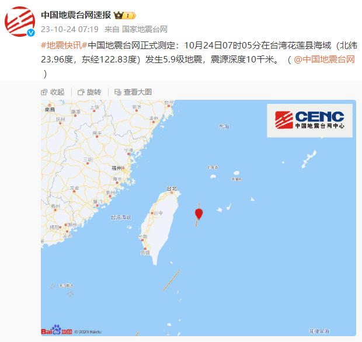

# 台湾再发生4级以上地震

来源：中国新闻网微博

【台湾再发生4级以上地震】
中国地震台网正式测定：10月24日10时54分在台湾花莲县海域（北纬24.03度，东经122.61度）发生4.4级地震，震源深度10千米。

**台湾花莲县海域发生5.9级地震，震源深度10千米**

中国地震台网正式测定：10月24日07时05分在台湾花莲县海域（北纬23.96度，东经122.83度）发生5.9级地震，震源深度10千米。

