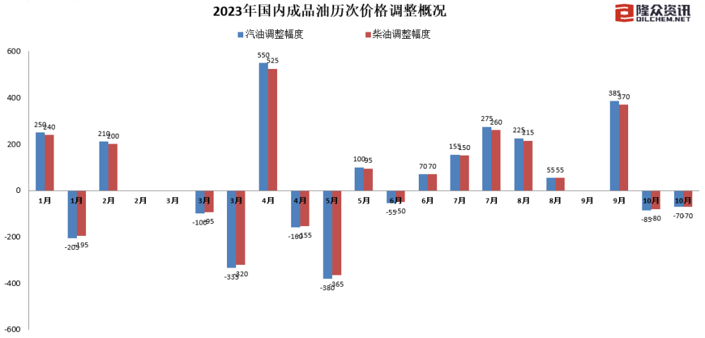

# 国内成品油价两连跌，加满一箱油少花2.5元

本次调价过后，今年成品油价将呈现“十涨八跌三搁浅”的格局。

_图片来源：视觉中国_

界面新闻实习记者 | 李晗

成品油价迎来年内第八次下调。

10月24日，国家发改委发布消息称，自24时起，国内汽油价格与柴油价格均下调70元/吨。折合升价，92号汽油下调0.05元，95号汽油和0号柴油下调0.06元。

此次调价后，私家车与物流企业用油成本减少。以油箱容量50升的普通私家车计算，此次调价后，车主加满一箱油将少花2.5元。对于满载50吨的大型物流运输车辆而言，平均每行驶一百公里，燃油费用减少2.4元左右。

据隆众资讯计算，调价后，全国大多数地区车柴价格在7.9-8.1元/升左右，92号汽油零售限价在7.8-8元/升。

本次调价是今年第二十一次成品油调价，也是年内第八次下调。本次调价过后，今年成品油价将呈现“十涨八跌三搁浅”的格局。

_图片来源：隆众资讯_

“本轮计价周期内，国际原油价格走势较为动荡，但原油价格涨幅较小，不足以扭转零售价下调趋势。”金联创成品油分析师王延婷称。

卓创资讯分析师王雪琴表示，一方面，地缘政治局势升级，市场担忧风险外溢，或导致中东石油产量和出口中断，对原油价格起到支撑作用；另一方面，美国石油去库幅度较大，亦对原油价格形成支撑，价格重心有所上移。

隆创资讯分析师刘文杰认为，虽然巴以冲突带来的地缘风险仍令市场担忧，但冲突尚未威胁到实际原油供应。

“后期巴以冲突亦出现缓和迹象，沙特与俄罗斯的表态在一定程度上缓解了投资者对能源供应中断的担忧，让国际原油价格重回跌势。”王延婷表示。

她分析称，十一长假过后，汽油需求逐步回归平淡。受国内经济增速欠佳以及下游前期备货充足影响，柴油市场刚需表现疲软。

截至北京时间10月24日凌晨，WTI 原油期货结算价收报85.49美元/桶，跌幅2.94%。布伦特原油期货结算价报89.83美元/桶，跌幅2.53%。

据金联创测算，截至10月24日第十个工作日，参考油种均价89.3美元，变化率-0.99%。

机构对下一轮成品油调价方向存在分歧。

王延婷表示，后市来看，短期内国际原油价格仍存下行风险，消息面对后期行情难有提振。受消息面与需求面的打压，国内汽柴油行情仍存下行压力，但资源供应缩减提振下，幅度将收窄。

隆众资讯分析师李彦则认为，目前巴以冲突导致地缘不确定性仍存，潜在利好支撑延续，预计下一轮成品油调价上调的概率较大。

王雪琴称，以目前原油来看，新周期原油变化率或正值低位开局，成品油零售限价面临搁浅预期。但目前距离调价窗口开启尚有较长时间，原油价格走势仍存在较大不确定性。因此，新一轮调价方向并不明朗。

按照当前成品油调价周期测算，下一次调价窗口将在11月7日24时开启。

