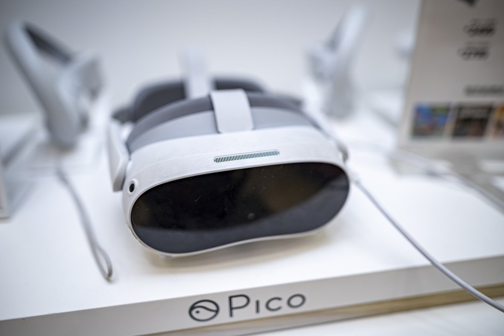

# 字节系元宇宙业务转向？PICO近半员工离开，多名高管离职调岗

_PICO 4 VR 展示。视觉中国 资料图_

字节跳动正在重新考虑字节跳动VR（虚拟现实）业务PICO的战略定位。

10月23日，澎湃新闻记者从多位知情人士处独家获悉，近期PICO多位核心业务负责人相继离职和调岗，今年上半年，PICO副总裁任利锋已实际意义上处于离职状态，长期不负责PICO的业务管理，但仍挂职在公司内。

澎湃新闻记者确认到，目前任利锋在字节跳动内部系统“飞书”的状态为“请假”。据知情人士透露，任利锋将在今年年底正式离职。

目前，PICO内部业务主要分为市场部门、硬件部门、OS产品部门、内容文化部门和社交中心，其中大量员工被裁员或主动离职。

据内部员工告诉澎湃新闻记者，PICO此前高峰期员工数量超过2000人，其中市场部门员工离职约2/3，技术部门流失率稍低，目前整体离职员工数量接近高峰时期的一半。

当天晚些时候，PICO相关负责人回复澎湃新闻称，公司会保持产品正常运营，并持续加强在产品技术方面的投入。

多名高管相继离开

澎湃新闻记者独家获悉，PICO总裁周宏伟目前直接指挥硬件部门，OS产品部门负责人为马杰思，其原来为小米VR部门总负责人。据去年5月的公开报道，马杰思进入PICO后担任社交中心负责人，负责旗下“轻世界”产品，但据知情人士透露，目前社交中心已流失大量员工，对“轻世界”的投入也大幅缩减，马杰思已任OS产品部门负责人。不过，目前马杰思在飞书上的状态仍为社交中心负责人。

此次离职的重灾区是PICO的内容文化部门。内容文化部门总负责人正是任利锋。作为抖音团队的创始成员之一，任利锋曾担任产品负责人，被外界视为抖音“元老”之一。

任利锋调任PICO后，不少抖音核心骨干相继转岗PICO，其中包括抖音综艺负责人宋秉华、抖音娱乐总监吴作敏等。

澎湃新闻记者了解到，在任利锋长期处于接近离职状态后，原抖音综艺负责人宋秉华在去年年底已经调岗回到抖音，仍回到综艺和娱乐部门。吴作敏目前仍在PICO负责视频业务，但未来或有变动。今年9月至10月内，曾深受任利锋重用的PICO视频直播负责人刘彧已离职。另外，任利锋手下的内容产品负责人也已经离开PICO，转岗回到抖音内部。

根据澎湃新闻记者梳理，这也意味着，在字节宣布收购PICO两年内，来自抖音的核心管理层已有相当数量离开了PICO。

公开资料显示，周宏伟在2015年创办PICO，他毕业于哈尔滨工业大学，曾在果链代工巨头歌尔股份任职十年。离开歌尔声学之后，周宏伟选择创业，并组建VR技术团队，进入头显市场。2021年9月，字节正式宣布收购PICO，高调入局VR行业，周宏伟也选择和字节跳动团队共同管理PICO。

知情人士告诉澎湃新闻记者，周宏伟近期曾前往新加坡，和字节跳动创始人汇报PICO相关动态，“高层对PICO的兴趣似乎没有前两年大了，所以预计PICO未来的发展方向将会有调整。”另一内部人士透露。

值得注意的是，有内部人士向澎湃新闻记者指出，有传言称，2021年在字节跳动收购PICO时，与原PICO管理层签订合作协议，原PICO管理层将获得一定经济回报，目前合作协议规定的期限未到。不过该消息未得到字节方面的证实。

2022年9月27日，PICO在中国市场正式发布新一代VR一体机——PICO
4系列，售价2499元起。该产品是PICO被字节跳动收购以来，首次发布升级换代产品，一经发布便吸引广泛关注。

当时，字节跳动副总裁杨震原在接受澎湃新闻记者采访时表示，字节在VR行业接触了很多公司，和PICO聊得最好，也认为PICO是其中最有潜力、文化上最匹配的公司。“当时大家一拍即合，PICO就加入了字节。”
他认为，双方匹配的原因主要由于PICO与字节的内容业务可以结合。

元宇宙，进攻还是撤退

据澎湃新闻记者了解，从2021年9月字节正式宣布收购PICO以来，PICO团队规模扩张极为迅速，从最初的200人扩张至约2000人，其中海外团队占比约30%。

自从PICO４发布以来，有关PICO的质疑声不绝。此前有传言称，由于内部组织人数快速扩张，在PICO内部分裂成“抖音派”和“PICO派”不同团队，并出现派系之争。

去年11月，PICO相关负责人曾告诉澎湃新闻：“非常重视外界对PICO的关注和对产品的反馈。但是对于公司组织层面的一些猜测和传言，只能说这是一种臆测，不符合事实。”

今年以来，PICO更是经历多轮裁员，今年2月份，其裁员规模达到20%-30%。另有媒体报道称，PICO业务将被逐步关停，字节跳动放弃元宇宙。

对此，10月23日，字节方面回应澎湃新闻记者称，消息不实，PICO在正常运营，公司会长期投入XR业务。

去年爆红的元宇宙业务，已成为让不少大厂头疼的“鸡肋”。有消息称，腾讯从今年8月开始重组XR团队，并计划代理Meta旗下的VR头显Oculus
Quest，参考腾讯与任天堂的合作方式。澎湃新闻记者从接近腾讯人士处获悉，该消息属实。

公开资料显示，XR指的是扩展现实，是VR(虚拟现实）/AR（增强现实）/MR（混合现实）三者的集合，通过将三者的视觉交互技术相融合，为体验者带来虚拟世界与现实世界之间无缝转换的“沉浸感”。XR被视为元宇宙领域的重要技术之一。

今年2月16日，腾讯曾对XR业务进行大规模调整，被外界视为接近退出XR业务。当时，腾讯回应澎湃新闻称，计划对自研硬件发展路线调整，并对业务线内相关的组织、岗位进行优化。除腾讯、字节之外，今年以来，包括Meta、微软、快手等多家公司陆续对元宇宙、XR业务进行组织或人员调整，以进一步提升业务效率。

过于“烧钱”是元宇宙业务在大厂内部频频受阻的重要原因。“VR硬件的器件需要定制，不管是核心器件还是整机制作成本都极为高昂，目前市场需求还在培育阶段，盈利路径不清晰。”一位PICO技术人士曾告诉澎湃新闻记者，“目前VR开发至少需要100人以上的团队做硬件和软件，且在设计与制造、内容制作、算法优化等领域都要持续性投入。如果资金实力不足且产品力不强的话，持续投入几年后就会面临资金困难，需要较长期的投入和足够的耐心。”

