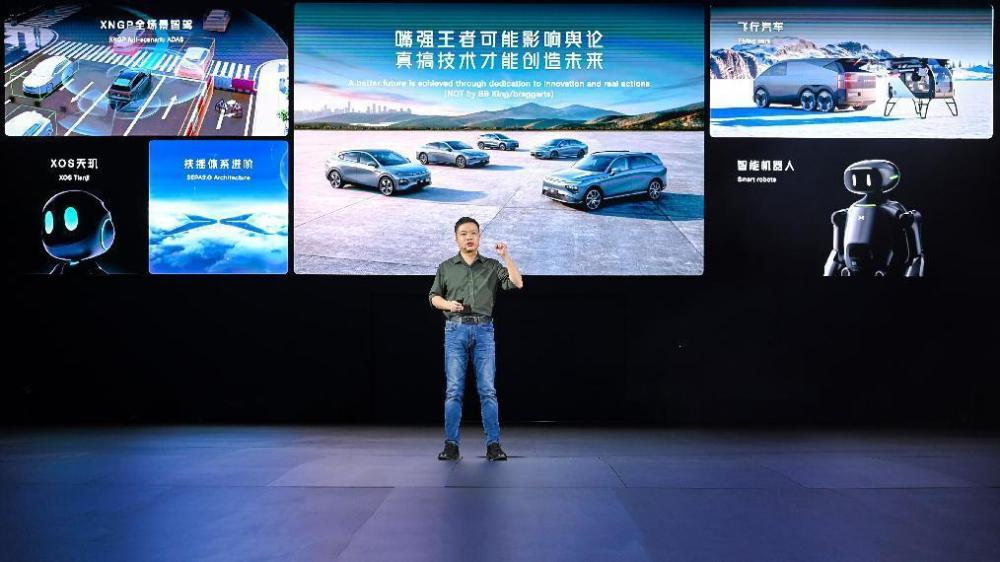
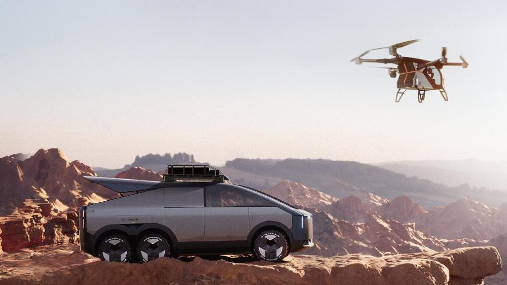

# 小鹏汽车科技日看点：发布飞行器和机器人、MPV车型X9亮相

腾讯新闻 《远光灯》刘雨点

10月24日，1024小鹏汽车科技日在广州举行。小鹏汽车董事长兼CEO何小鹏在演讲中称，汽车将从软件定义汽车逐步进化至AI定义汽车的时代。

本次发布会有四个看点，分别是MPV车型X9亮相、XNGP城市导航辅助驾驶进展，以及发布飞行器和机器人。

**发布会的看点之一MPV车型X9亮相。**

小鹏X9是小鹏“扶摇”架构下的旗舰车型，是一款纯电智能大七座车型，将承接“扶摇”架构的技术，搭载后轮转向、800V、一体式铝压铸、XNGP等。其将登陆今年11月举行的广州车展。

**发布会的看点之二是XNGP城市导航辅助驾驶。**

此前，小鹏汽车已对外公布11月XNGP城市导航辅助驾驶覆盖至25城，12月底开放至50城。本次发布会上，何小鹏表示：小鹏汽车不画大饼，不偷换概念，“开城”及“AI代驾”两种模式将同步进行。

24日活动当晚，首批“开城”城市将正式开启公测，“AI代驾”开启小范围测试，并将于近期全量开放，系统版本号4.4.0。

**发布会的看点之三是两种飞行器。**

小鹏选择飞行汽车的两条发展路径，即陆空一体式飞行汽车和分体式飞行汽车。

其中，陆空一体式飞行汽车采用陆行/飞行双模式座舱，并在前两年公布的造型基础上进行了进一步优化，采用超跑造型设计；旋翼、机臂等飞行系统可完全折叠并收纳进车内，可降低陆行时的风阻系数。

分体式飞行汽车则由陆行体和飞行体构成，陆行体具有可乘坐4-5人的座舱，采用增程式混合动力系统，可搭载飞行体行进并为飞行体持续补能；应用纯电动垂直起降技术的飞行体搭载270°全景双人座舱，支持手动/自动驾驶两种驾驶模式，可与陆行体自动分离/结合。

据何小鹏介绍，分体式飞行汽车拥有更多的应用场景：不仅能纵向拓展个人用户的出行边界，也可服务于应急、救援等公共事业。

**发布会的看点之四是自研双足机器人，具备末端触觉感知能力。**

这次他们的机器人从四足到双足，据何小鹏称，该机器人进化出一双超轻量级类人手臂和仿人灵巧手，单臂最大负载3kg，最大末端线速度1m/s，可针对不同形状的物体提供个不同的抓取包覆姿态，并具备末端触觉感知能力。

