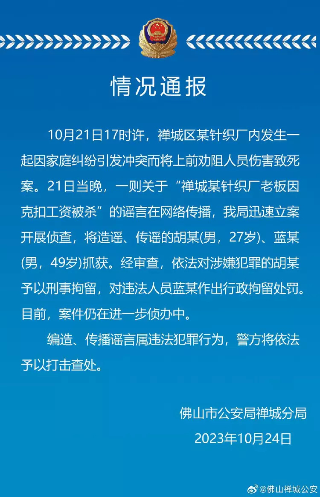

# 广东佛山某针织厂老板因克扣工资被杀？警方再回应：两男子涉造谣被抓

广东省佛山市公安局禅城分局官方微博10月24日通报，21日17时许，禅城区某针织厂内发生一起因家庭纠纷引发冲突而将上前劝阻人员伤害致死案。当晚，一则关于“禅城某针织厂老板因克扣工资被杀”的谣言在网络传播，该局迅速立案开展侦查，将造谣、传谣的胡某（男，27岁）、蓝某（男，49岁）抓获。经审查，依法对涉嫌犯罪的胡某予以刑事拘留，对违法人员蓝某作出行政拘留处罚。目前，案件仍在进一步侦办中。

来源：@佛山禅城公安

