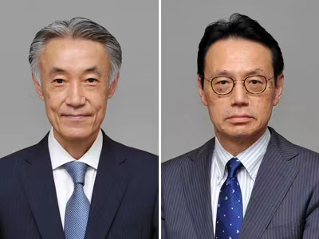

# 日媒：日本同日宣布任命新任驻华和驻美大使，金杉宪治为新驻华大使

【环球网报道 记者 赵博元】据日本共同社报道，日本政府周二（24日）宣布任命金杉宪治和山田重夫分别为新任驻中国和美国大使。

 _山田重夫（左）、金杉宪治（右）图源：日本共同社_

报道称，这两名大使的任命正值日本盟友美国明年举行总统大选之际，同时东京也希望与北京举行高层对话，以缓解紧张的双边关系。

共同社称，金杉宪治将是约7年来首位非外务省中文研修班出身的驻华大使。日本外务省中文研修班出身的外交官被称为“中国帮”，包括现驻华大使垂秀夫在内的多名驻华大使均为中文研修班出身。据日本媒体介绍，现年64岁的金杉宪治于1983年加入外务省，曾任外务省经济局局长、亚洲大洋洲局局长、负责经济事务的外务审议官等职，现任日本驻印尼大使。共同社称，金杉宪治专业方向是对美外交，其信息收集能力得到公认，并以高超的信息分析能力和在美国等国丰富的人脉关系而为人熟知。

中国社科院日本研究所研究员吕耀东对《环球时报》记者表示，虽然不是“中国通”，但金杉宪治对亚洲事务有足够的了解，在这一点上同垂秀夫区别并不是太大，只是外交经历不同。而且相比垂秀夫，金杉宪治又具备对美工作阅历和人脉，因此更善于从日美同盟的出发点，处理对华、对东亚事务。他还有经济方面的工作经历，又擅长信息收集，这也符合日本现在对华在经济安保方面的政策取向。日本政府如果最终任命金杉宪治为驻华大使，那么应该是基于以上考量，即落实日本外交基本方针中的对华政策，进一步强化日美同盟在东亚的“威慑力”，维护日美既得利益。“我们未来除了要看他怎么改善中日关系，也要从他对东亚区域经济合作的态度，以及如何落实日本的东亚政策来观察他。”

