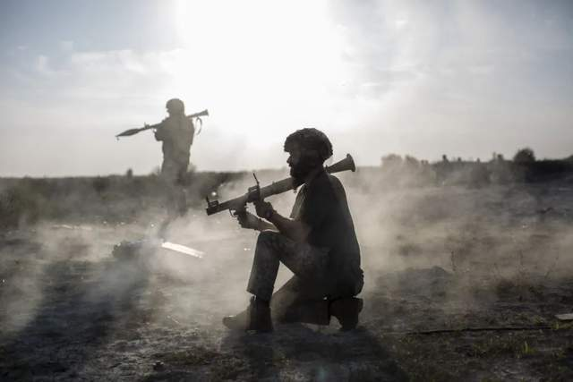

# 欧美领导人纷纷去以色列，乌克兰忧虑了

“把全世界所有的武器弹药生产能力加在一起，都不足以应对乌克兰的战争。”这是乌克兰政府战略工业部长卡梅辛10月23日的最新表态。当天，卡梅辛陪同乌克兰总理什梅加尔前往德国柏林。他们的任务是：在全球目光聚焦于巴勒斯坦和以色列时，说服欧洲主要军火供应商继续向乌克兰提供武器弹药。

随着以色列加大对巴勒斯坦加沙地带的空袭力度，并积极采取大规模的地面军事行动，美国承诺向以色列提供军事援助。虽然美国总统拜登21日再次重申“对以色列和乌克兰的支持同等重要”，但西方国家领导人近期的飞行轨迹正向中东地区集中。24日，法国总统马克龙也访问了以色列。

_9月21日，顿涅茨克地区，乌克兰士兵在一处射击场进行军事训练。图/视觉中国_

在此背景下，乌克兰首先担忧的是军火供应。五角大楼发言人莱德22日称，对乌克兰和对以色列的援助并不相同，“有能力同时满足两国的需求”，但卡梅辛的表态显示出，乌方对此持不同意见。莱德也承认，两份援助计划有所交叉，包括乌军急需补充的155毫米炮弹。

如果供给真的出现矛盾，更可能拿到弹药的是以色列。美国国会众议院的议长之争尚未结束，而“逼宫”前任议长麦卡锡下台的共和党极右翼，正激烈抵制对乌援助。拜登新提交给国会的1050亿美元国家安全一揽子计划，包括614亿美元对乌克兰援助和143亿美元对以色列援助。一些众议员明示：可以先将对乌援助剔出交易，优先讨论对以援助。“我们需要取消对乌克兰的资助，给予以色列伙伴应有的尊重。”
众议员加西亚说。

更令基辅担忧的是，如果美国政府及国会在战争期间都不能保持对乌援助，西方对乌克兰战后重建的承诺又如何能落到实处？战前，乌克兰有4100万人口；根据最新测算，考虑到青年人口的大量流失，未来30年乌克兰人口将降至2900万以下。乌政府经济部警告，人口危机的连锁反应将“阻碍任何复苏”。

恶性循环是：经济和社会发展状况越糟糕，乌克兰就越难加入欧盟；乌克兰距离欧盟越远，在欧盟国家的乌克兰难民就越可能选择留在当地。这一切都意味着，如果乌克兰不想沦为“失败国家”，就需要西方盟友在战后第一时间落实千亿美元级的重建援助。如果美国因对以色列“分心”而减少对乌援助，将重挫乌政府战后重建的信心。

面对危局，乌克兰总统泽连斯基采取一系列行动。除了派出高层官员游说欧洲军火商外，在10月23日的最近一次全国讲话中，泽连斯基强调要维持世界对乌克兰局势的关注。当天，乌克兰总参谋部报告称，俄罗斯军队突然在东线战场大规模进攻，巴赫穆特、红利曼等焦点地区再次陷入激战。乌军说，最近几天的冲突数量已达到10月中旬的两倍。

23日，泽连斯基还和沙特王储萨勒曼通话，讨论中东局势并亲自邀请沙特派代表出席下一次乌克兰问题国际会议。今年8月，第二次乌克兰问题国际会议在沙特阿拉伯吉达举行，42国代表与会，数量翻倍，被各方视为重启和平进程的积极信号。沙特也是俄乌换俘对话的重要中间方。如今，第三次乌克兰问题国际会议即将于10月28日在马耳他召开，但国际社会、特别是作为“俄乌调停人”的中东各国的目光已聚焦于巴勒斯坦。

《金融时报》写道，在一系列博取关注的活动中，泽连斯基“小心翼翼地避免让自己显得像是在争夺注意力，他对在袭击中失去亲人的以色列人表示同情，并将他的战争与以色列的战争进行比较”。据以色列媒体报道，泽连斯基还向以方表示：希望访问以色列以示声援。但他得到的回应是“不是时候”。

分析指出，和乌克兰相比，不论在战场上还是争取西方援助上，以色列目前都处于优势地位。10月以来的多份民调显示支持对乌军援的美国选民只占四成。与此同时，有民调称64%的美国选民赞成军事援助以色列，拜登的执政支持率也因其明确支持以色列的立场而有所上升。

记者：曹然

编辑：徐方清

