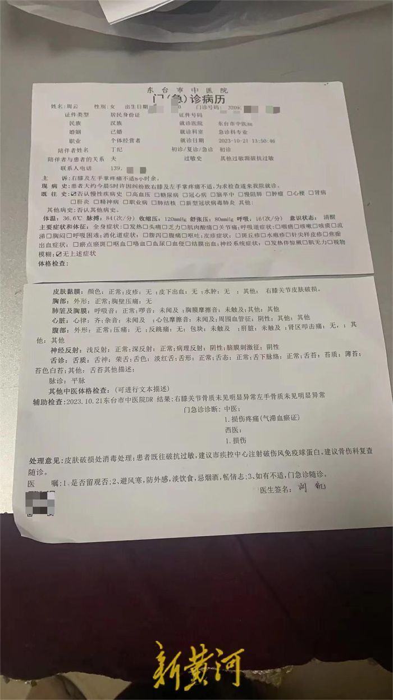
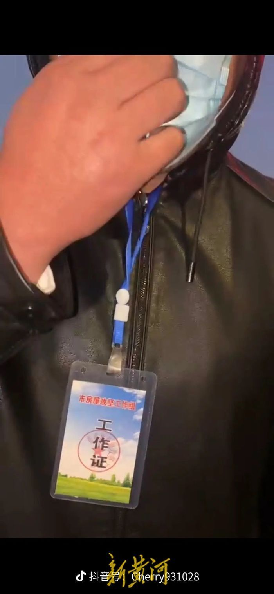

# 江苏东台多名男子持棍打人，网友：因拆迁问题，自家房子已被推平

10月21日，有网友在网上发布多条视频。视频中，多位手持铁棒或木棍的男子，头戴帽子，口罩遮脸，对着视频拍摄者挥舞起了手中的铁棒和木棍。该网友称，被打者系自己父亲，事件起因与拆迁有关。

_本文图片均由受访者提供_

据视频定位，事发地为江苏省东台市东台互通主线桥附近。23日，东台市公安局城东派出所就此事回应新黄河记者称，“确有此事，持棍打人者已被抓。”

据该网友介绍，视频中被打的是她54岁的父亲。“我们家在江苏省东台市高新区团北村九组，位于344省道附近。10月21日早上5点左右，几十个人带着挖掘机聚在我们家附近，推平了我们家的一座钢结构房子。”该网友称，此前他们没有接到任何拆迁方面的通知及相关公告。

该网友的父母听闻自己房子被拆，赶到事发现场对拆迁阻拦无果后，遂拿出手机进行拍摄。“对方先是抢手机，接着就有五六个戴着帽子和口罩的男子，拿着木棍、铁棒和扫帚，对我家人进行驱赶，带头动手的男子看我爸在拍，直接用铁棍子打在了我爸的胳膊和腰上。”该网友向新黄河记者展示了其父背后的长条状淤青，疑似棍棒伤。

事发后，该网友及其父亲立即报警求助。网友父亲也被送往东台市市中医院检查，其诊断结果显示为：损伤。“我们报案后派出所到了现场处置，但是至今都没拿到立案回执。”

据该网友拍摄的其他视频显示，现场除有挖掘机外，还站了多位手拿扫帚，口罩遮面，胸前戴着工作牌的疑似工作人员。蓝色脖绳的工作牌上写有“市房屋攻坚工作组”字样。在视频中，还能看到写着“东进路东段城市化改造、高新区东区城市更新建设指挥部”的红色条幅。

23日，新黄河记者就此事多次联系江苏省东台市高新区管委会多个相关电话，均无人接听。随后，新黄河记者联系了东台市公安局城东派出所，接电工作人员回复称确有此事，“当时的确是我们出的警，打人的都已经被抓起来了。”

记者:梅寒 剪辑:梁明星 校对:杨荷放 编辑:邢志彬

