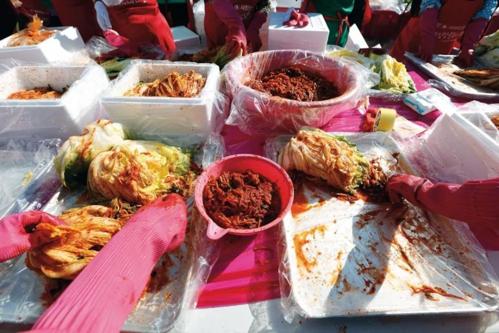
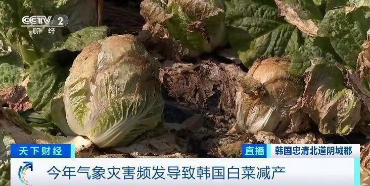
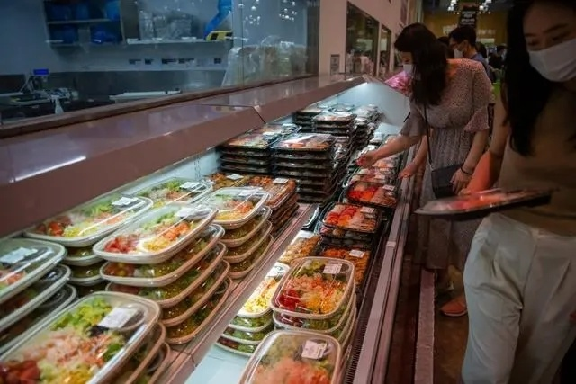

# 泡菜波及尹锡悦：一棵白菜36元人民币，韩政府投放2900吨白菜抗通胀

_▲资料图：志愿者们在泡菜节上制作泡菜。图/新华社_

据参考消息网援引韩联社报道，韩国政府22日决定在每年的泡菜季到来前投放2900吨白菜，称这是为抗击通胀和支持人们生活所做的最新努力。

国民力量党发言人、众议员朴正夏（音）对记者说，这一决定是在政府官员与该党议员举行的一次会议上达成的。

说起来韩国通胀率并不算高。据韩国统计厅最新数据，韩国8月份消费者价格指数（CPI）同比上涨3.4%，9月上涨3.7%。虽呈现上涨之势，但与2022年5.1%的通胀率相比，已回落很多。韩国政府之所以还要投放白菜，是因为食品价格涨得实在离谱。

**一棵白菜36元人民币**

据韩国食品流通部门发布的数据，刚刚过去的一周，韩国市场一棵白菜的平均零售价约合人民币36元，在短短一个月内涨了20%。这个价格与一年前相比上涨11%，与2018年至去年的平均价格相比上涨了21%。

除了白菜外，腌制泡菜所需的大葱、生姜等价格与去年同期相比涨幅也都超过了20%。

韩国腌制泡菜的成本急剧上升，直接原因是白菜等原材料产区遭了灾。今年夏季，韩国连续遭遇酷暑和暴雨，导致数十人死亡，韩国白菜主产区江原道的夏白菜减产。进入秋季，江原道软腐病在秋白菜中蔓延，又导致秋白菜减产。

原材料价格如此昂贵，所以韩国现在腌制泡菜的家庭越来越少了。2019年韩国还有42%的家庭在冬季到来前腌制泡菜，今年就跌到了20%多。不过韩国人吃泡菜的习惯还在，近年来，韩国泡菜年消费量一直稳定在180万吨以上。所以选择买包装好的泡菜或去餐厅吃泡菜的人越来越多。

这间接带动了韩国餐厅食品价格的飙升。据韩国消费者院价格信息门户网站10月16日的数据，9月份，首尔一碗炸酱面的价格首次涨到了7000韩元以上，达到了7069韩元（约人民币38.26元），一人份200克的五花肉涨到了1.92万韩元，一份泡菜汤的价格则涨到了惊人的7846韩元。

首尔居，大不易。当然，这不仅只有白菜、葱姜价格飙升这一个原因。

_▲资料图。图/央视视频截图_

**韩国粮食自给率过低是关键**

更深层的原因是，受地理条件制约，韩国人均耕地面积只有0.6亩，实际上韩国的农业发展禀赋远不如北方邻居朝鲜。所以韩国的粮食自给率一直很低。

而韩国粮食自给率不足情况还在进一步恶化。

据韩国统计厅去年的数据，2000年韩国粮食自给率尚为30.9%，但2020年已降至19.3%。比较一下粮食自给率同样低的日本，自给率尚能保持在27.3%，比韩国还高8个百分点。

韩国除大米基本能自给自足外，其余粮食产品均需进口。因此韩国食品价格受外部环境制约极大，大起大落成了常态。

而从去年到今年，韩国食品供应连遭重创。

俄乌冲突后，多国限制粮食出口。像俄罗斯限制小麦、葵花油和糖出口，乌克兰限制小麦、燕麦等出口。而韩国小麦自给率还不到1%，价格不涨都不行。

而这一轮巴以冲突引发的潜在石油危机，又进一步提高了韩国的总体通胀率，带动韩国食品价格连连上升。目前在发达国家中，韩国的食品价格仅次于瑞士。

 _▲资料图：人们在韩国高阳市一家超市购物。图/新华社_

**冲击韩国“泡菜文化”**

泡菜号称韩国人的“灵魂食物”，但如今韩国泡菜面临的问题，足以打击韩国非常傲娇的“泡菜文化”。

不少人应记得2020年底那场中韩“泡菜”之争。当时“中国泡菜之乡”四川省眉山市历时三年半，牵头提出了相关国际标准的制定，最终通过国际标准化组织投票，形成了ISO
24220《泡菜（盐渍发酵蔬菜）规范和试验方法》国际标准。该标准中泡菜的英文就是 “pao cai”。

韩国对此极为敏感，不少韩国网民与中国网民展开争论，甚至韩国政府也卷入其中，2021年，韩国文化体育观光部出面强调韩国泡菜已改名“辛奇”。其实这个名字2013年韩国就用过了，只是没掀起什么浪花。

不仅是“泡菜文化”受冲击，对于尹锡悦政府来说，也是冲击。

10月11日，有韩国“小型国会选举”之称的首尔江西区区厅长补缺选举，尹锡悦力挺的金泰宇大败，导致他所属的韩国国民力量党领导层集体辞职。

10月23日，韩国民调机构公布的调查结果显示，尹锡悦的施政好评率为32.5%，差评率为64.1%，好评率再次下降，差评率再次上升。

泡菜是韩国民众有直接观感甚至敏感的问题，需要尹锡悦政府好好应对。只是，饭碗不端在手里的韩国，恐怕很难解决泡菜和其他食品问题。至于韩国政府投放的2900吨白菜，与韩国180万吨的年泡菜消费量相比，实在是微不足道。

撰稿 / 徐立凡(专栏作家）

编辑 / 刘天红

校对 / 刘军

