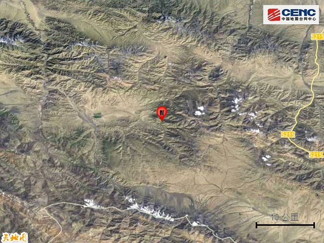

# 甘肃酒泉市肃北县发生5.5级地震 震源深度10千米

据中国地震台网正式测定，10月24日19时32分在甘肃酒泉市肃北县发生5.5级地震，震源深度10公里，震中位于北纬39.43度，东经97.28度。

本次地震周边5公里内的村庄有东沟、刃岗沟、韭菜沟，50公里内无乡镇驻地分布，100公里内的乡镇有昌马镇、赤金镇、清泉乡、玉门东镇、玉门镇、小金湾东乡族乡。

震中距嘉峪关市95公里、距玉门市98公里、距肃州区111公里、距金塔县152公里、距瓜州县176公里，距嘉峪关市95公里，距酒泉市109公里，距兰州市688公里，距西宁市504公里。

震中5公里范围内平均海拔约3474米。

根据中国地震台网速报目录，震中周边200公里内近5年来发生3级以上地震共37次，最大地震是2022年3月26日在青海海西州德令哈市发生的6.0级地震（距离本次震中104公里），历史地震分布如图。

