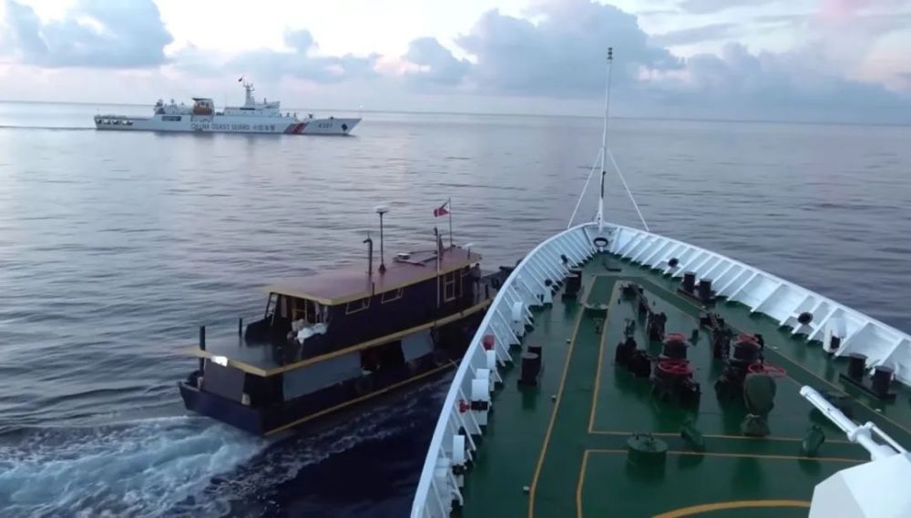
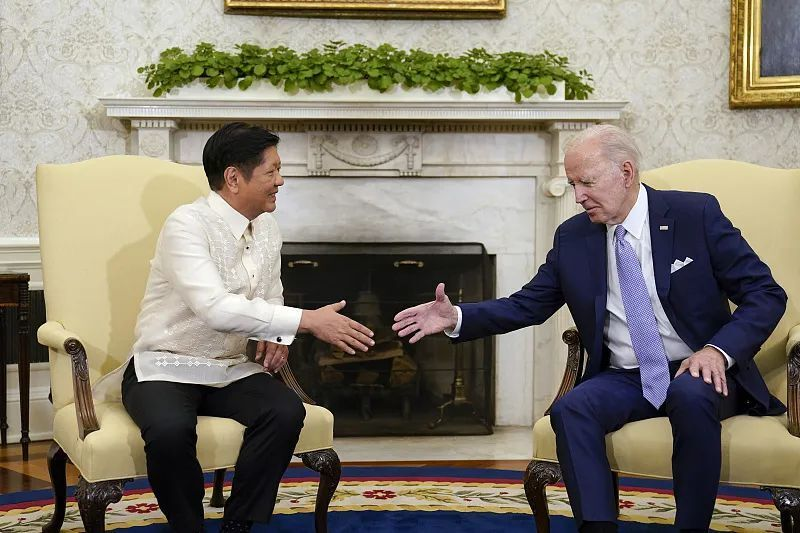
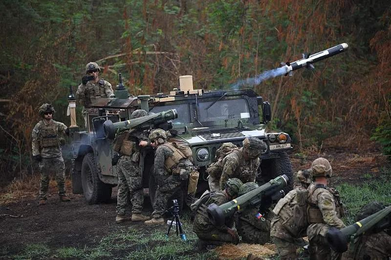

# 菲律宾在南海持续挑衅 专家：不仅是试探中国底线 还高估美菲军事同盟

最近一段时间，菲律宾在南海动作不断，反复在仁爱礁和黄岩岛海域挑衅，严重侵犯中国的领土主权。

10月22日，菲方挑衅行动进一步升级。菲律宾2艘民用船和2艘海警船未经中国政府允许，擅自闯入中国南沙群岛仁爱礁邻近海域，且不顾中国海警船警告，执意冲闯仁爱礁潟湖，并以危险方式碰撞现场执法的中国海警船和正常作业的中国渔船。

_菲方船只以危险方式接近中方船只导致擦碰。视频截图_

菲方的一系列侵权挑衅行动，离不开美国的怂恿支持。军事专家告诉长安街知事（微信ID：Capitalnews）
，菲律宾持续的挑衅行动是在进行“两个试探”，一是对中国底线红线的试探，二是对美菲军事同盟的试探。

而这也恰恰是菲方的“两个误判”，既低估了中国维护自身领土主权和海洋权益的坚定决心和意志，同时高估了美国对其所作出的“承诺”。

湖南师范大学外交研究中心主任滕建群指出，同以往相比，菲律宾近一段时间采取的挑衅行动更为大胆和猖狂，手段也更加直接，在非法侵占我岛礁的同时，还对我们的渔船、执法船进行擦碰，恶意碰瓷，试图在南海地区挑起事端，从而让美国介入，以实现对仁爱礁和黄岩岛的控制和占领。

“从历史传承和国际法理来看，中国对仁爱礁和黄岩岛拥有无可争辩的主权，而现在菲律宾采取冒进激进的做法，显然是非常危险的。”滕建群说。

军事专家宋忠平指出，菲律宾持续在海上滋事挑衅，其实是进行“两个试探”。

第一是对中国的试探，包括在仁爱礁、黄岩岛问题上对中国底线、红线的试探。

第二是对美国特别是菲美军事同盟的试探。如果中菲之间出现了摩擦，菲方要考验试探美国到底是不是会帮助菲律宾来对抗中国。

_5月1日，美国总统拜登在白宫会见菲律宾总统马科斯。图源：视觉中国_

自去年6月马科斯上任菲律宾总统后，菲美军事同盟不断加强。

今年4月，根据美菲《加强防务合作协议》，菲律宾向美国再开放4处军事基地。目前美军已获准使用菲律宾的9个军事基地，其中7个位于吕宋岛和巴拉望岛。

吕宋岛与中国台湾岛“隔海相望”，其中1处军事基地距离台湾岛仅约400公里。而巴拉望省的巴拉巴克岛基地则靠近中国南沙群岛，面向的是中国南海海域。

最近还有日媒报道称，美国可能将获准进入更多菲律宾军事基地，这些基地可能集中在菲东部沿海地区。

宋忠平指出，美国在敏感区域加强军事基地建设，目的是借助菲律宾来强化“第一岛链”的军事防御，在亚太地区把针对中国的“太平洋威慑倡议”践行到极致。同时，美国还邀请日本、澳大利亚等盟友在菲律宾搞大规模联合军演，拉帮结派，其核心就是要把菲律宾作为对抗中国的“前哨站”。

“菲律宾也要明白一点，请神容易送神难。日后要想让美国离开菲律宾，可就不那么容易了。”宋忠平说。

_7月4日，美国驻菲大使馆外，民众要求美军撤出菲律宾。图源：视觉中国_

事实上，菲律宾的“两个试探”，也恰恰是菲方的“两个误判”。

滕建群告诉长安街知事（微信ID：Capitalnews）
，第一个误判是，菲政府低估了中方维护主权安全的决心和意志。中方的回应一贯有理有节，保持极大的克制和耐心，不希望在地区制造紧张局势。“我们不贸然惹事，但我们也不怕事，一旦侵犯了中方的核心利益和国家安全，我们肯定会作出有力回应。”

菲律宾的第二个误判是，一旦本地区发生摩擦，美国会向它提供实质性的支持。

滕建群指出，从历史和现实来看，美国不可能对菲律宾提供实质帮助。他举例说，2012年日本时任首相野田佳彦曾搞出非法“购岛”事件，并认为美国会支持他，因为美国承诺过《日美安保条约》适用于钓鱼岛。

但事实证明这一切都只是闹剧，2012年9月起，中国开始对钓鱼岛海域开展巡航执法活动，切实行使中方主权。

如今美国又以所谓《美菲共同防御条约》适用南海来承诺菲律宾。对此，滕建群说：“菲律宾应该吸取历史教训，好好看一看当年日本是怎样被美国耍的。”

_4月，美菲举行“肩并肩”联合军演。图源：视觉中国_

一段时间以来，美国不断纠集盟友在中国家门口进行密集的挑衅性军事活动。

10月14日，加拿大空军1架CP-140型机多次侵入中国赤尾屿领空并抵近我华东沿海、进入台湾海峡侦察滋扰，中国空军依据中国法律和有关国际规则，对其实施查证识别、跟踪监视、警告驱离等管控措施。

宋忠平指出，无论是加拿大也好，菲律宾也好，美国的这些盟友，看似具有独立自主的军事能力，其实不然。他们的军事能力是美国军事能力的重要组成部分，他们不仅拥有美制的各种武器装备，同时他们的作战指挥体系也都融入到美国的作战指挥体系之中。

“无论是拜登还是布林肯都在强调一点，通过拉拢盟友，最后实现的是美国的国家安全，并非是盟友的国家安全。这其实已经充分暴露了美国的政治野心，就是要利用盟友对抗中国。”宋忠平说。

面对美国及盟友在中国家门口的频繁挑衅，中方应如何反应？宋忠平认为，一些国家在中国周边派舰机进行抵近侦察，试图达到搜集某些重要军事情报的目的，中方必然要抵近拦截，让对方的图谋无法得逞。同时我们要对那些不怀好意在中国周边抵近侦察的舰机设立“不安全区”，以此维护中国的国家主权和安全。

