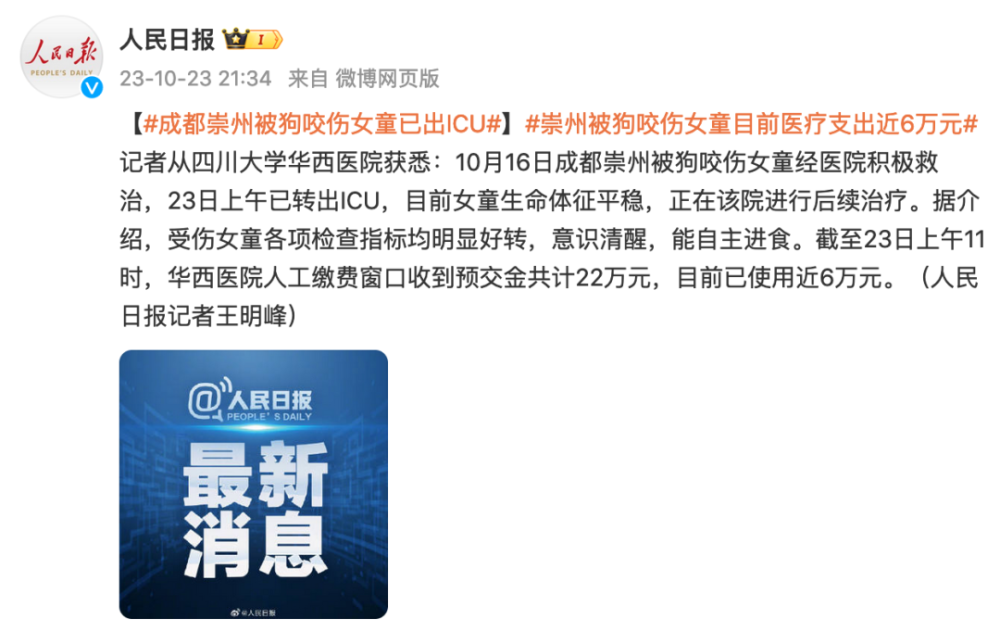
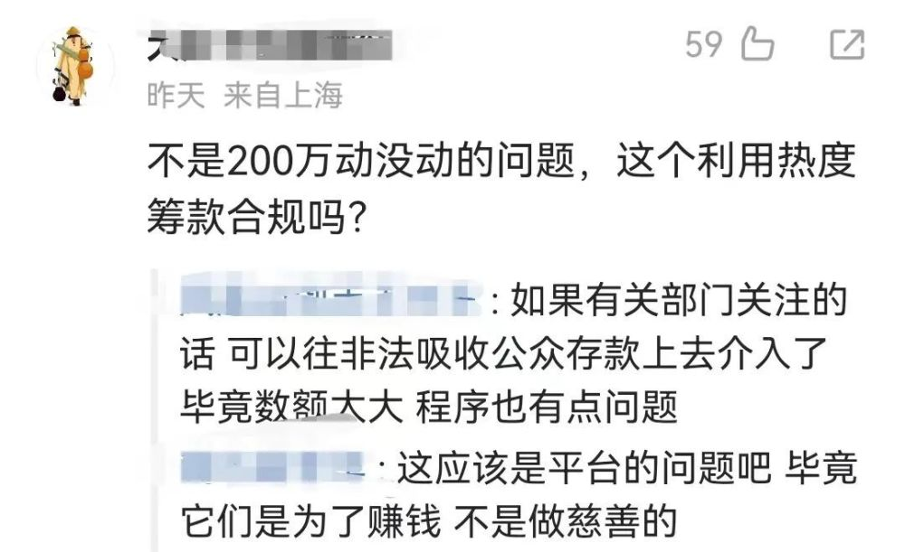
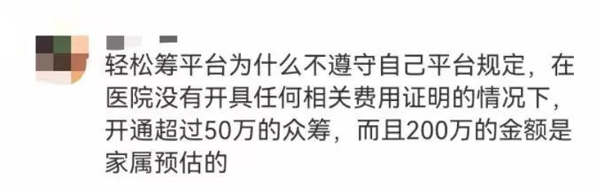
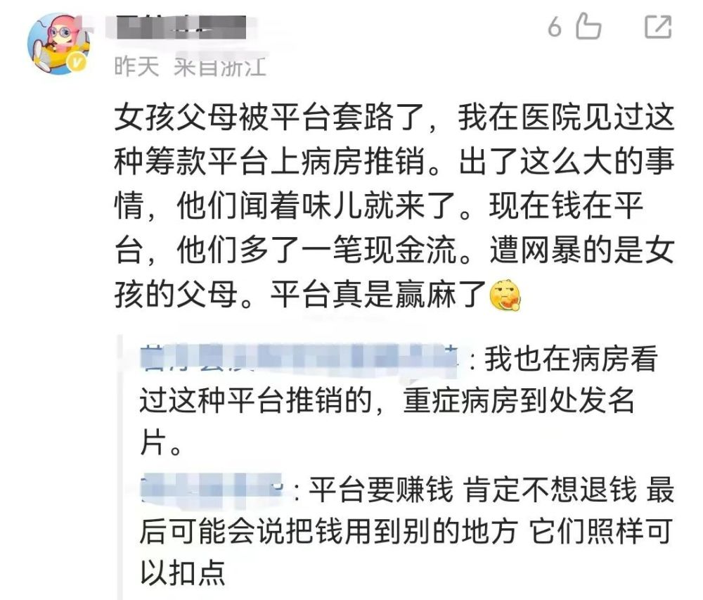

# 被狗咬伤女童医疗费近6万，200万捐款是何去向？相关方回应网友质疑

10月23日，四川崇州被狗咬伤女童已转出ICU。

据人民日报报道，截至23日上午11时，华西医院人工缴费窗口收到预交金共计22万元，目前已使用近6万元。

网友在平台上众筹的200万捐款为何变成了22万？女童治疗未用捐款可否退回？受伤女童的代理律师周兆成表示，目前近200万元的募捐款还未使用，治疗费以此前物业垫付的费用为主。

**受伤女童代理律师称**

**不存在拿捐款又收到巨额赔偿**

据南方都市报10月24日报道，周兆成表示，对于募捐款的使用，轻松筹机构承诺只用于孩子治疗，任何人都无权挪作他用，若有剩余全部捐出。

此前，周兆成表示，家属筹款是出于对孩子后续治疗及未来康复费用的考虑，“不存在拿着捐款又收到巨额赔偿的情况，法律不允许”。

**轻松筹表示**

**网友想退款可直接申请**

10月23日晚，轻松筹方面回复南都记者称，有关注到女童已经从ICU病房转出，对于网友关心的女童后续治疗费用可能达不到筹集的200万元的问题，其表示：“筹的这笔钱一定是用于治病的，我们会直接转给医院，不会打到家属的个人账户，具体的对接目前还在进行中。”

“因为现在也有部分网友表示要退款，我们现在也在跟家属和医院沟通，具体治疗费用是多少，筹款用不完的部分是要退还给大家还是如何处理，这些问题都会跟各方协商。”

轻松筹方面表示：“现在网友想退款是可以直接申请退还的。”

记者注意到，截至23日23时，女童家属在轻松筹平台发起的筹款页面显示已筹集金额为1950862元，比此前已筹集金额减少了约5万元。

**网友质疑众筹平台**

**筹款程序和善款最终去向**

针对众筹的约200万善款，不少网友质疑利用热度筹款是否合规。据轻松筹平台规定，单次求助金额超过50万元时，应提交具有相关资质的医疗机构书面证明。但此次事件，医院方表示并未出具任何相关的费用证明。对此，轻松筹方解释称，考虑到孩子当时情况危急，家属和医院沟通后自己预估了200万的金额。

也有网友怀疑平台未遵守规定就筹款的动机，并担心最终未用的善款是否能真正返还到捐助者手中。

人们的善心不该被辜负，善款究竟有多少？筹集是否合规？平台在此次筹款中是否会“抽成”？善款使用明细是否会公开？这些关切，期待相关各方及时回应。

**北京日报（ID：Beijing_Daily）综合@人民日报、南方都市报、网友评论**

