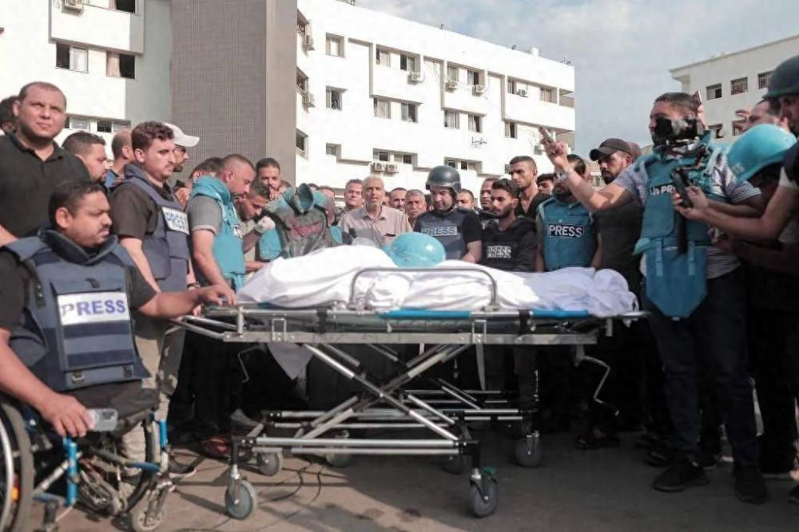

# 23名记者遇难：加沙没有前线，加沙都是前线

在过去11年里，巴勒斯坦记者罗什迪·萨拉杰是多家国际媒体在加沙地带的“耳朵和眼睛”。

新一轮以色列与哈马斯的武装冲突爆发后，随着多名同行遇害、新闻编辑部被毁、电力和网络被切断，萨拉杰的工作遭遇了前所未有的困难。“我们仍努力坚持，继续报道，好让全世界都能看到以色列在加沙犯下的罪行。”萨拉杰在最后一则社交媒体贴文中写道。

10月22日，以色列对加沙城一处社区发动空袭，31岁的萨拉杰被弹片击中，送医不治。萨拉杰的妻子和11个月大的孩子也在袭击中受伤。在冲突第一周，萨拉杰一家的公寓毁于炮火，此后他们一直在亲戚家中避难，不料厄运再次降临。

据保护记者委员会的统计，截至10月23日，本轮巴以冲突已造成23名记者身亡，其中包括19名巴勒斯坦人、3名以色列人和1名黎巴嫩人。此外，还有8名记者受伤，3名记者失踪或被拘留。保护记者委员会中东和北非项目协调员谢里夫·曼苏尔指出，过去两个星期内遇难记者的数量，已超过此前20多年的总和。

随着以色列对加沙空袭力度的加大以及地面进攻计划的推进，双方的冲突有外溢的风险，这意味着新闻界迄今面临的风险和遭受的损失很可能进一步扩大。

“记者是在危机时期从事重要工作的平民，不应成为交战各方的目标”，曼苏尔表示，“该地区的记者正在为报道这场令人心碎的冲突做出巨大牺牲。所有各方都必须采取措施确保他们的安全。”

_10月10日，巴勒斯坦加沙地带，悼念者参加两名在袭击中遇难的记者的葬礼_

**防弹背心并不能真正救命**

“在巴勒斯坦，你无法逃避的主要是安全问题。”巴勒斯坦记者协会驻约旦河西岸代表舒鲁克·阿萨德表示。被占领土有约1200名新闻工作者为阿拉伯语和国际媒体机构工作，“每个记者都有自己的故事，无论是被殴打、被枪击、失去同事，还是被禁止旅行，我们有很多创伤。”

萨拉杰生前经营着一家媒体服务公司。据半岛电视台报道，五年前，萨拉杰的好友兼合伙人亚瑟·穆塔尔在报道抗议以色列占领的活动时，被以军狙击手开枪射杀。10月7日，萨拉杰的好友和同事易卜拉欣·穆罕默德·拉菲在埃雷兹过境点报道时，也倒在以色列军队的枪口下。据保护记者委员会统计，当天有3名巴勒斯坦记者在加沙遇害，3名以色列记者被哈马斯所杀，另有至少5人受伤、失踪或被拘留。

正在卡塔尔出差的萨拉杰在听闻噩耗后返回加沙，接手好友未完成的工作。“他有很多机会离开加沙，但他选择留下提供帮助，并告诉世界那里正在发生什么。”
旅居英国的巴勒斯坦记者雅拉·伊德在社交媒体上悼念朋友萨拉杰。“他们扼杀了我们的声音。”伊德写道。

地中海之畔的加沙是一块面积仅365平方公里、居住着230万人口的拥挤飞地。由于缺乏防空掩体，也没有拦截率超过9成的铁穹防空系统，加沙在面对以色列的猛烈攻势时相当脆弱。

《华尔街日报》驻开罗记者贾里德·马尔辛表示，在报道其他地区的冲突时，记者大多数时候可以选择何时前往前线，从而在一定程度上调控风险水平。但是加沙战场拥挤，即使记者们聚集在特定知名酒店，并在白天乘坐标有“媒体”标识的汽车出行，安全也无法得到保障。曾多次前往加沙报道的埃及记者谢里夫·库杜斯形容道，“加沙没有前线，加沙都是前线。”

法新社是为数不多在加沙设有全功能分社的新闻机构之一，在以色列要求加沙北部居民向南疏散后，9名法新社记者撤离了办公室，仅留下了一台摄像机记录加沙城的实时画面。法新社全球新闻总监菲尔·切特温特表示，他与以色列当局保持着密切的联系，以确保其员工不会成为攻击目标。“他们向我们保证，他们知道我们的办公室在哪里，而且不在目标名单上。”

尽管如此，切特温特也没有把握保证办公室安然无恙。“我们办公室附近的两栋大楼遭到了袭击，距离我们不到50米。办公室的窗户被炸飞了。”即使法新社、路透社、半岛电视台等新闻机构听从以色列的命令向南迁移后，威胁也并未远离。10月19日，国际媒体和加沙本地新闻机构在南部搭建的临时新闻编辑部在空袭中被摧毁，所幸没有造成人员伤亡。

根据巴勒斯坦发展与媒体自由中心的数据，2021年5月以色列对加沙的袭击导致30家新闻机构关闭或被摧毁，其中美联社和半岛电视台所在的大楼被夷为平地。巴勒斯坦记者联合会则表示，10月7日以来，有至少48家媒体机构办事处被完全摧毁或部分损坏。

为成员提供安全培训和装备是巴勒斯坦记者工会的主要工作。在最新发布的给记者的安全建议中，巴勒斯坦记者工会写道：“如果你选择使用地下室或掩体，请确保在建筑物倒塌时有逃生的可能”，“确保你随身携带挖掘工具，因为你可能需要将自己挖出来”。该指南亦强调，“任何报道或照片都不值得你付出生命”。

在红十字会、国际记者联合会等国际组织的帮助下，巴勒斯坦记者工会向加沙几乎每一位记者提供了头盔与防弹衣。但这些得来不易的装备只能在一定程度上救命。

2022年，被誉为“巴勒斯坦之声”的半岛电视台明星记者夏琳·阿布阿克利赫在报道以色列军队扫荡巴勒斯坦难民营时，被子弹贯穿头部，当场毙命。多家媒体的调查指出，以色列军队或负有责任。10月10日，当地新闻网站主编萨义德·阿塔维尔和两位同事在加沙西部报道居民疏散情况。此前以色列军方向一座大楼的居民发出袭击警告，但炸弹最终偏离先前指定的目标，将在100多米外“安全距离”拍摄的阿塔维尔三人炸死。

舒鲁克·阿萨德表示，“在一个有狙击手瞄准记者的地方，这些防弹背心并不能真正救你的命。我们一直在加沙收集证词。其中一名记者告诉我，当他们到处轰炸的时候，这根本没用。”

**“信息战中有害且危险的一环”**

“这是我们当地的医院，里面有我的朋友、邻居。这是我的社区。”BBC阿拉伯语频道记者阿德南·埃尔布尔什在加沙城的阿尔·希法医院的直播报道中发现，他的亲友和邻居就在伤亡人群之中。“今天是我职业生涯中最困难的一天。”

切特温特表示，国际新闻机构通常会尽快派遣特派记者，支援当地团队。“我认为向我们的团队展示我们与他们同在是非常重要的……对于报道来说，拥有不同的视角也很重要。”但切特温特表示，这次不是一个可行的选择。

在相对和平的时期，国际记者只要持有以色列政府新闻办公室颁发的记者证，就可以从重兵把守的埃雷兹边境口岸进入加沙。由于在10月7日遭到哈马斯武装分子的袭击，该口岸目前已无限期关闭。

英国皇家联合军种国防研究所高级副研究员H.A.海勒认为，加沙记者报道面临困难，国际记者又无法前往加沙，造成了对苦难呈现的失衡。“有数十名国际记者在以色列，可以报道那里发生的每一起暴行的每一个细节。但对于加沙正在发生的令人难以置信的平民灾难，却没有类似的深度报道。”

资深中东记者贾里德·马尔辛则指出，通过对加沙边境的控制，以色列在很大程度上塑造了外界对加沙内部情况的认知。

以色列自上世纪90年代起对加沙实行封锁政策。1991年波斯湾战争期间，以色列撤销了巴勒斯坦人的出境许可证，此后又以一套复杂的许可证和身份证系统束缚加沙人的行动自由。2007年之前，以色列记者和他们的国际同行一样可以随时进出加沙。然而，随着哈马斯占领加沙，以色列对飞地实行完全封锁并禁止以色列公民进入加沙后，巴勒斯坦记者和国际记者成为加沙的主要报道力量。

在2008至2009年以色列与加沙的武装冲突中，尽管以色列高等法院颁令准许外国记者进入加沙，但以色列军方禁止媒体通过埃雷兹口岸。埃及也禁止记者经由拉法口岸入境加沙。不过，以色列在2014年冲突中开放记者进入加沙，多年来国际记者首次有了全面报道以色列对加沙的军事行动的机会。据以色列政府新闻办公室的数据，当时至少来自42个国家的705名外国记者被派往以色列。但不清楚有多少人前往了加沙。

“以色列人认为，让人们进入加沙更容易诋毁哈马斯或展示其残忍。”以色列独立记者诺姆·谢扎夫表示。但由于巴勒斯坦武装分子难以接近，国际媒体并未将报道重心放在他们身上，而是更关注周围的战斗。谢扎夫说，那次开放，从某种程度上来说是以色列方面的误判。

有专业机构指出，亲以色列的声音在系统性地诋毁独立的巴勒斯坦记者，挑战其公信力，导致巴勒斯坦记者对死亡和破坏的报道被斥责是有偏见的、甚至是捏造的。“这是信息战中有害而危险的一环”。

即使是从加沙外部进行报道的记者，所面临的压力也在增加。在耶路撒冷，BBC的媒体车被以色列警察拦下盘问，一名试图拍摄这一遭遇的记者据悉遭到警方殴打。以色列左翼记者弗雷在发布为加沙暴力事件受害者祈福的视频后，右翼抗议者向他的住宅投掷照明弹，并试图破门而入。

此外，以色列政府已经通过紧急条例，若有媒体节目被认为危害国家安全、为敌方做宣传（即便传播的信息是真实的），有关部门有权叫停节目、关闭该机构在以色列的办事处。带头推动这项条例的是以色列通讯部长什洛莫·卡尔希。他此前曾表示，这些措施的目标很明确，就是要阻碍半岛电视台的工作。卡尔希称，这家总部位于卡塔尔的国际媒体是煽动反对以色列公民的“宣传喉舌”。

“为了让外界能够自由地获得可靠的局势报道，记者必须能够工作。但是，新闻工作每天都在变得更加危险。近两周来，以色列武装部队一直在竭尽全力阻止图像的传播。我们谴责以色列试图实施的媒体封锁。新闻报道是消除正在该地区大肆传播的虚假信息的良药。”一家记者行业组织负责人表示。

‍记者：陈佳琳

编辑：徐方清

