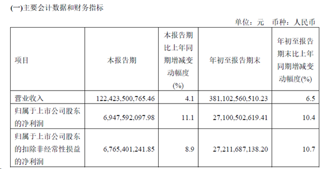
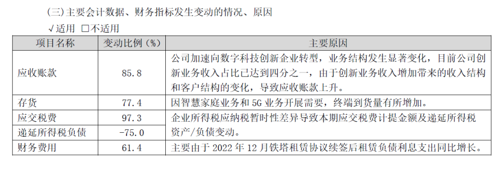

# 三大运营商成绩单：前三季度日均总收入52亿元，日均总利润超5亿元

本文来源：时代周报 作者：郭美婷

10月24日晚，中国联通发布第三季度财报，此前，中国移动和中国电信已相继发布三季度报。至此三大运营商前三季度成绩单全部出炉。

财报显示，前三季度，中国移动营业收入7756亿元，同比增长7.2%；归母净利润达1055亿元，同比增长7.1%。中国电信实现营业收入3811.03亿元，同比增长6.5%；归母净利润为271.01亿元，同比增长10.4%。中国联通营收2816.93亿元，同比增长6.7%；归母净利润75.78亿元，同比增长10.9%。

以前三季度共273天来算，三大运营商合计平均日入52.69亿元，日赚5.13亿元。其中，中国移动日赚3.86亿元；中国电信日赚9927.11万元；中国联通日赚2775.82万元。

时代周报记者梳理发现，前三季度三大运营商在研发投入上进一步加大，尤其是第三季度的研发费用，均超过前两季度研发费用的均值。AI和算力成为三大运营商的重点布局领域。

二级市场上，截至10月25日收盘，中国移动（600941.ＳＨ）跌4.27%，报91.90元/股；中国电信（601728.SH）跌3.40%报5.40元/股；中国联通(600050.SH)跌3.63%，报4.51元/股。

**产业数字化业务增长明显**

前三季度，三大运营商业绩稳健增长。

中国移动方面，截至2023年9月30日，中国移动实现营业收入7756
亿元，同比增长7.2%；其中，主营业务收入为6646亿元，同比增长7.2%，其他业务收入为1110亿元，同比增长7.4%。归母净利润达1055亿元，同比增长7.1%。

_中国移动主要会计数据节选，来源：中国移动第三季度报_

中国电信方面，公司前三季度实现营业收入3811.03亿元，同比增长6.5%；归母净利润为271.01亿元，同比增长10.4%。

分业务看，中国电信前三季度，移动通信服务收入为1519.16 亿元，同比增长2.4%；公司固网及智慧家庭服务收入达到929.05
亿元，同比增长3.9%；电信产业数字化业务收入达到997.41亿元，同比增长16.5%。

_中国电信主要会计数据节选，来源：中国移动第三季度报_

中国联通方面，公司前三季度实现营收2816.93亿元，同比增长6.7%；归母净利润75.78亿元，同比增长10.9%。其中，主营业务收入达到2525.2亿元，比去年同期提升
5.4%。

 _中国联通主要会计数据节选，来源：中国移动第三季度报_

以前三季度共273天来算，三大运营商加总日均收入52.69亿元，日赚5.13亿元。其中，中国移动日均收入28.4亿元，日赚3.86亿元；中国电信日均收入13.96亿元，日赚9927.11万元；中国联通日均收入10.32亿元，日赚2775.82万元。

对比过去三年的财务数据，三大运营日均盈利能力均有不同程度提高。中国移动2022年约日赚3.44亿元，2021年日赚3.18亿元，2020年日赚2.95亿元；中国电信2022年约日赚7599.84万元，2021年日赚7110.13万元，2020年日赚5713.70万元；中国联通2022年约日赚1999.86万元，2021年日赚1727.52万元，2020年日赚1430.50万元。

另外，三大运营商的5G用户数持续实现稳定增长。中国移动截至今年9月30日移动客户总数达到9.90亿户，其中5G
套餐客户数达到7.50亿户，5G网络客户数达到4.25亿户；流量业务保持稳定增长，手机上网流量同比增长16.2%，手机上网DOU达到15.6GB；移动
ARPU 为51.2 元，同比增长1.0%。

中国电信方面，前三季度移动用户净增1463万户，达到约4.06亿户，5G套餐用户净增3965万户，达到约3.08亿户，渗透率达到75.8%，移动用户ARPUI为45.6
元，同比增长0.2%。

中国联通截至前三季度的移动用户规模达到3.32亿户，移动用户净增达到967万户，移动
ARPU达到44.3元；固网宽带用户达到1.11亿户，年内净增用户突破783万户。

在细分业务中，三大运营商的产业数字化业务增长速度最为明显，基本超过了10%。

前三季度，中国移动在政企市场的DICT业务收入为866 亿元，同比增长
26.4%。中国电信产业数字化业务收入达到997.41亿元，同比增长16.5%。中国联通的产业互联网业务实现收入606.9亿元，占主营业务收入比达到24.0%，比去年同期提升1.8pp；物联网业务收入实现75.2亿元，同比增幅达到21.9%。

三大运营商中只有中国联通在三季报公布了云计算营收情况，“联通云”前三季度实现收入367.0亿元，较去年同期提升36.6%；同时，中国联通也是唯一在三季报中披露数据要素的运营商，前三季度大数据业务收入实现40.7亿元，同比增幅达到
46.7%。

值得关注的是，国务院于7 月 28
日任命原中国联通董事长刘烈宏为国家数据局局长，10月25日，国家数据局正式揭牌，负责协调推进数据基础制度建设，统筹数据资源整合共享和开发利用，统筹推进数字中国、数字经济、数字社会规划和建设等，由国家发展和改革委员会管理。

**研发投入力度加大**

单从第三季度看，中国移动的营业收入为2449亿元，同比增长8.1%；归母净利润293亿元，同比增长3.8%；中国电信第三季度的营业收入为1124.24亿元，同比增长4.1%；归母净利润为69.48亿元，同比增长11.1%；中国联通第三季度实现营业收入898.60亿元，同比增长2.4%；归母净利润21.34亿元，同比增长4.3%。

除个别指标外，三大运营商第三季度的营收和利润增速普遍慢于上半年的增速。

独立电信分析师付亮认为，从往年规律看，三大运营商在第三季度都会进入一个业绩调整期。不过，相对来看，中国联通的业绩情况略显落后。付亮认为，自从今年7月刘烈宏辞去中国联通董事长、董事及董事会发展战略委员会、提名委员会主任委员职务后，中国联通董事长位置仍然空悬，新董事长何时就位是一个相当急迫的问题，关系到公司明年的战略布局。

另外，中国联通还在财报中也提到，公司加速向数字科技创新企业转型，业务结构发生显著变化，目前公司创新业务收入占比已达到四分之一，由于创新业务收入增加带来的收入结构和客户结构的变化，导致应收账款上升。目前中国联通年内其应收账款增幅达到
85.8%。

_中国联通主要会计数据、财务指标发生变动的情况、原因，来源：中国联通第三季度报_

时代周报记者梳理发现，相较于前两个季度，三大运营商在第三季度研发投入力度进一步加大，AI和算力是三大运营商的重点布局领域。

财报显示，前三季度，中国联通研发费用为43.17亿元，相比去年同期增长8.4%，相比半年报中的24.35亿元投入增加18.82亿元。中国联通提到，公司着力加强新型数字信息基础设施建设，加快5G、宽带、政企、算力网络建设，持续加大研发投入力度。

中国电信前三季度研发费用为73.35亿元，较去年同期增长24.0%。中国电信半年报此项数据仅为41.4
亿元，即中国电信在第三季度加大投入了31.95亿元进行研发。中国电信表示，这主要由于公司强化科技创新，加大高科技人才引进，围绕云计算、AI、安全、量子、5G
等重点领域，加强关键核心技术攻关，提升核心能力。

中国移动前三季度研发费用达151.01亿元，经计算，相比去年同期增长28.90%。而根据此前半年报中披露研发费用85.15亿元，中国移动光第三季度研发投入就高达65.86亿元。

总体来看，前三季度，三大运营商每天在研发上投入达9799.63万元。其中，中国联通每日投入1581.32万元研发费用；中国电信每日投入2686.81万元研发费用；中国移动每日投入5531.13万元研发费用。

不过，相对比销售费用，研发费用占营业成本比例仍然较低。中国联通、中国电信和中国移动今年前三季度的研发费用分别占营业成本的2.05%、2.75%、2.73%；对比来看，三家企业销售费用占营业成本的比例分别为12.31%、15.30%和7.05%。

10月，中国移动召开了全球合作伙伴大会，中国移动联合中国信科、中国航信、中国航油、广汽集团等多家央企重磅发布“九天·众擎基座大模型”。据了解，“九天•众擎基座大模型”训练数据规模超两万亿Tokens，融合通信、能源、钢铁、建筑、交通等8大行业专业知识，已得到中国远洋、中智集团、中国铁建、中国信科、中国航信、中国航油等多家企业支持。中国移动“九天”人工智能团队成立于2013年，目前核心技术人员规模近1500人，累计战略投入超百亿元。

