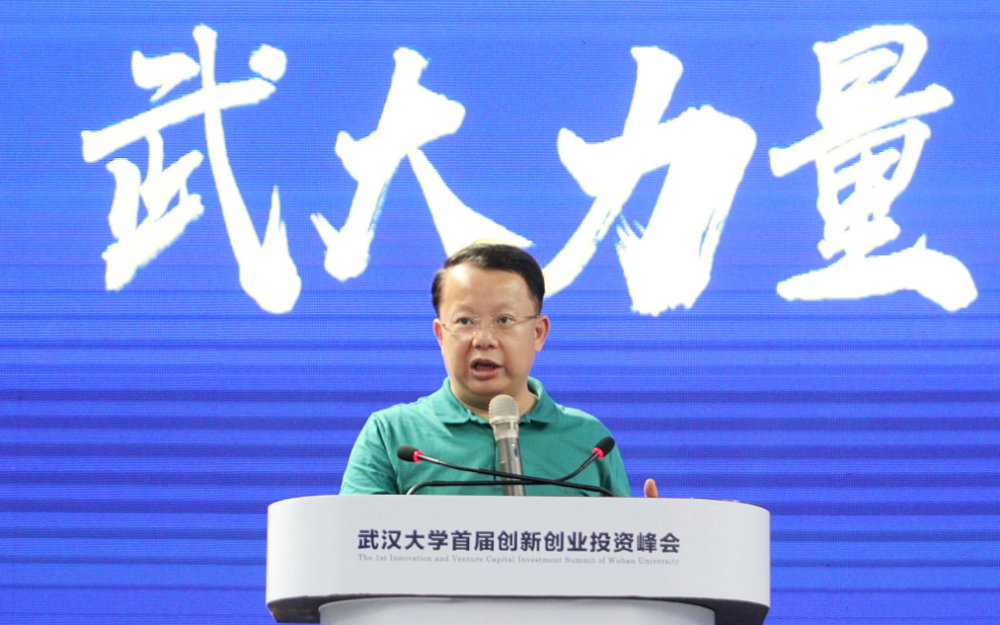

# 两位金融大咖吵起来了：借了笔钱合伙开店，算不算是欠债？

_来源：视觉中国_

作者 | 叶蓁

编辑 | 康晓

出品 | 深网.小满工作室

由前港交所行政总裁李小加创立的滴灌通近日引发争议。知名消费投资人宋向前接连在社交媒体发文批评滴灌通的商业模式，措辞激烈。宋向前表示，滴灌通“本质上还是个高利贷，是个升级版的P2P”。

“我关注滴灌通两年多了，业务上没什么交集。”对于质疑滴灌通的动机，宋向前告诉腾讯新闻《深网》，
**“滴灌通的贷款对象是个体户、夫妻店等小微企业，他们真正缺的是做生意的能力和知识，滴灌通给出的无抵押‘贷款’，刺激了他们的创业激情。现在很多消费品牌做成了金融属性，拼命放开加盟，以此模式来赚钱；如果放任不管，很多没有创业能力的人由于这样的产品可能因此倾家荡产。”**

滴灌通创始人李小加曾执掌香港交易所超过10年。今年8月，滴灌通宣布完成4.58亿美元C轮融资。官网数据显示：成立两年多的滴灌通已投资签约近600个品牌，签约门店10783家。

针对质疑，10月25日，李小加对《深网》等媒体表示，“国内外市场上除了债和股外，还有其他的投资方式。滴灌通本质是开店做生意的合约模式。业主、开店者和我们三方一起开店做生意，即业主出店铺，我们出钱、开店者出力运营管理，这是一种联营模式。”

李小加认为，DRC目前是完全脱离了传统意义上的金融，是一种实体经济行为，是以金融服务实体。

对于李小加的回复，宋向前告诉《深网》，“滴灌通从法律上讲全球都没有先例，李小加究竟是在做实业还是在做金融？如果是做实业，就得参与企业经营，帮人家提高能力和水平，共同经营这个企业，但看不出其有任何参与企业经营的活动；如果不是实业，那就是个金融产品。”

宋向前认为，世界上没有无风险的投资生意，滴贯通的风控方式是不使用利润分成而使用收入分成，这本质上利用了小店的短生命周期，正是担心普通创业者能力无法支撑店铺走长走远。“刺激能力不足的人膨胀野心去做力所不能及之事，大大增加社会空转成本。”

“世界上不存在滴灌通所宣称的‘非股非债’模式，既不是股，又不是债，能叫夹层吗？夹层也是上面是股，下面是债。金融合同也是产品，本质上这种金融产品就逃脱在了监管之外，不在公司注册地合法持牌就是非法金融。”宋向前告诉《深网》。

宋向前质疑滴灌通的底气，在于其过往深耕消费领域的经验。宋向前是加华资本创始合伙人兼董事长，曾投资东鹏特饮、居然之家、东鹏特饮、老乡鸡、爱慕内衣等众多消费品牌。

当下“黑天鹅”和“灰犀牛”频现，宋向前认为这是一个系统重装的百年未有之大变局的时代，宏观问题变得非常重要，它会深刻的影响产业发展结构，比如像人口问题，而教育、医疗、房地产三座大山都要面对低生育、低增长、低消费。

加华资本是一家专注于消费的投资机构，宋向前认为，投资人需要“顶天立地”，所谓“顶天”，就是了解宏观政策，了解百年未知之变局；“立地”就是接地气，懂行业为企业发展提供有价值的建议。

改革开放四十年，水大鱼大的时代结束了，在宋向前看来，“ **当下是危中有机，因为要出清一些僵尸企业。未来，是一个好人赚钱的时代。**
那些老路不能走了，我们要走新路，要穿新鞋，这个过程中应该怎么办？中国的企业管理一定要靠德鲁克式的管理科学，靠科学技术进步。”

**以下是腾讯新闻《深网》与宋向前的对话实录整理：**

**“日本的治理经验值得借鉴”**

**《深网》：你一直说中国经济处于百年之大变局？**

**宋向前：** 中国这样的大国，国民财富的分配状况和经济发展的深度、广度和总量都有关系。

2016和2017年提倡做棚改化，房地产快速的进入到所谓的三高模式——高负债高周转高杠杆，房地产领域经历了一个狂飙突进的发展，地方也对土地财政的依赖越来越深。我认为分析中国的经济现象还是应该从财税体系出发，居民部门再加杠杆，社会总宏观负债也很高，非金融业务也加杠杆，债务堆积的就很快，上行的也比较快，一方面经济增长放缓，就形成一个剪刀差。

**《深网》：影响是什么？**

**宋向前：**
刚才讲的高杠杆高债务，资产债务表要调整，这个过程周期可能就会很长，就像辜鸿铭先生讲的，资产负债表的一个大衰退，方方面面都面临着比较大的压力，对经济的发展不是个有利的因素。这个大环境首先是对消费有抑制作用和挤出效应，整个经济发展的压力就会比较大。

**《深网》：这个过程会有多长？**

**宋向前：** 大家都预计5-10年。

**《深网》：日本经验对中国有借鉴意义吗？**

**宋向前：**
仔细研究日本过去30年的货币政策和财政政策，日本财政政策是做出巨大努力的。外界把注意力都放在了日本央行所采取的量化宽松的政策，其实日本的财政政策有效的填补了居民部门和企业的投资不足，日本整体的GDP还维持在一个相当的水平线上，GDP没有衰退，人均收入水平虽然没有增高，但维持在一个相当高的水平上。

今年日本经济今年非常好，进入一个增强通胀的环境，日本央行考虑推出负利率和低利率，这对日本这样一个长期陷入衰退的国家来说很不容易，增长还是挺不错的。日本经济从通缩到当下的通胀是很不容易的，从通缩环境进入通胀，全世界成功的国家不多，这种治理经验值得借鉴。

**《深网》：当下我们面临的环境是什么？**

**宋向前：**
房地产作为主营业务，在经济中间占了15-17%的总量。然而，随着房地产市场下行，房地产公司面临高周转和高负债情况，部分房地产公司甚至出现暴雷情况。目前，还没有一个可以替代房地产的支柱产业。

消费不是一个一蹴而就的事情，内需市场的拉动和内循环，是一个中长期的目标，还在于人均可支配收入。此外，还在于人均收入水平的改善，需要转变老百姓的消费习惯，愿意花钱，也敢花钱，这取决于一系列配套因素，社保体系的完善，就业市场的稳定，市场主体的稳定。

**《深网》：你如何看待过去高速增长的40年？**

**宋向前：**
一个高速增长的经济体连续增长了40年，我们习惯了一个高增长的环境，突然进入了一个有质量的增长或者低增长环境中，我们也是不适应的。管理者不适应，企业家不适应，老百姓也不适应，这个环境中确实面临着一个转型的阵痛，现在就是转型的阵痛期。

在这个时候要越发的冷静，越发的保持战略的定力，越发要清醒的认识到自己的优越点，进行深刻的反省。然后向制度要红利，向公平竞争要红利，向基础设施要红利，向产业结构要红利，向人均收入水平的可持续增长要红利，未来的20-30年，中国经济会慢慢的形成一个良性反转。

**“系统重装出清僵尸企业”**

**《深网》：你说的系统重装意味着什么？**

**宋向前：**
为什么我提出系统重装，因为在中国很多人是不重视宏观经济研究，也不重视社会结构性的变化，当下面临着从中等收入向中高收入国家迈进，因为现在是人均收入12,000美金，按照联合国80年代的标准是12,800美金进入到高收入国家的门槛，美国是77,600美金，跟新加坡、日本、韩国，还有我们的香港比，差距都比较大。

从人均角度来讲的话，中国依然还是个发展中国家，中国是一个14亿人口大国，中国所面临的经济情况的复杂性，作为一个迈向高收入门槛的发展的大国，经济总量很大，质量也很高，特别是人均收入水平还没有真正做到藏富于民。

北师大的研究报告显示：10亿人没有护照，没出过国，没坐过飞机，没使用过马桶。

**当下国际环境比较恶劣，也给中国经济的发展带来挑战。国家安全是个很重要的事情，在国家安全情况下，行稳致远的、长期的健康的经济发展，这是一个在宏大叙事背景下的非常高水平的课题。**

**《深网》：系统重装，需要付出的成本是什么？**

**宋向前：**
形象的比喻就是说无论用windows还是用MAC，无论用什么源代码来使用这套桌面系统，但底层这个系统操作的逻辑基本是一致的。这就是社会经济生活进入了一个改革的深水区。过去是摸着石头过河，现在桥都建设好了，就直接走桥，干嘛要去河里摸石头，第二个就是理解中国经济的复杂性，第三个很多人也低估了中国经济。

**《深网》：你说的低估指的是中国经济的韧性吗?**

**宋向前：**
不是。大家都觉得中国经济有韧性和弹性，但我觉得大家对韧性的认识不够。因为韧性和弹性大家觉得是个总量关系。当下中国经济也需要一次重启，为什么？因为我们要质量，不能一味盲目的去追求速度，追求总量。

**水大鱼大的时代过去了，不能简单的认为规模大就是好、快就是好，比如世界500强。**

**当下是危中有机，因为要出清一些僵尸企业。比如说电动车，目前阵亡的所谓的新势力公司太多了，尸骨累累，没有人去反思。**

大家都在探讨中国经济的韧性和弹性，一讨论有韧性和弹性，大家都指望着政策出台，指望着经济增长要高一点，总量要大一点，这是错误的。中国经济真正的韧性和弹性在于改革，在制度化和法制化，对生产要素的配置，坚持以市场经济为原则，释放制度的红利。

**“一个好人赚钱的时代”**

**《深网》：你刚才说，一个好人赚钱的时代到来了？**

**宋向前：**
当下是一个百年未有之大变局的时代，水大鱼大的时代过去了，简单的要素投放换来的不是增长，那些老路不能走了，我们要走新路，要穿新鞋，这个过程中大家应该怎么办？中国的企业家的企业管理一定要靠德鲁克式的管理科学，靠科学技术进步，从粗放经营转向精耕细作。谁能把市场资源放在最有效、最合适的位置上，制定出适配的、现代化的企业制度，谁就有机会赢得时间的复利价值。

**《深网》：你如何看待时代里的周期？**

**宋向前：**
周期有几类。第一类叫朱格拉周期，第二类库存周期和产业周期。当然也有大周期，康波周期，那么在大的周期面前，理解周期就非常重要，中国进入了系统重装百年之大变局的大时代，这个时代宏观经济就变得非常重要，它会深刻的影响产业发展结构，它会影响一些结构性的变量，比如像人口问题，教育、医疗、房地产三座大山都要面对低生育、低增长、低消费。

今年不到800万的新出生人口，断崖式下跌，很多人没有意识到人口达峰所带来的变局，我们现在的总和生育率水平仅仅高于韩国，全世界大概是排名到最后三位。以后的幼儿园、学校、小学、中学甚至于大学都面临着合并的空间，学生不足；而劳动力供给有限，因为劳动力越来越少越来越贵，很多行业的成本结构都会发生很大的变化，这些东西很多企业家没有意识到，这种结构性的慢变量会深刻的改变中国社会经济生活的运行方式，中国行业的发展态势以及中国企业的竞争力。

**牵一发而动全身，人口达峰，资源达峰，金融的资源达峰，环保领域也是。这样的环境下我们的瓶颈很快就来临，对吧？在这种情况下是要存量博弈，增量中间换增长，要高质量增长。在这个环境下，初期有一段时间是阵痛期，大家要老老实实的去债，调整资产负债表，增加现金流。**

投资本质上是一个买未来的增长的行为，此外，产业布局很重要，加华作为一个专注于投消费的机构，我们就抓刚需大的，抓民生的，抓极致性价比的，抓民生基础设施建设的，为老百姓提供好产品和好服务。即使没有所谓的时代红利和人口红利，我们就认认真真的干活和做管理。

人货场的关系中间，人是最高级的。以货为中心，以场为中心，在过去的四十年，都不断地被出清被调整，最后，以人为中心，以消费者为中心创造消费福利的，创造消费者剩余价值的好产品和好服务，才能长久赢的人心，老百姓会用脚投票拥护你，用手投票，买你的股票。好产品和好服务在时间面前是正相关的，很有效。

时间，是企业价值的称重器，利润是作对事情的副产品。这个中间，中国企业家面临这些宏观环境的变化，生产要素慢变量的结构性变化，要苦练内功，把管理搞好。

**中国的企业水平在这样一个出清的时代，甚至是微利的时代，以危为机，转危为安，中国的企业的竞争力，竞争水平和结构性的竞争优势也慢慢的开始被养育和成长，中国企业的竞争力就开始出现一大批真正有能力参与全球竞争的企业家，我认为这样的竞争，这样的出清，这样的下行，这样的危机面前，反而是个好事。这是一次真正的对企业家、对产业、对产品、对服务、对品牌的历练，叫浴火重生。**

**《深网》：市场会做出筛选？**

**宋向前：**
该出清的就要出清掉，我们不能说给孩子洗澡倒水把孩子也倒出去了，要有所区别对待。通过制度红利释放，通过市场属性，通过结构优化，让市场来主动筛选，有竞争实力的，有结构性竞争优势的，
**真正的好人一定会赢得市场竞争，这是道德情操论或者国富论中间强调的要点。** 因此，这场调整来的恰逢其时，
**这是对过去的水大鱼大，简单要素投放中数量第一的一次很好的反思**
，也是凤凰涅槃。高质量增长一定要与过去告别，这个是很对的，要壮士断腕，不能既要又要还要。

**《深网》：你会投什么样的企业？**

**宋向前：** 好赛道，选好企业家，选好人，也就是好行业，好公司，好人，必须三好合在一起。他必须是个三好学生，才有机会赢得未来的竞争。

商业天然是逐利的，而道德是无私的，每当有商人站出来谈道德，仿佛上帝都要发笑。但一切常识也都有它的时代适应性，当今社会已经发生了一个趋势性的转变，那就是市场正在褒奖那些有道德的商人。

**《深网》：未来，投资人最重要的认知是什么？**

**宋向前：** 当下对投资人的要求更高了， **投资人要顶天立地，顶天就是你要能够了解宏观政策，了解百年未知变局**
，要了解我们的产业政策，要了解我们的制度变化，也要了解我们的未来社会高质量发展所带来的环境变化，也包括我讲的经济慢结构变量。

第二个 **立地也要求投资人真正接地气**
，要真正的去参与企业的经营，为企业赋能，真正的创造价值，而不是站在董事会上说一些董事所讲的一些话，那些话大部分都是求同存异，是妥协的结果，其实对企业的增长，企业的经营不产生革命性的变化和决定性的作用，要为企业做好参谋助手，不仅仅是不帮忙不添乱，还要真的做懂行业为企业提有价值的建议。

**《深网》：加华对标的投资机构是？**

**宋向前：**
我想成为谁我很清楚，因为投资确实是向善的行为，而不仅仅是一个经济行为。它本质上对社会经济结构的调整，产业结构的优化，对行业的发展，对百姓社会生活的福利是有帮助的，所以它有很多的社会责任，因为社会汇聚了财富，交给你来管理，通过你的专业化的的工作，创造更好的产品和服务提供给社会大众。

第二个我就信奉一条走进人间烟火，赋能百姓生活，支持中国品牌，助力中国消费，这个事情足够大，也足够久，赛道也足够宽，中国在百年未有之变局下要拉动内需，以后社会要从生产型社会市场和消费型社会转型，而且百姓的储蓄能力要转化成消费能力，我们的基本矛盾是什么？已经是人民群众日益增长的美好生活的需要和发展不平衡不充分的矛盾。它缺少的就是我们要给补给的。

**供求关系本质上是供给和需求之间的平衡，有质量的供给不足的情况下，中国的消费和服务业大有可为。**

**《深网》：你如何看过去的新消费投资？**

**宋向前：**
消费本质上并不存在新旧，还是要提供产品给大家。食品就是吃的，出行还是要用到车，单车，汽车，还是飞机，酒店还是一个物理场所，本质都没有变。即使用了互联网，用了电子支付，用了互联网的这些手段，但本质上最终交互的产品和服务没变。

创新消费和传统消费之分，这个是存在的，但不存在媒体所报道的新旧之分，好像新消费和传统消费就是对立起来的。
**这种概念出来本质上是制造对立和冲突，制造概念和风口，迅速的从资本市场获得红利。**
他的目标不是好好的去经营一家企业，通过现象看本质的话，企业还是那个企业，运用的手段方法掌握的技术能力的不同，但是产品服务的内容是一样的。

