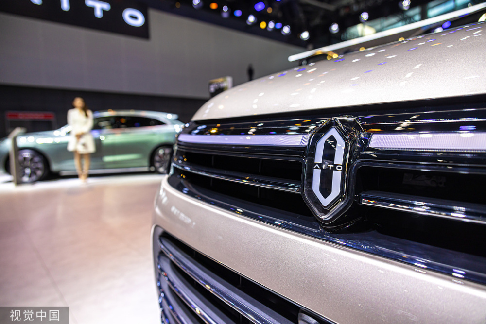
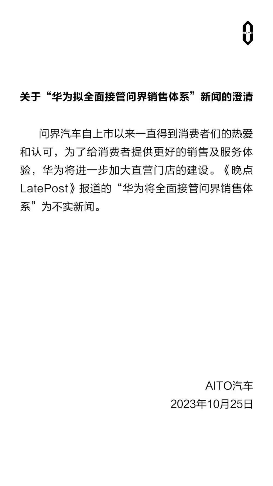

# 华为拟全面接管问界销售体系？华为方面回应：不实新闻

腾讯科技讯 10月25日晚间消息，针对媒体报道“华为将全面接管问界销售体系”的消息，华为方面回应称，此为不实新闻。

今日有媒体报道称，问界所有销售人员将加入华为全资子公司
“深圳慧通商务有限公司”，成为华为的编外员工，换签将在明年全部完成。这之前，这些员工就职于华为和赛力斯的经销商。

对此，华为方面回应称，问界汽车自上市以来一直得到消费者们的热爱和认可，为了给消费者提供更好的销售及服务体验，华为将进一步加大直营门店的建设。华为方面称，媒体报道的“华为将全面接管问界销售体系”为不实新闻。

