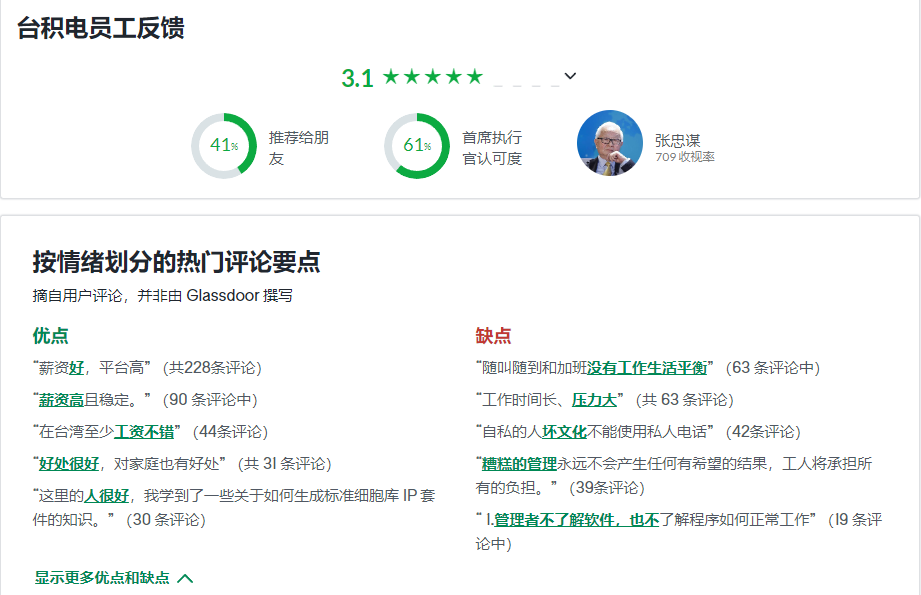
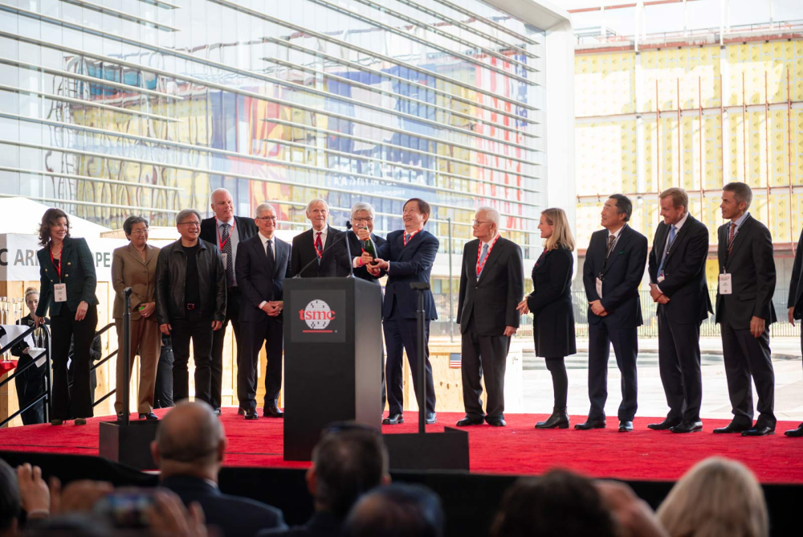

# 台积电美国扩张“失速”：工作12小时睡办公室，让美国人叫苦不迭

_“芯事重重”半导体产业研究策划，本期聚焦台积电美国建厂过程中面临的文化冲突和人才短缺问题。_

**文 / 胡泳 北京大学新闻与传播学院教授，本文独家发布腾讯新闻，未经授权，请勿转载。**

**“台积电还没有准备好进入美国？”**

在全球最大的半导体芯片制造商台积电的Glassdoor（一家员工匿名评价公司的平台）个人主页上，在职和离职的亚利桑那工厂美国员工交流着关于艰苦工作条件的信息。

一位工程师在2022年8月写道： **“人们连续一个月睡在办公室里。每天工作12小时是常事，夜班和周末轮班也很常见，还有随时待命。”**
另一名工程师在2023年1月写道： **“台积电充斥着服从文化，还没准备好进入美国。”**

类似的抱怨在Glassdoor上很常见，因为匿名使得员工可以对过去和现在的雇主大加指责。Glassdoor并不以“观点中立”而著称。说句实话，无论是在
Glassdoor、亚马逊、应用商店里还是其他任何地方，用户留下的评论都趋于极端。与那些对某个工作或产品感到愤怒的人相比，满意的人往往觉得不需要表达自己的意见。

_Glassdoor上台积电官方页面的员工反馈，工作机会的推荐度为41%_

然而， **考虑到台积电还在与英特尔竞争——后者也在亚利桑那州扩张——留住和吸引人才是头等大事。** 所以，如果台积电员工在
Glassdoor上并没有描绘出这家科技巨头工作文化的美好图景，公司丝毫不能对员工的抱怨掉以轻心。

《财富》杂志6月的报道称，从当时对台积电美国业务的91条评论来看，它的推荐度仅为27%。这意味着只有不到三分之一的评论者会鼓励其他人去那里工作。相比之下，英特尔的推荐度为
85%，尽管它的评论多达数万条。

**对于在Glassdoor上发帖的美国工程师来说，台积电的长时间会议带来了另外一种挫败感。**

“这些会议一天加起来很容易就达到三个小时”，一位新员工说。“这占据了工作日的很大一部分时间。为什么不把一些解决方案放在软件中？大多数这类软件都可以自动化。最后使用设备的工程师将工具状态和变化记录下来，并为下一个班次提出建议。”一位高级工程师表示同意：“我认为一些软件需要被修改，使其更符合美国人的习惯。”事实是，台积电的分析软件自公司成立以来（1987
年）就一直传承下来，但只有些微小的改变。

对这些抱怨也有其他人予以反驳，例如，Reddit上的一条帖子说：
**对于任何晶圆厂工艺/设备工程师来说，长时间的会议和更长的工作时间都是熟悉的事情。试图摆脱疯狂的工作时间和随叫随到，而转为工程职位也不利于职业发展，那样你只会整天陷入工具问题，很少参与流程改进。**

在那些不了解流程的人听来，成天开会似乎意味着效率低下。然而，这些工程师正在开发每台成本为1000万至1.5亿美元的设备。召开长时间的面对面会议来讨论眼前的问题并不是一种负担。一个全新上岗的工程师可能没有意识到面对面沟通的价值。

对于美国员工的抱怨， **台积电董事长刘德音曾向中国台湾地区一家新闻媒体发表评论，毫不客气地建议：“那些不愿意轮班的人不应该进入此行业**
，因为这个领域的工作不仅仅是为了丰厚的薪水，而是出于对半导体的热情。”

虽说如此，这些抱怨还是指向了一个更大的问题： **这家中国台湾芯片巨头的强硬文化正在吓退美国员工和求职者**
，使台积电招聘到足够的员工为其在亚利桑那州新建的两家代工厂工作的努力变得更加复杂。而这两家代工厂又构成了美国520亿美元的《芯片法案》的基石，该法案旨在将至关重要的半导体产业在美国重新本土化。

01 台积电的全球扩张之路

台积电于2020年5月宣布在亚利桑那州建厂，最初承诺投入120亿美元。2022年12月，公司将投资增加到400亿美元，并计划用更先进的——虽然不是最先进的——芯片制造技术升级工厂。原预计第一家工厂将于2024年开始生产芯片，公司表示稍后将在该地增设第二家工厂。

美国总统拜登认为台积电的投资是有史以来外国公司在美国最大的投资之一，是“游戏规则的改变者”，它将把关键的芯片供应链转回美国。

台积电已然走上全球扩张之路，除了美国在建的两座工厂，日本有一座，德国也有一座。

2022年，日本政府提供总额约4760亿日元（约合40亿美元）的补贴，邀请台积电在熊本县建设半导体工厂，预计2024年量产16nm、12nm和28nm。在日本建设的新芯片厂将耗资约80亿美元，其中日本政府帮助支付大约一半的费用。另外，最新消息也显示，台积电还将在熊本新建一座6nm制程的工厂。

德国也在斥资数十亿欧元来吸引芯片制造商。台积电将投资35亿欧元（合38亿美元）在欧洲建立第一个生产基地，并拥有这家位于德累斯顿的合资企业70%的股份。另外三家公司——德国的博世、英飞凌以及荷兰的恩智浦——将各自控制10%的股份。这对德国来说是一次胜利。德国一直在寻找芯片制造商，这种微型设备对该国庞大的汽车工业和无数其他设备的生产至关重要。据德国财经日报《商报》报道，政府已承诺为台积电项目提供50亿欧元。而“包括欧盟和德国政府的大力支持”在内的私人和公共投资总和，预计将达到100亿欧元。

_台积电美国工厂外景_

在台积电的全球化之旅中， **亚利桑那州是其海外巨型工厂发展的第一次试验。试验是否顺利将决定美国在其本土恢复半导体生产的成败**
——美国为新晶圆厂提供了价值 390 亿美元的补贴，这是美国自第二次世界大战以来在产业政策方面最大公共投资的一部分。
**亚利桑那项目还将决定台积电能否转型为真正的全球公司。**

然而，即使台积电在亚利桑那州的试验成功，由于该公司规模庞大，将全球芯片生产从中国台湾地区转移出去的影响仍然有限。分析师和高管估计，在亚利桑那工厂前两期达到满负荷生产以及该公司在日本和德国的工厂竣工后，
**中国台湾以外生产的总销售额不太可能占据台积电收入的10%以上。**
但美国观察人士表示，无论如何，这至少是重建该国芯片制造能力的第一步。美国商务部前顾问凯特琳·莱加茨基评论说：“拥有一定的能力，总比零好。”

尽管美方和台积电都希望项目获得成功，但挑战几乎从一开始就扑面而来。在2023年1月的财报电话会议上，
**台积电表示，受人力开支、许可证、合规性和通货膨胀的影响，美国的建设成本可能至少是中国台湾的四倍**
。台积电首席财务官黄仁昭表示，美国建厂投资可能会损害台积电2023年的盈利能力。

然而，台积电从来不是为了赚钱布局海外的。所以， **那些从成本的角度批评这一耗资400亿美元的项目是一个糟糕的商业决策的人，其实只看到了表象。**

在观者眼里，台积电的全球扩张首先是地缘政治的产物，美国、欧洲和日本的政府和工业界对中国台湾地区陷入地缘麻烦可能导致全球芯片供应短缺的忧虑与日俱增，这迫使该公司扩大其生产足迹。不过这一点也不是台积电赴美的首要考量，这从下述情况中可以看出来：面对美国和其他国家政府要求台积电将芯片生产转移到中国台湾以外地区的压力，台积电进行了回击。台积电首席执行官魏哲家向股东保证，目前正在量产的最先进制程技术N3以及下两代产品N2和N1的大部分产能将留在中国台湾。

实际上， **保持技术领先、封堵对手英特尔和三星，才是台积电全球决策的重中之重。**

张忠谋1987年创立台积电，一个关键信条是：技术领先。在过去的数十年里，台积电在制造最小和最快的芯片竞赛中，已经远远领先于英特尔和三星等竞争对手。不过，台积电走向全球扩张要晚得多。

刘德音回忆称：“我想，也许是时候让台积电走向全球了，我知道我们的技术目前处于领先地位，但未来呢？”

他的想法是， **一方面，台积电65%的客户在美国，有不同的需求，公司可以获得新机会。另一方面，公司需要全球化，以保持并扩大其技术和制造方面的领先地位。**
在刘德音眼里，去美国并不全是弊端，也不仅仅是增加成本的问题，而是台积电的长期发展方向。“未来 10 到 20
年，我们如何保持全球技术领导者的地位？这与中国台湾地区是否有足够的人才，是否有足够的研发力量有关。我们绝不能认为目前的成功在未来还会继续。”

这句话的潜台词是，中国台湾半导体行业的高管们开始担心，当地人才供给无法跟上行业对新一代工程师不断增长的需求。人口减少、要求苛刻的工作文化和大量竞争激烈的技术工作意味着人才变得越来越稀缺。

**对台积电来说，潜在的人才缺口导致其加紧了前往海外建厂、培训工人的步伐。与大部分早就将研究和生产分散到世界各地的大型硬件企业不同，台积电的绝大多数芯片代工厂都在中国台湾。**
哈佛商学院教授史兆威表示，多年来，台积电将最优秀的员工、供应商和最先进的工厂集中起来，对其发展起到了推动作用，但该公司需要开始将目光投向中国台湾以外的地区。

“如果我是台积电，我会认真考虑还有哪些地方能为我提供那样的人才”，史兆威称。

然而美国是这样的地方吗？

02 芯片人才的残酷竞争

在美国，
**政府动用数以十亿计美元的资金补贴吸引半导体工厂的努力，催生了英特尔、三星、台积电等企业宣布新建工厂的计划。但对行业高管的调查显示，人才短缺仍是问题。**

英国《金融时报》报道，台积电亚利桑那公司目前拥有的员工人数约为运营两座晶圆厂所需员工总数4500人的一半，且几乎一半的员工来自中国台湾地区。

中国台湾的学生通常完成了四年的工程学校学业后，台积电成为其为数不多的优质选项，但美国的工程专业毕业生拥有比在晶圆厂工资更高、更鼓舞人心的工作机会，比如为苹果开发新镜头或为
Meta 工作。

许多年轻工程师会将台积电美国工厂视为良好的职业起点，但计划提前跳槽。当人们加入台积电时，他们会在中国台湾花一段时间接受工具培训，当他们回来时，
**所有当地公司都试图向他们支付更高的工资并雇用这些经过培训的人员，所以台积电的人才之战将是一场持续的战斗——台积电在亚利桑那州面临着截然不同的工作流动性环境**
，这对长期身处中国台湾的台积电来说并不容易习惯，因为这家公司是中国台湾最受珍惜的雇主之一。

在中国台湾地区的高等教育体系中，31%的大学生选择 STEM 专业（科学、技术、工程与数学），而在美国仅为
17.5%。半导体行业专家、位于加利福尼亚州的芯片行业研究和咨询公司 SemiAnalysis
首席分析师迪伦·帕特尔说，与英特尔等同行相比，台积电更青睐拥有博士和硕士学位的求职者。早些时候，《财富》杂志对台积电工程类职位的招聘信息进行了筛查，发现这些职位都要求应聘者拥有博士学位或硕士学位。

一些行业观察家认为，
**台积电对教育的要求过高，尤其是在美国，数十年来芯片制造的离岸外包和硅谷高薪软件工作的诱惑，造成了以硬件为重点的STEM毕业生的短缺。**
咨询公司埃森哲认为，美国正面临着“整个价值链的人才严重短缺”。埃森哲估计，美国需要7万到9万名“高技能人才”，才能满足国内对关键半导体应用的需求，如航空航天、国防和汽车等行业。

_台积电亚利桑那工厂的移机典礼上，库克、苏姿丰、黄仁勋等科技巨头高管到场助阵_

2023年7月，台积电以熟练工人短缺为由，将投产时间推迟到了2025年。目前派大量中国台湾籍工程师到美国，肯定不是一个可以持续的方法。在美国，它当初所承诺的就业机会创造受到了质疑。工会指责台积电捏造技能短缺作为雇用更便宜的海外劳动力的借口，请愿反对台积电为中国台湾地区工人申请
500 份签证来美建设设施。另一方面，由于可能存在文化冲突，中国台湾工程师也对移居美国犹豫不决。

相比之下，日本工厂的建设进展比美国工厂顺利得多。“我们的文化彼此更接近，日本的制造思维和职业道德与我们相似”，熟悉这两个项目的台积电工程师表示。

由于日本和德国的晶圆厂将投产比亚利桑那工厂相对成熟的技术，因此建设和初始生产面临的挑战应该更少。但贝恩公司的咨询专家怀疑，
**德国工厂在劳工问题上会更加困难，那里以长假期和强大的工会等工作文化著称** ，有可能比亚利桑那州的情况还要棘手。

台积电和其他在美国或欧洲扩张的中国台湾公司最初都选择派遣大量现有员工，因为他们很难雇用和留住足够的本地员工来快速扩大业务。但台积电清楚，当它在新地点达到规模并建立良好声誉后，需要系统地培养一支稳定、可持续的当地劳动力队伍，因为不可能永远依赖中国台湾人来经营。

**如社交媒体和在线论坛所显示的，台积电管理者与美国工人之间已经因文化差异而出现内部摩擦。**

EE
Times报道称，该公司在西方环境中应用中国台湾地区管理风格时面临着障碍。一位人士表示，虽然随着中国台湾劳工标准的变化，员工的工作与生活平衡逐渐改善，但尚未达到美国和其他西方国家的水平。

**美国人不习惯中国台湾地区的长时间工作和自上而下地处理一切事务的管理风格，而此种以艰苦奋斗著称的工作文化却正是台积电成长为拥有7.3万名员工、市值4400亿美元的巨型公司的原因。**

一位中国台湾工程师对《纽约时报》说：“晶圆制造最困难的不是技术，而是人事管理。美国人在这方面做得最差，因为美国人是最难管理的。”培训美国工程师的台积电员工表示，很难让他们做到标准化。中国台湾工程师一般二话不说就会去照做，但美国员工会向经理提出挑战，质疑是否有更好的方法。

一位美国工程师承认，当地员工也需要适应台积电的方式。由于大多数员工可能来自中国台湾，亚利桑那州工厂组织文化的改变可能会很缓慢。

台积电敏锐地意识到这些深层次的差异。除了技术培训外，该公司还对外国员工进行语言和文化培训。但更大的需求将是培训中国台湾地区高管和中层管理人员，让他们为全球化的工作环境做好准备。

正在美国建设的晶圆厂当中，95%的管理人员都来自中国台湾。数十年来，他们都受到某种文化的熏陶，因为台积电常被比作一支纪律严明的军队。他们中的大多数人拒绝接受美国文化，因为这不是他们晋升到如此高职位的路径，因此，台积电需要更多的美国管理者来建立融合文化。

台积电正在进行改革，以更好地参与美国芯片人才的残酷竞争。刘德音表示，公司并不期望美国员工遵守与中国台湾地区员工相同的标准，并且只要每个人都坚持公司的核心价值观，公司始终愿意就这个话题进行讨论。2021
年，该公司将全球员工的工资提高了20%，希望以此改善招聘和留住人才的状况。然而招聘人员称，台积电的竞争对手也提高了薪资，从而提高了整个行业的薪资水平。

**除了员工，还有供应商问题。台积电需要供应商就近为亚利桑那工厂提供原材料、设备和关键部件。然而，一些试图同期落户亚利桑那的供应商表示，他们遇到了人力困难和高成本。**

一家化学品供应商在台积电亚利桑那州工厂附近购买了土地，但发现规划过程比在中国台湾地区工业园区要复杂得多，成本也高得多。它发现这里的建造成本是中国台湾的10倍。成本高是因为对美国法规和建筑许可不够熟悉，以及生产材料供应不足。

迄今为止，台积电只在中国台湾地区的大型工厂生产最先进的芯片。附近的研发人员可以随时解决任何问题，供应商紧密地聚集在公司周围，数十年来一直参与公司晶圆厂建设的服务供应商会对公司的每一个要求做出回应。这种运转良好的模式使台积电的盈利能力超过了大多数其他半导体制造商。

反观台积电本土与美国工厂的对比，差距最大的是未来运营的人工成本与供应链成本。对于后者而言，如果几乎所有原物料成本和供应商的服务成本都是翻倍的，亚利桑那工厂的盈利将遥遥无期。而且，虽说
**台积电可以搬家，但它在中国台湾拥有的非常强大的生态系统有多大部分可以随之挪移呢？**

**有消息称，台积电目前计划将芯片运到中国台湾完成半导体制造的最后一步，即封装。而如果美国制造的芯片最终仍需从海外封装，再运回美国，似乎就失去了在美国建设晶圆厂的意义。**

台积电人士告诉媒体，台积电不可能在美国建造封装厂，因为成本太高。同时，亚利桑那州工厂也不会生产足够的芯片来吸引台积电在美国建造封装厂。据 CNBC
报道，当该晶圆厂最终全面投入运营后，每年将生产60万片晶圆以满足美国芯片需求。这与台积电 2022年生产的1500万片晶圆总量相比，是个很小的数字。

在美国国内开发封装工艺需要美国投资昂贵的设施，并培训美国工人掌握高超的专业技术。这意味着，要想实现半导体本土化，仅仅拿出政府补贴是不够的，美国还必须提供更低的成本、充足的基础设施、充裕的服务和工程人才，以吸引更多半导体制造的私人投资。在一体化的竞争市场中，企业成败终究还是要由资本、价格、质量和服务所决定。

**从目前来看，台积电的美国开局并不顺利。亚利桑那项目进度落后，预算超支，生产时间已从2024年推迟到2025年。高昂的成本和管理上的挑战表明，将人类有史以来最复杂的制造工艺之一移植到地球另一端是极其困难的。**

虽然台积电掌握着当今世界上最先进的芯片生产技术，控制着全球90%最先进的芯片制造，然而，这并不能使它避免全球扩张所带来的文化冲击，这一冲击令公司和员工都面临着陡峭的学习曲线。

台积电发言人表示，台积电鼓励员工“培养平衡的生活”，其美国工厂提供了健身和健康中心，努力营造“各种活动和俱乐部以及温馨的氛围”。该发言人还说，这家芯片制造商还“建立了多个内部沟通渠道，让员工能够分享有关工作条件的想法和关切”。“我们会积极倾听员工的意见，并在必要时做出改变。”

张忠谋曾多次表示，台积电在中国台湾取得的成功很难在其他国家复制。正如他所说，美国“缺乏制造人才”，而且生产成本高昂，这使得台积电的美国赌局尤其具有挑战性。阅读
**有关台积电在美遭际的新闻，让人很难不想起《美国工厂》（American
Factory，2019）这部纪录片。虽说公司主体由中国台湾变成了中国大陆——曹德旺的“福耀玻璃”——但发生的是相似的文化冲突——抱怨美国人懒惰、需要被宠爱，总体上达不到公司令人生畏的标准；美国人则对他们东方同龄人崇拜的职业道德感到困惑。**

台积电可能不是圣人，但他们在美国开始建厂的时候，员工和雇主正在为更好的工资、更好的工作时间和更好的工作/生活平衡而互相争斗。而当一家公司从一种文化转向另一种文化，它总是有一个学习曲线。所以，不同文化之间存在摩擦几乎是必然的。最终要看双方是否学会容忍，因为差异也可能带来综合价值。

