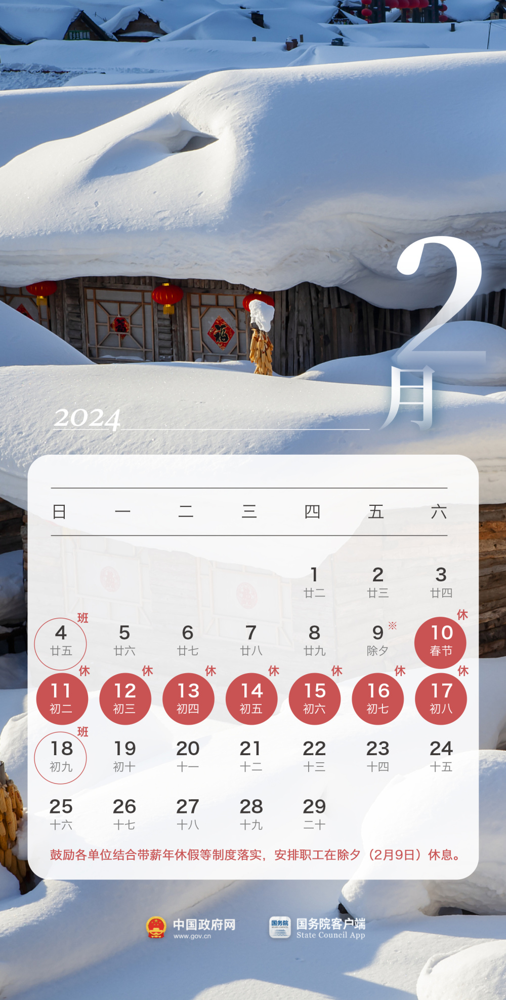
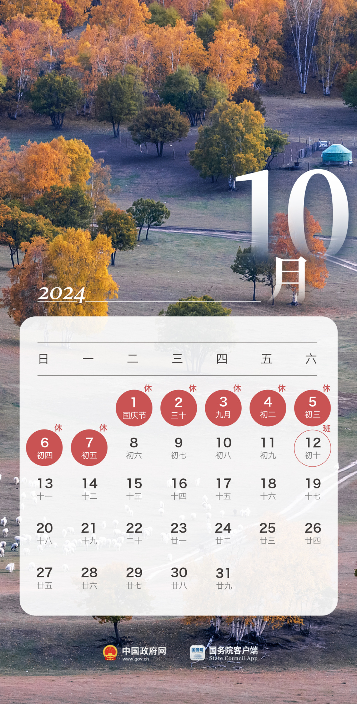
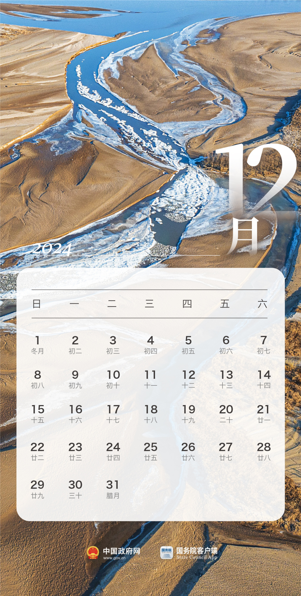

# 国务院办公厅关于2024年部分节假日安排的通知

各省、自治区、直辖市人民政府，国务院各部委、各直属机构：

经国务院批准，现将2024年元旦、春节、清明节、劳动节、端午节、中秋节和国庆节放假调休日期的具体安排通知如下。

**一、元旦：** 1月1日放假，与周末连休。

**二、春节：**
2月10日至17日放假调休，共8天。2月4日（星期日）、2月18日（星期日）上班。鼓励各单位结合带薪年休假等制度落实，安排职工在除夕（2月9日）休息。

**三、清明节：** 4月4日至6日放假调休，共3天。4月7日（星期日）上班。

**四、劳动节：** 5月1日至5日放假调休，共5天。4月28日（星期日）、5月11日（星期六）上班。

**五、端午节：** 6月10日放假，与周末连休。

**六、中秋节：** 9月15日至17日放假调休，共3天。9月14日（星期六）上班。

**七、国庆节：** 10月1日至7日放假调休，共7天。9月29日（星期日）、10月12日（星期六）上班。

节假日期间，各地区、各部门要妥善安排好值班和安全、保卫、疫情防控等工作，遇有重大突发事件，要按规定及时报告并妥善处置，确保人民群众祥和平安度过节日假期。

国务院办公厅

2023年10月25日

