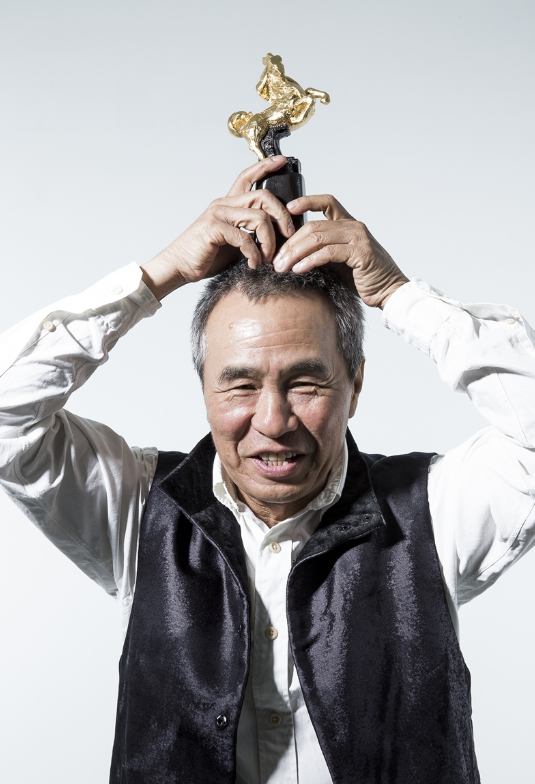
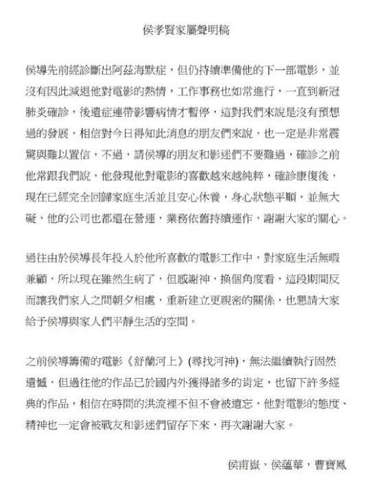
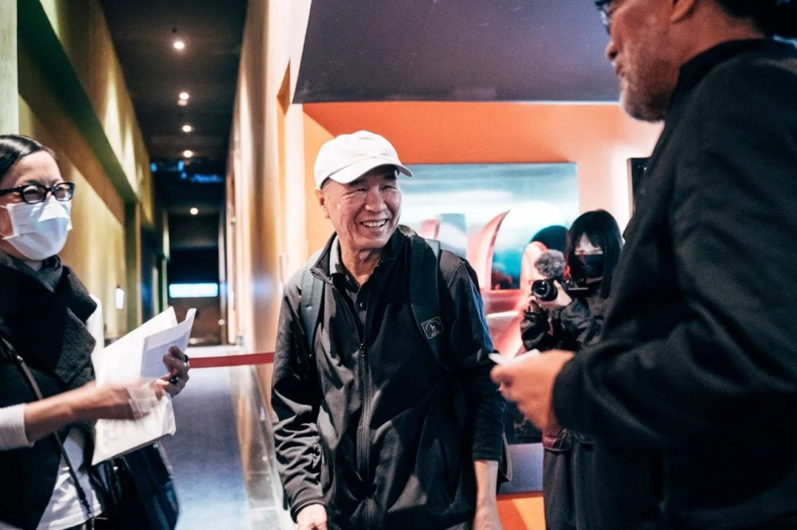
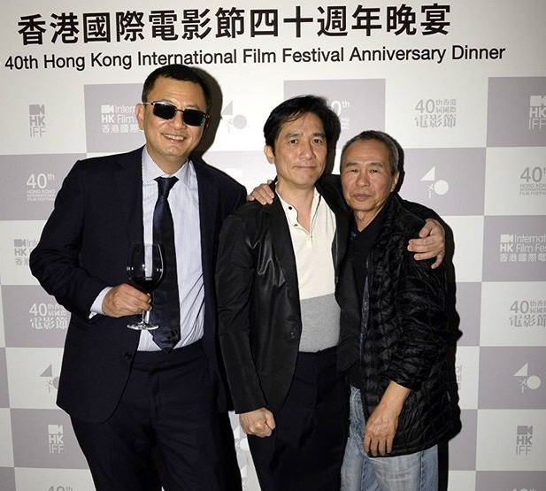
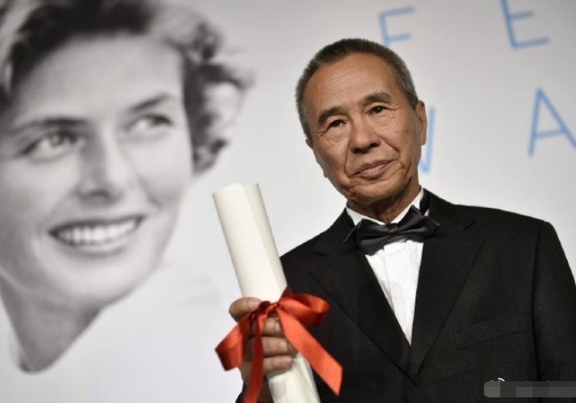
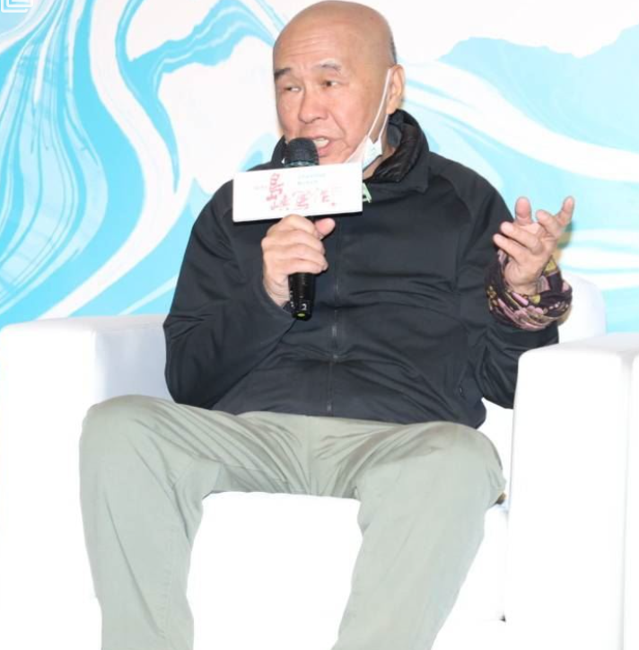
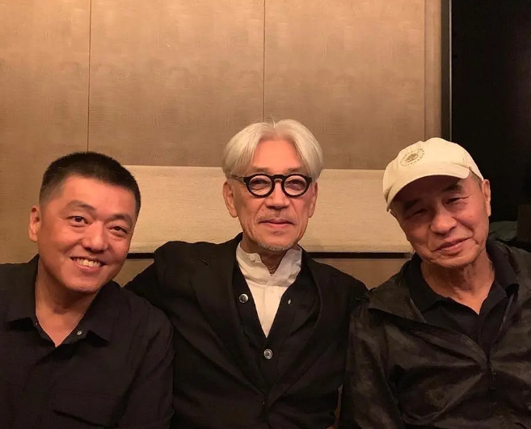
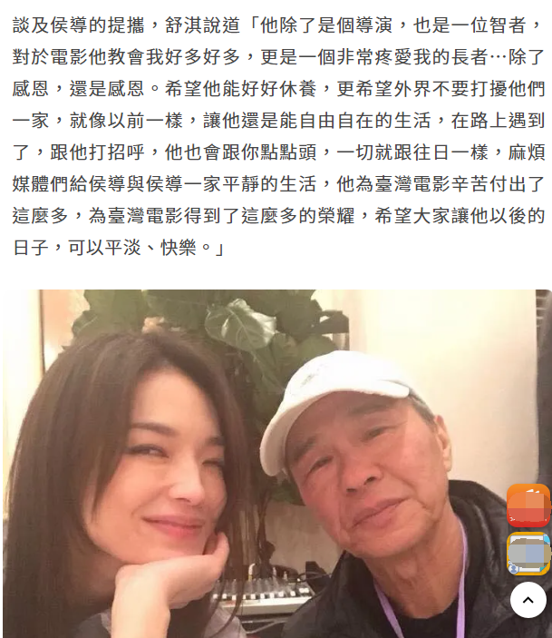

# 子女发声明证实侯孝贤患阿兹海默症：因新冠后遗症影响病情才停工

10月25日，台湾著名导演侯孝贤被曝患上失智症，也就是大家口中的老年痴呆，其子侯甫岳在25日下午发布声明证实。

侯甫岳在声明中证实侯孝贤确诊阿茨海默症（阿尔茨海默症），确诊之后照常准备下一部电影，对电影的热情没有减退，一直到确诊新冠并产生后遗症影响病情才暂停工作：“这对我们来说是没有预想过的发展，相信对今日得知此消息的朋友们来说，也一定是非常震惊与难以置信。”

侯甫岳让影迷放心，侯孝贤确诊康复之后回归正常生活安心休养，身心状态平顺并无大碍，他的公司还在运营，过去忙于工作无暇照顾家庭，如今生病了与家人朝夕相处，建立更亲密的关系。

据了解，侯孝贤确诊失智症最先由外媒曝光，友人称侯孝贤已经认不出家人，他在台北的工作室已经关闭，遣散了工作多年的员工。

今年10月，侯孝贤宣布退休不再执导电影，舒淇主演的《刺客聂隐娘》是他导演的最后一部作品，另外《舒兰河上》《我将前往的远方》因身体原因已经停拍。

据台媒报道，原来早在2015年拍摄《刺客聂隐娘》时，侯孝贤就传出健康亮红灯，明明试过镜了隔天又忘记，圈内人都知道他的状况不好，上次公开亮相是今年2月。

据悉，侯孝贤出生于广东梅县，是淳朴的客家人，1948年跟随家人移居到台湾，1973年踏入影坛，1980年首次执导《就是溜溜的她》，他的代表作《悲情城市》《戏梦人生》与《好男好女》被誉为“悲情三部曲”，也为他赢下多个国际奖项，其与张艺谋合作的《大红灯笼高高挂》还入围了奥斯卡最佳外语片，被日韩影评人誉为最出色的华人导演。

侯孝贤儿子发声后，舒淇接受台媒采访透露，称知道侯孝贤患病已经是很久的事情了，称侯孝贤是一个非常疼爱她的长者：“除了感恩，还是感恩。希望他能好好休养。”

