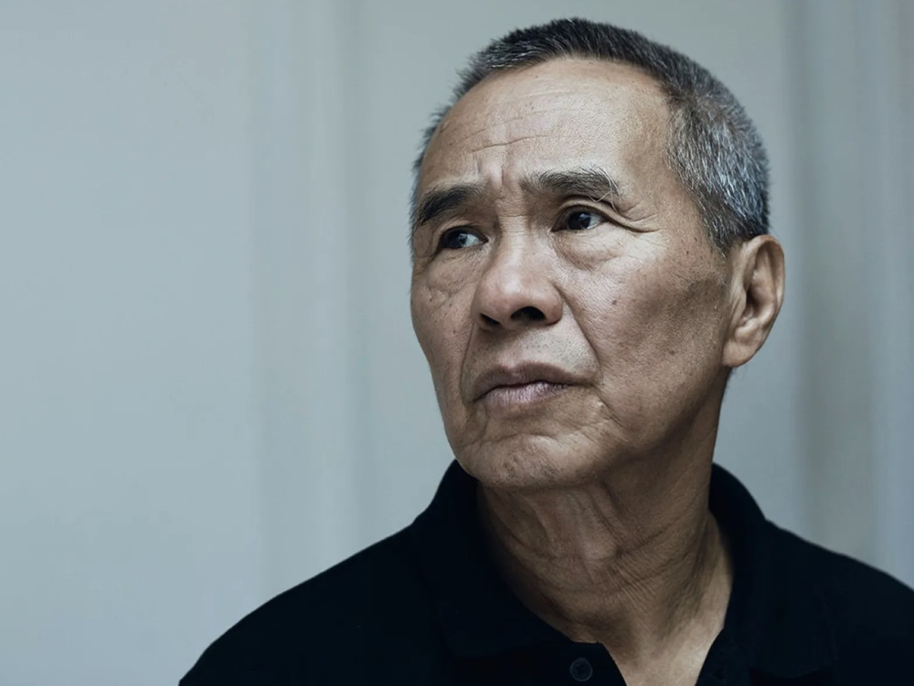
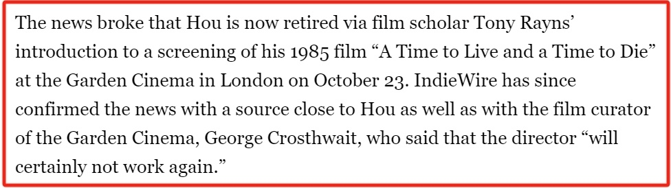
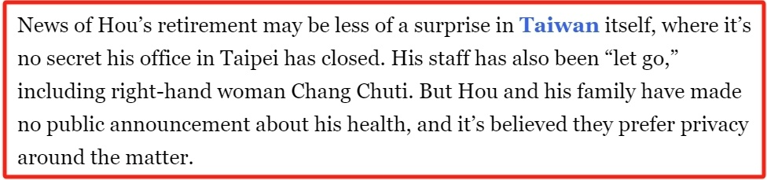
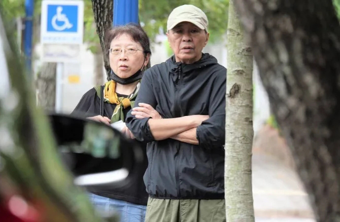
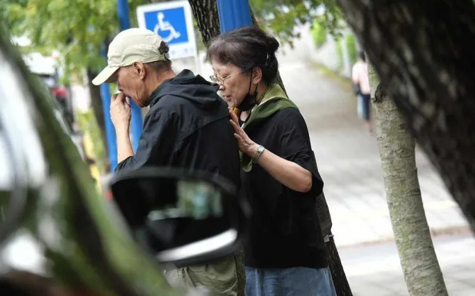
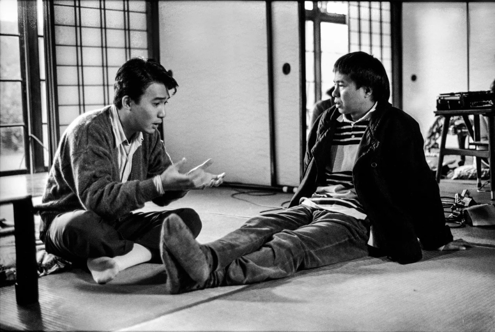
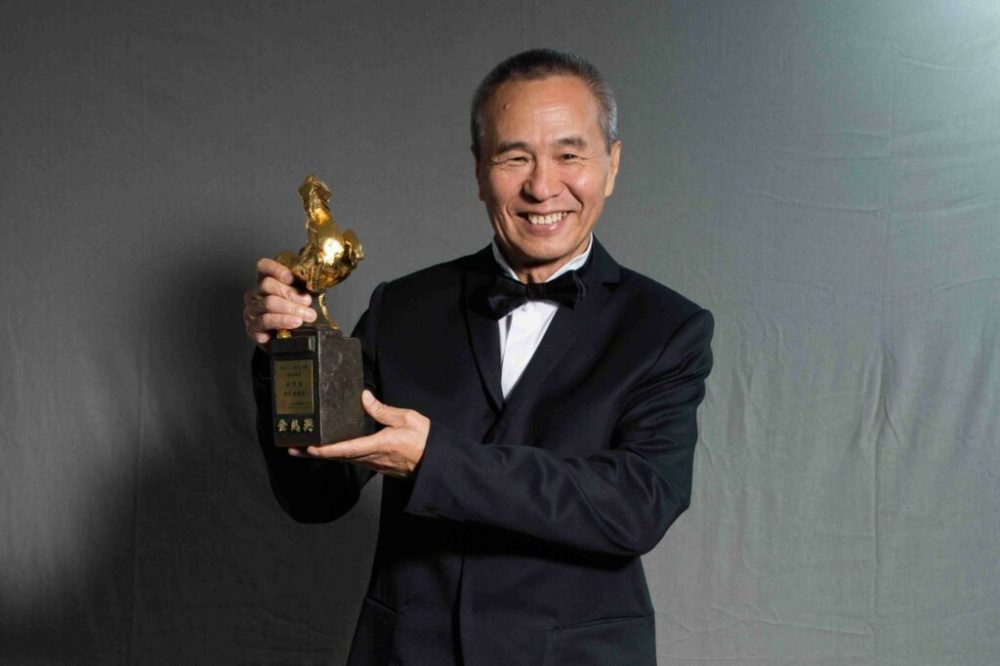
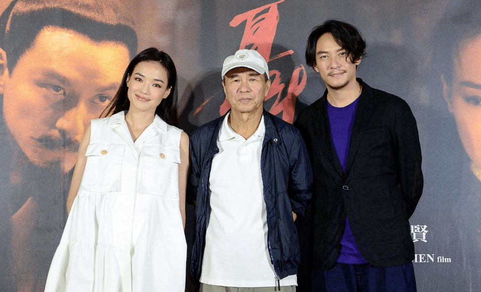
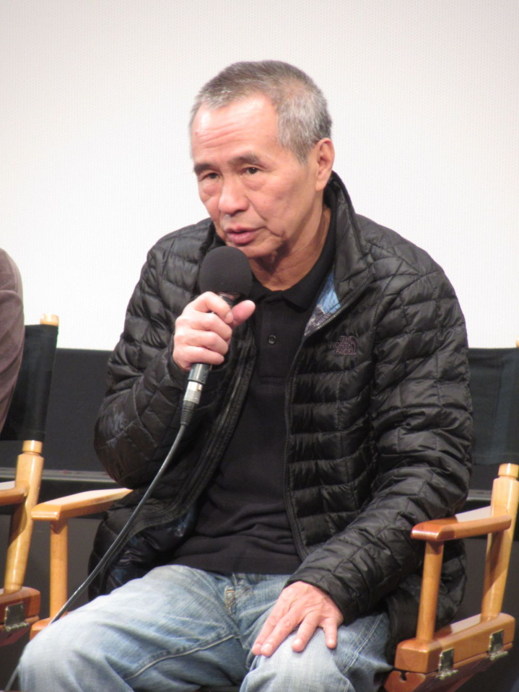

# 导演侯孝贤被曝患失智症退休，一年前现身画面曝光，身形消瘦表情木讷

10月24日，据IndieWire媒体报道，现年76岁的著名导演侯孝贤因患上失智症（Dementia）目前已经退休，无法再继续参加电影制作方面的工作。

报道称，10月23日，电影学者托尼·雷恩斯(Tony Rayns)在伦敦花园电影院展映侯孝贤1985年拍摄的电影《童年往事》（The Time to
Live and Time to
Die）时，透露侯孝贤目前正与失智症作斗争，现已从电影界退休。随后，IndieWire确认了这一消息。一位与侯孝贤关系密切的知情人以及花园电影院的电影策展人乔治·克罗斯韦特表示，这位导演“肯定不会再工作了”。

该报道还指出，他的家人没有公布侯孝贤的健康状况，他们更希望能保护侯导的隐私，但这在台湾已经不是秘密。现在，他在台北的办公室已经关闭，包括他的得力助手张筑悌在内的所有工作人员都已遣散。

另据台媒报道称，侯孝贤近年来健康状况不佳，3年前传出罹患帕金森症，当时指他不记得导演好友，身形也变得消瘦。但随后他的工作伙伴朱天文澄清说侯孝贤未患帕金森，但年纪大了，确实记忆力不佳。两人在一起筹备新作《舒兰河上》，打算找舒淇出演。

去年9月，侯孝贤执导的《悲情城市》33周年数位版首映，侯孝贤缺席，加剧了其健康状况的猜测。但就在去年10月24日，有媒体拍到侯孝贤与朱天文一起在路边候车，两人还不时热聊，看起来并无失智状况。

不过，彼时的侯导确实是非常消瘦，表情略显木讷，精神状态一般。

上车时，似乎需要朱天文搀扶。至于彼时是否已经开始患病，不得而知。

侯孝贤出生于1947年，导演、编剧、演员、制片人。自从1980年执导了个人首部电影《就是溜溜的她》后，一发而不可收。陆续执导《风柜来的人》《童年往事》《恋恋风尘》《尼罗河女儿》《悲情城市》《海上花》《最好的时光》《刺客聂隐娘》等多部作品，此外，他还参与制作了电影《大红灯笼高高挂》《爱丽丝的镜子》《第36个故事》等。多次获得金棕榈奖、金马奖、金像奖、金狮奖、金郁金香奖、最佳导演奖、黑泽明奖等多项大奖。

图为侯孝贤与梁朝伟当年在《悲情城市》片场讨论。

2020年，侯孝贤获得第57届金马奖终身成就奖。

2015年，由侯孝贤执导，舒淇、张震主演的古装武侠电影《刺客聂隐娘》上映，侯孝贤凭借该片获得第68届戛纳国际电影节最佳导演奖、第52届台湾电影金马奖最佳导演奖。

据悉，过去几年，侯孝贤一直在筹备电影《舒兰河上》，并且已经开始了外景拍摄，但恐怕已经无法由他本人亲自制作完成。也因此，《刺客聂隐娘》或将成为侯孝贤执导的最后一部电影。

侯孝贤也是与他长期合作的艺术导演黄文英首部执导电影《车顶上的玄天上帝》监制，该电影是由林依晨、周渝民、阮经天、张孝全等主演，将于今年11月在中国台湾上映。

就在10月23日，《车顶上的玄天上帝》在台北举办宣传记者会，导演黄文英、周渝民、林依晨、阮经天等人一同出席，侯孝贤未现身，背后的宣传板上，貌似并未出现监制的名字。

侯孝贤的家人目前还未回应“失智症”传闻，但其退休消息传出后，影迷们都深感遗憾，希望他安心养病，状况早日好转。

