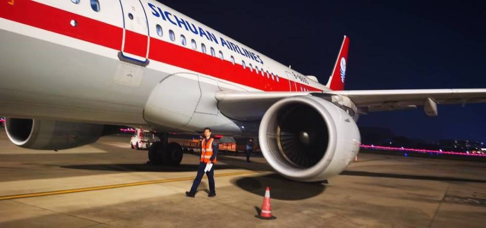
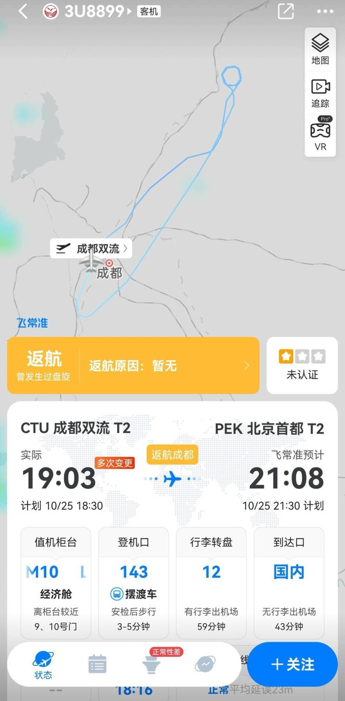
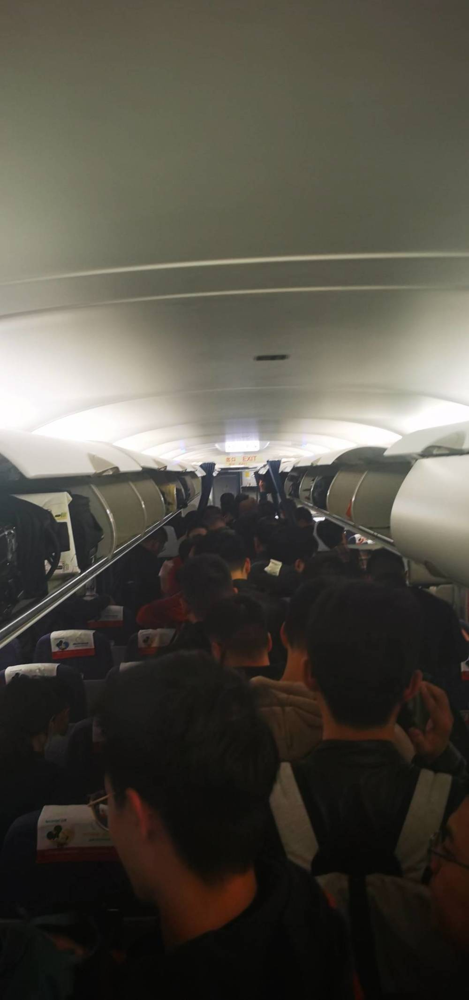
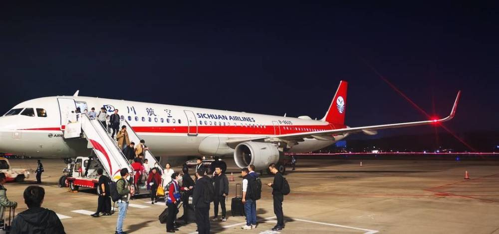

# 成都飞北京一航班遭鸟击返航，已降落成都双流机场

封面新闻记者 杨金祝 受访者供图

10月25日晚，有网友爆料称，自己乘坐的川航3U8899航班在飞行过程中突遭鸟击，目前该航班已经返航成都双流机场。

_飞机返航成都双流机场_

记者在飞常准App上查询注意到，川航3U8899由空客A321-211飞机执飞，于25日19点03分从成都双流机场起飞。该航班状态显示，返航过程中曾发生过盘旋。

该航班旅客曹先生告诉记者，19点40分左右，飞机上的乘客收到飞机被鸟击的通知，“我在飞机上没有感觉到明显的晃动，飞机上的情况稳定。”曹先生说，随后，机组表示，需要返航待机械部门进一步检修。20点左右，飞机返航落地双流机场。

 _飞机返航降落后乘客准备下飞机_

“20点17分左右，飞机舱门打开。在从飞机上下来时，我看到已经有维修人员进场查看飞机情况了。目前，我们已乘坐摆渡车到机场内等消息。”曹先生告诉记者，他咨询机组人员后得知，“飞机是爬升到3000米以上的飞行高度时，遭到鸟击的。”

_飞机返航后旅客下飞机_

曹先生称，目前已得到通知，川航将安排另一个航班复飞。

记者随后联系了川航。川航方面表示，确有此事，考虑到安全问题，航班返航双流机场，已安排其他航班运送旅客。

