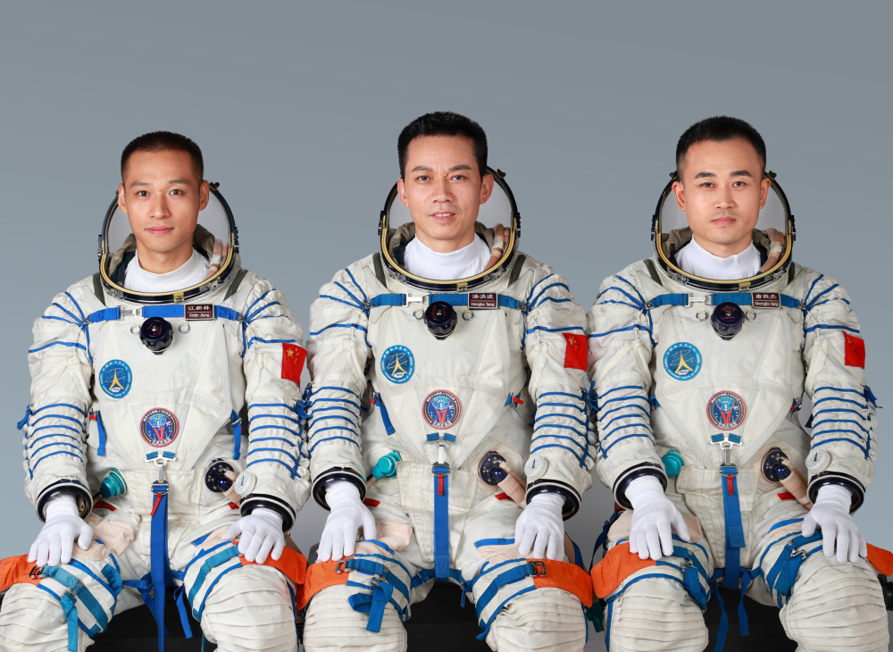
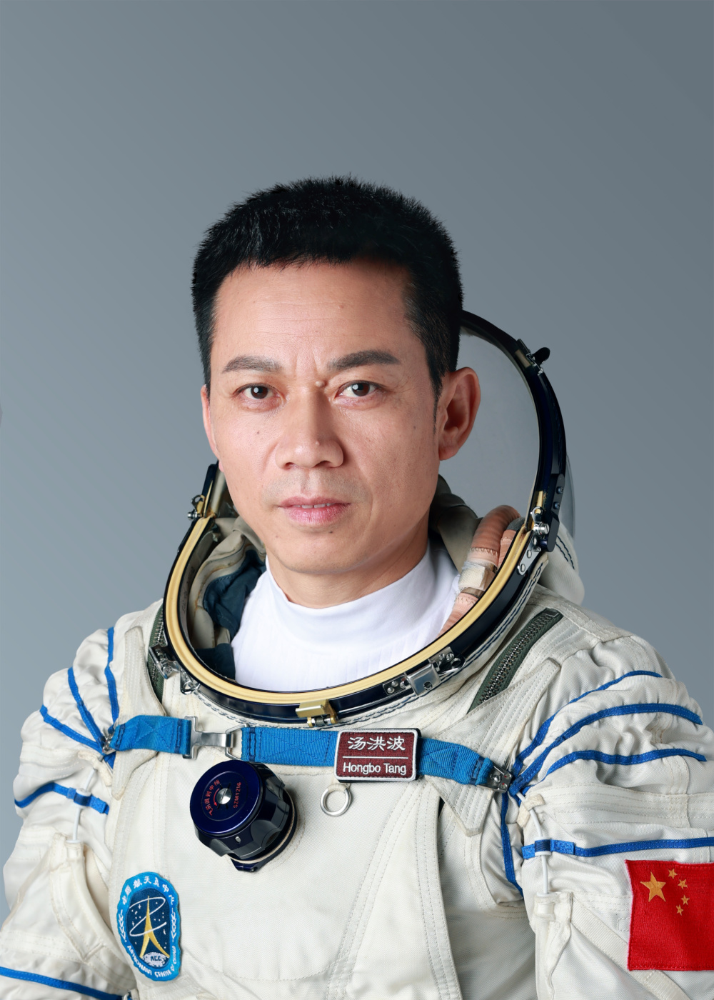
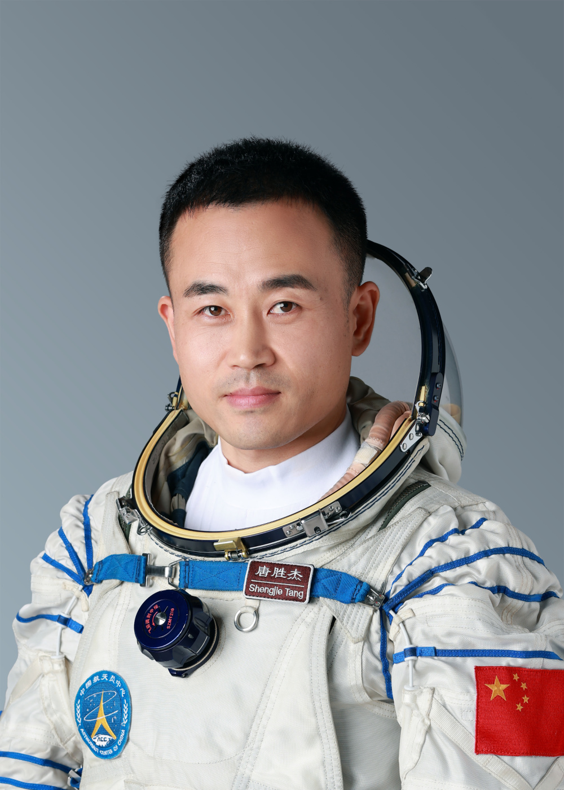
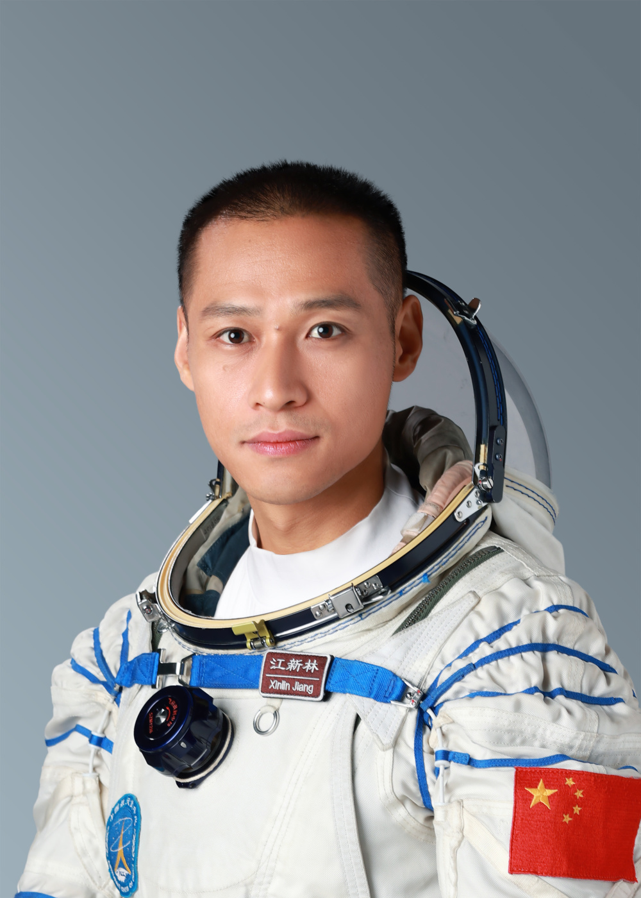

# 执行神舟十七号载人飞行任务的航天员乘组确定

据中国载人航天工程办公室消息，经空间站应用与发展阶段飞行任务总指挥部研究决定，执行神舟十七号载人飞行任务的航天员乘组由汤洪波、唐胜杰、江新林3名航天员组成，汤洪波担任指令长。乘组包括1名第二批航天员和2名第三批航天员，是空间站建造任务启动以来，平均年龄最小的航天员乘组。（来源：人民日报）

**相关报道：**

[神舟十七号瞄准10月26日11时14分发射 ](https://new.qq.com/rain/a/20231025A01JQ600)

[神舟十七号载人飞行任务主要目的公布](https://new.qq.com/rain/a/20231025A01N4300)

[神十七航天员计划于2024年4月返回 ](https://new.qq.com/rain/a/20231025A01NJD00)

