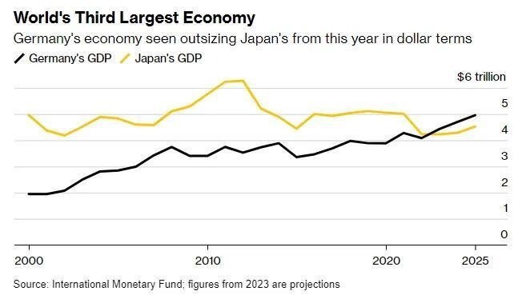

# 日本GDP，将跌至全球第四

德国预计将在2023年取代日本，成为世界第三大经济体。

根据国际货币基金组织（IMF）的预测，2023年日本的名义GDP将从全球第三跌至第四。预测数据显示，2023年日本名义GDP约为4.23万亿美元，而即将反超日本的德国约为4.43万亿美元。

中国人民大学重阳金融研究院研究员、合作研究部主任刘英告诉长安街知事（微信ID：Capitalnews），创新力不足是日本经济持续低迷的病灶所在，被反超是必然，而这次反超对日本的“玻璃心”来说将是一次严重的冲击。

刘英认为，日本GDP被德国反超的大背景，是全球经济增速“南升北降”“东升西降”的整体趋势。

_按美元计算，今年德国（黑线）经济将超日本（黄线）_

**根本原因不在“日元贬值”**

有日媒分析称，近期日元兑美元平均汇率已大幅贬值为1美元兑150日元左右，而欧元兑美元汇率的贬值程度不及日元，日元的贬值导致GDP换算成美元后缩水；此外，名义GDP受物价变动影响，德国比日本物价涨幅更高，也对排名产生了影响。

日本经济被德国反超，仅仅是日元贬值、物价变动的问题吗？实际上，日媒也坦言，日本经济增长低迷已是长期持续现象。

刘英认为，在上述直接因素之外，日本GDP被德国反超，根本原因还是日本经济自身存在的问题，最核心的就是缺乏活力。

“安倍经济学”中提出“通过提高工资增加财富、依靠中小企业拉动出口、‘智慧’是创造财富的宝库”这“新三支箭”，试图刺激经济增长，但尽管箭箭齐发，日本经济却并未真正走出低迷窘境。

一方面，日本受限于土地不足、自然资源匮乏的“先天条件”，而少子化、人口老龄化问题严重，进一步导致劳动力不足、消费不足、投资不力，致使经济持续下滑。

此外，日本的创新力不足、缺乏经济增长动力成为“致命一击”。全球独角兽企业最多的两个国家是美国和中国，其中很少看到日本企业的身影。不仅如此，日本传统产业基本被赶超，而创新产业当中，数字经济等则表现平平。

日本是目前全球唯一采取非常规货币政策的国家，试图通过极端刺激来改善经济，然而，经济动力不足，再多的货币政策和财政政策刺激恐怕都是枉然。

实际上，在今年德国GDP超日本的预测出来之前，日本的人均GDP已经逐年下滑。日本人均GDP原来是高于美欧发达经济体的，但据统计，目前在七国集团中已经垫底，连韩国也已赶超日本。刘英认为，长此以往，日本经济总量跌出第三、跌到德国之后是必然，而这种趋势也很难改变。

**心理打击比上一次还大**

面对即将被德国反超的现实，日本政界颇显“无奈”。日本经济产业大臣西村康稔24日表示，“日本的经济增长潜力确实已落后，且保持低迷。”

日本首相岸田文雄23日称，希望通过即将出台的一揽子计划等措施，帮助缓解日本民众生活成本危机，经济刺激方案包括延长能源补贴等。“我们想夺回过去二三十年的失地。”他表示。

 _10月23日，岸田文雄在日本国会特别会议上发表政策演讲。图源：视觉中国_

不过，日本民众对政府的经济刺激方案似乎也已失去信心和期待。共同社近日的一份民调结果显示，岸田内阁支持率仅为32.3%，创下自2021年10月组阁以来新低。对于政府即将推出的经济对策，表示“不予期待”的回答达58.6%。

刘英指出，此次德国经济反超日本的消息，对日本来说不单单是“打击”的问题，而将是一个强力的“冲击”。

“上世纪，曾经号称经济‘世界第一’的日本风光一时，不把任何国家放在眼中，一度在美国‘买买买’，纽约的不少高楼大厦都是日本的囊中物。但伴随日本经济回落，这些物产又物归原主了。本世纪第二个十年中，日本经济被中国赶超。如果说当时中国超过日本，日本还有‘中国人口规模大’的借口，那么这次德国反超日本，日本将无言以对，因为德国的人口还不足日本的七成，日本本来就严重的‘玻璃心’，恐怕要受到较为沉重的冲击。”刘英说。

对于日本政府即将出台的宏观政策刺激措施，刘英认为，无论是安倍经济学还是后续的岸田政府的经济政策，恐怕都是强弩之末，或者说难逃边际效益递减的规律，难以刺激经济增长，日本经济继续滑落仍是大概率事件。

**南升北降、东升西降是大势**

日本经济颓靡的背后，是整个发达经济体的经济增长放缓。实际上，IMF在下调全球经济增长预期的同时，把美国等发达经济体的增长预期下调到了几乎腰斩的程度，却维持了新兴市场和发展中经济体4%以上的增幅。

刘英认为，全球经济正处在“南升北降”“东升西降”的态势中，而且这个趋势还会继续下去。发展中国家和新兴经济体更具经济增长的动力，无论是劳动力、土地、技术还是创新力，新兴经济体都更具活力和潜力，相对而言，发达国家经济体则有一些“迟暮老人”的意味。

发达国家增长不足的同时，却正在越来越走向封闭，实际上两者恰恰互为因果——一些发达国家经济衰弱导致了逆全球化的封闭思潮，推行贸易保护主义、单边主义措施，这又反过来进一步限制了其经济发展。

一些国家不是去解决自身的发展问题，反而是热衷于高筑壁垒、搞贸易限制、科技打压、零和博弈。这样的心态和做法带来经济衰落是必然的。

“要走出困境，发达国家经济体应该放平心态、敞开胸怀，秉持开放的理念和持续改革的路径，才能够更好地融入全球化当中，与其他经济体合作共赢。这才是根本的出路，而不是在封闭和衰落之间恶性循环。”刘英说。

