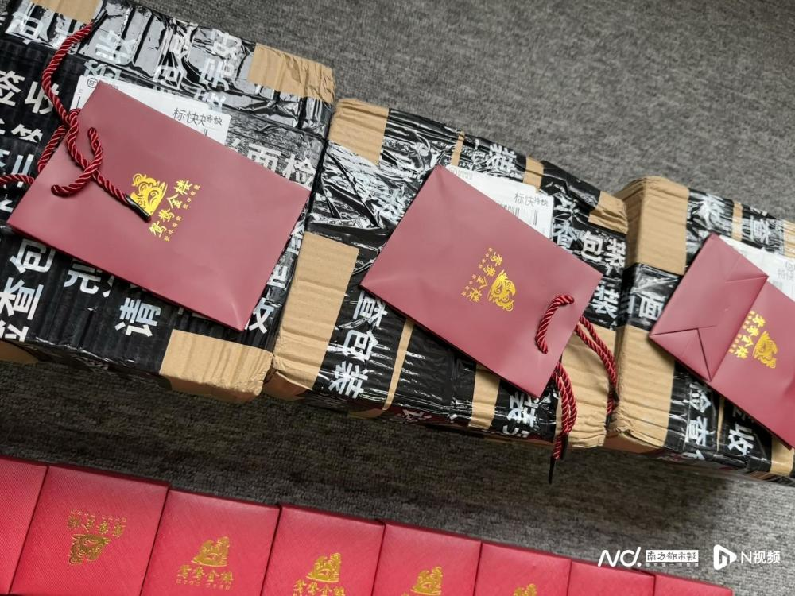
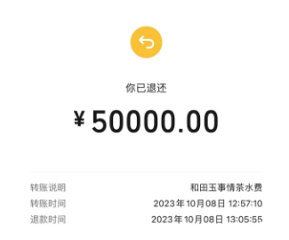
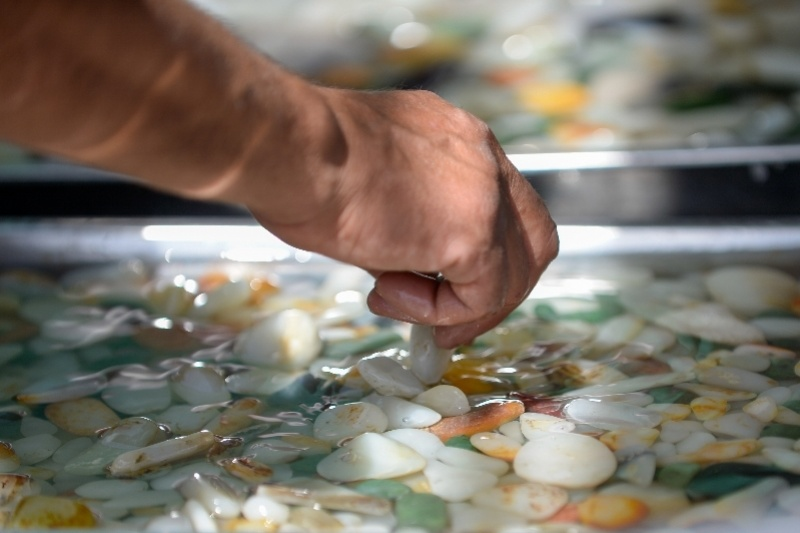

# 李佳琦直播间假和田玉追踪：透闪石比例无法确定，全重引质疑

“消费者在李佳琦直播间买到假和田玉”一事持续发酵。10月25日，涉事品牌方鸳鸯金楼两度发文澄清此事，声称产品为正规并符合标准的和田玉项链。（此前报道：[李佳琦直播间买到假和田玉？鸳鸯金楼回应：产品均正规](https://new.qq.com/rain/a/20231025A04SEE00)）

真假和田玉随即被推至舆论的风口浪尖。商家寄给消费者的鉴定证书，和消费者自行送检的鉴定证书，为何会不一样？从鉴定证书看，能看出项链是否是和田玉呢？消费者曾称，检测机构的工作人员说产品碳酸盐过多，无法出具和田玉鉴定证书，真相如何？

**回顾：在李佳琦直播间买到几十条假和田玉项链**

**鸳鸯金楼两度发文回应**

近日，职业打假人王海曝出李佳琦直播间卖假和田玉，被消费者曝出品牌方鸳鸯金楼花五万元想和解，但是遭到消费者拒绝。

消费者此前告诉南都·湾财社记者，他花了5000多元在李佳琦直播间买了几十条项链，但收到货后，发现商品的鉴定证书有问题，这几十条和田玉项链的重量都是一样的，均为40g。于是，他随即选取了十几条项链送去检测。

他表示，检测机构工作人员曾称，送检样品碳酸盐过高，出不了（和田玉）鉴定证书。其提供的一段录像印证了此事。

消费者收到货后，发现证书显示的产品重量均为40g。

该消费者称，他曾与李佳琦直播间联系，对方曾回应称会去找品牌方联系，督促品牌方改正，并跟领导汇报，尽快处理，“但还是没有最新进展”。10月25日，李佳琦直播间回应南都·湾财社记者称，直播间产品均符合相应标准才会准予上播。

10月25日，鸳鸯金楼官方微博针对此事两度发布声明。声明称，公司售出的和田玉项链通过了广东省金银珠宝检测中心有限公司等多家国内权威的玉石质检机构的复检，为正规符合标准的产品。

在其最新声明中，鸳鸯金楼提到，关于伍万元转账记录，是断章取义的内容，公司已报警。

不过，就该声明，消费者回应称“没啥好说的，转账有备注”。在消费者提供的截图中，伍万元转账记录备注“和田玉事情茶水费”

10月25日，南都·湾财社记者在天猫鸳鸯金楼官方旗舰店查询，并未搜索出和田玉相关产品。企业官方电话也未能打通。

**和田玉没有产地意义，以矿物成分来划分**

**什么是和田玉？**

南都·湾财社记者注意到，早年，新疆曾出台地方标准，指出和田玉“系指产于新疆维吾尔自治区行政区域内昆仑山-阿尔金山一带成因特殊以微晶-
隐晶质透闪石为主的玉石”（地DB65/035-2010《和田玉》）。

不过，2013年末，中国国家标准管理委员会和全国标准样品技术委员会就批准发布了国家标准GSB
16-3061-2013《和田玉实物标准样品》，此前，在接受媒体采访时，新疆产品质量监督检验研究院和田玉产品质量监督检验中心主任李新岭曾表示，
**和田玉的矿物成分是透闪石，学术界对和田玉是按产地来划分还是按矿物成分来划分存在很大的争议，《和田玉实物标准样品》国家标准不论产地，一律按其矿物成分来界定**
。

2020年12月1日起，由国家和田玉产品质量监督检验中心（新疆）牵头起草的国家标准《和田玉鉴定与分类》（GB/T
38821—2020）正式开始执行。该国标对和田玉进行了定义，和田玉是透闪石矿物集合体，次要矿物可为阳起石，可含少量方解石、透辉石等矿物。

_新华社记者 高晗 摄_

和田玉是怎么形成的呢？广州番禺职业技术学院珠宝学院岳素伟博士告诉南都·湾财社记者，我们国家新疆、青海等地的和田玉基本上都是接触交代变质作用形成，就是中酸性岩浆侵位到大理岩（白云质大理岩）中，在接触带发生了物质交换，形成了一系列的矿物组合，包括透辉石、石榴石、硅灰石、透闪石等等。

岳素伟称，当中酸性岩浆侵位，在透闪石形成过程中会包裹稍早形成的矿物以及围岩大理岩，透闪石中就可能存在方解石（大理岩的主要矿物，宝石学称大理石）或白云石等碳酸盐矿物。这个矿物组合能否被称为和田玉，则要看方解石等次要矿物的量，只是很少量，则影响不大。

“再如，我们经常说的蓝田玉是蛇纹石化大理石，玉石以方解石为主，含一定量的蛇纹石，如果是蛇纹石为主会被称为岫玉，如果是纯净的方解石组成的玉石，被称为大理石。”

**单从鉴定证书无法确定透闪石占比**

**此前检测机构曾称产品碳酸盐含量过高**

对比消费者提供的两份产品鉴定证书，一份是消费者在李佳琦直播间购买鸳鸯金楼时商家提供的，另一份则是消费者委托其他检测机构检验的，前者显示，经深国监鉴定，产品为和田玉项链，外观白色，总重40g，含其他矿物成分；后者显示，经NGTC鉴定，产品为碳酸盐—透闪石质玉项链，其中一份样品总重48.84g，外观白色，放大检查为纤维粒状结构。

那么，真假和田玉的关键就在于，产品中透闪石的比例有多少？

国标《和田玉鉴定与分类》里提到：若同一件玉石中其他矿物百分比为5%以下时，可以直接使用和田玉命名，若其他矿物百分比为5%以上(墨玉除外)时，又分为两种情况讨论。
其中一种情况是：如所含其他矿物均匀分布，矿物颗粒界线不清晰，使用“透闪石质玉”，附注说明含其他矿物的方式命名，例如：透闪石质玉(含碳酸盐)。

由此，可推断出，消费者送检的十几条“和田玉项链”，均为 **所含其他矿物均匀分布，但是矿物颗粒界线不清晰** 。

岳素伟也向南都·湾财社记者表示，消费者自行送检的鉴定证书显示，产品为“碳酸盐—透闪石质玉项链”，碳酸盐和透闪石之间使用了连字符，一般是代表产品中不能衡量具体的百分含量，“这两种物质含量可能相当，或碳酸盐略少”。如果是质地较纯的透闪石，则会直接命名为“和田玉”。

岳素伟表示，目前国家标准并没有具体规定透闪石的占比，从在岩石学上，名称中含“质”字，一般是指该物质含量较高。

广东南方产品质量研究院何主任告诉南都·湾财社记者，NGTC的证书检测结论是碳酸盐-
透闪石质玉项链，说明检测到碳酸盐矿物成分较多；另一家证书检测结论为和田玉，只在备注栏写明含其他矿物成分，说明透闪石含量较多，“具体含量多少都没有确定，因为需要更近一步的仪器检测。根据国标的规定，和田玉必须是透闪石含量为主，并且密度、折射率要达到一定的范围值，否则不可以定名和田玉”。

不过，值得注意的是，消费者表示，检测机构工作人员曾称，送检样品碳酸盐过高，出不了（和田玉）鉴定证书。

**几十条项链克重都一样**

**很可能存在不规范现象**

另一个聚焦的问题是为何两份鉴定结果显示产品的克重数不一样。

岳素伟认为，证书上如果统一是一个克重，一两条有可能，如果是几十条上百条甚至更多都是一个克重，很可能存在不规范现象，“因为数量很多时很难做到完全一样的克重，至于有没有造假，就不清楚了”。但他强调，没有看到具体的实物之前，不太好下结论，但是，希望消费者还是要擦亮双眼，去正规的渠道购买，以免上当受骗。

他也表示，希望消费者对珠宝行业有信心，这也是不断规范的过程，现在市场有了很大进步，还会持续进步，消费者的监督，也是对珠宝行业的不断走向规范的促进。同时，也希望珠宝从业者严于律己，共同促进珠宝行业的健康繁荣发展。

采写：南都·湾财社记者 冯家钜

