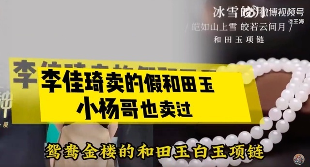

# 王海打假李佳琦直播间卖和田玉：根本不是和田玉，连鉴定证书也是假的

**最新消息：**[商家回应：产品为真，是售罄后下架，相关部门正在处理](https://new.qq.com/rain/a/20230519A06SZX00)

据板扎在线报道，10月24日，北京（发布），知名打假人王海发布视频，称李佳琦直播间卖和田玉为假货。

王海介绍，消费者在李佳琦直播间购买“鸳鸯金楼”的和田玉项链，NGTC实验室对项链的鉴定结果为“碳酸盐-透闪石质玉项链”。

“根本不是和田玉，鉴定证书也是假的。”王海表示，消费者（向商家）反映后，“鸳鸯金楼直接给消费者微信转了5万块钱，希望能够息事宁人，但被消费者拒收了”。

据了解，目前该款商品已被商家下架。

10月25日，王海再次发文称，“李佳琦假和田玉项链小杨哥也卖过！建议检测一下要求退一赔三，这个价格不可能买到真的。”

视频中，小杨哥说：“你们要的东西我砍下来了，鸳鸯金楼的和田玉白玉项链，这个直播间卖380。这个是项链，这个是手链，多少钱？319元，上车！”

对于“王海打假李佳琦直播间卖和田玉”一事，网友纷纷表示，“李佳琦：你不知道和田玉是什么价格吗？自己不努力还想贪便宜”；“直播带货真是假货泛滥，直接给消费者转了5万块钱，收着啊，然后广而告之，让每一个买了玉的都去反映，你看他们配得起吗？”

还有的网友表示，和田玉并非特指新疆和田地区出产的玉，而是一类产品的名称。“玩玉的都知道，和田玉本来就是透闪石啊。和田玉虽然因新疆和田而命名，但其本身不是地域概念，中国把透闪石成份占98%以上的石头都命名为和田玉，都在国标范围内。”

**【来源：九派新闻综合板扎在线、王海个人账号、网友评论】**

