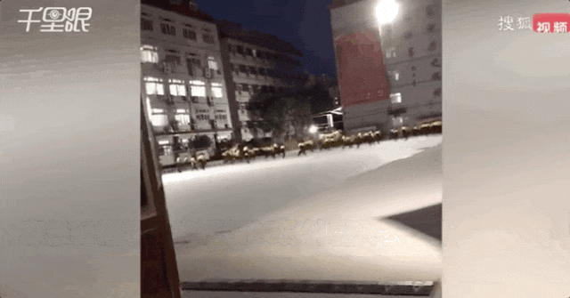

# 近5000万学生患抑郁症，是课间十分钟都不能活动的后果

​本日代班者，是忧心忡忡的宝爹富贵。

比起除夕不放假，今天的另一条新闻更让我闹心：

我国有9500万人罹患抑郁症，其中50%是在校学生。

更闹心的，是评论区依旧有不在少数的人觉得，抑郁症就是吃饱了撑的。

“现在的孩子不能吃苦。”

是，之前确实没有抑郁症，我们一般管它叫中邪、鬼上身和失心疯，文雅一点的还有郁郁而终。

但话说回来，在我的记忆里，“中邪”高发群体并非孩子。

而我上次去北京安定医院做检查，却看到里面站满了学生。

当时一家三口看完病从我身边路过，女儿低头跟妈妈说：“你看吧，我真的有病。”

那个妈妈的回答让我心凉了半截儿：“我看你不上学就什么病都没有了。”

……

是啊，不上学，逃离一个连课间十分钟都不存在的环境，也许可能真的会缓解一点吧。

鸦雀无声的课间十分钟，老生常谈的问题了。

2021年它就已上过热搜。

当时白岩松说，连课间十分钟都很难走出教室的孩子，怎么能支撑篮球、足球冲出亚洲？

现在两年半过去了，足球篮球今日是何成绩大伙都有目共睹，但这都不重要了。

重要的是孩子的健康，无论生理还是心理。

**腾讯新闻问答** 的答主 **@00M** 是一名高中教师，在她学校的厕所的门上，有学生写着：想死的风还是吹到了x中，我想死，天天都想死。

同样身为老师的另一位答主 **@我不想上幼儿园** 说，“好多学生缺乏锻炼，脱发严重，抑郁症每个班都有一两个，白头发比我都多。”

老师很心疼，却又无能为力，当地教育不发达，“再不苦不是更差。”

“我们学生一本上线率25%左右，如此高压的情况下还有逐年下降的趋势。”

不过富贵我对这种高压式学习对提升成绩的帮助性，一直持怀疑态度。

人是有极限的，逼迫到极致的后果就是适得其反。

**@我不想上幼儿园**
也说，学生疲劳上课效果特别差，“都说劳逸结合，现在基本只有劳没有逸了。周末没有，上课要上到周日早上十一点半，周日晚上又回来晚自习，每周只有半天时间调整。”

他们老师都很清楚，再高压，每年的一本率都不会有大的波动。

但学校领导不能放松，只能不停地在上一届的基础上继续高压。

因为“
**最后考得好还行，如果考不好，上级就会说是不是放松了？是不是做的不够？是不是领导不行？领导的乌纱就不保啦。所以他知道没有效果也要压，何况他还有幻想如果有效果呢**
。”

在我的印象中，之前虽然也听说过学生压力倍增，但也没到现在这样过载。

是从什么时候开始，连小学生的十分钟玩乐都成了奢侈呢？

答主 **@就是宇文酱** 给出了她的答案。

2018年，她所就职的学校来了一个新的校长，走的是衡水模式，“把原先的早上七点半到校，提前到了七点钟，星期六开始补课，美其名曰是课后延时服务。”

学校还创新地开始走精细化管理的路线，每天上课有专门的领导巡视。

结果是管理的越精细，越压抑。

”学生每天在校的时间长达13个半小时，中午也不准回家，必须在学校午休，而且是趴在桌上午休，必须保持绝对安静，不然会被通报批评，平时走廊上也不准学生发出稍微大一点的声音。”

再加上不超过20分钟的吃饭时间，吃个饭跟逃荒一样，多少学生在飞奔中患上了肠胃炎。

仿佛一个大监狱。

回想一下，虽然说我们80后的童年有诸多不如意，可是那些课下的每一个瞬间都是那么美好。

那些口口声声说自己比现在孩子苦多了的家伙，扪心自问，年少的自己在其中能坚持几天？

中小学生有很强的可塑性，十年光阴，他们是成长为清新质朴、刚健直率的少年男女，还是变成畏缩不前、糊弄规则、表面一套背后一套的小大人，和校园生活息息相关。

他们现在在经历什么日子？

身在河北的答主 **@Mr.刑** 的回答触目惊心：

“睡眠严重不足，高度压抑、单调、重复、乏味的日常，每天高强度KPI重复考核，每天在20cm—5m之间的目视距离，每周日照时间不足3个小时；

十七八岁的年纪长时间静坐，身材走形，虚胖，女生月经不调，男生前列腺炎情况时有发生。”

精神状态，更是不容乐观：

“同学之间没有友谊，没有共同回忆，没有时间玩耍社交，你和同桌只是高考的竞争对手；师生之间也没有感情，他的KPI需要通过我们的KPI来实现。

单一指标竞争状态下，一眼看去都是没有情感、没有情趣、没有人格的工具。大部分眼神是呆滞的，没有光。”

按照等量关系，一方的变化都会引起另一方相应的变化。

学生痛苦加剧，总会有人快乐加倍吧？

老师吗？

**@我不想上幼儿园**
说，他们的工作早就超负荷，老师没有周末，法定假期基本全是上课，“社会上都认为老师补课肯定是为钱，可公立学校早就不多收学生一分钱了。”

也就“高三有点超课时津贴，每节课五六块，每个月三四百，而且还经常拖欠不发的。”

更让他们闹心的还有部分家长。

要么是“只要孩子成绩好，我什么都可以放下，只要孩子成绩好，我可以付出一切代价。”

要么是“我孩子不能在学校受到一点磕碰，天呐他居然在玩萝卜刀老师你快去管管不管我就来闹。”

配合上学校怕惹事，又要升学率，这一切的压力都传导给了老师，他们能怎么办？只能压住学生的天性，即使课间十分钟也不让他们自由活动，多做多错不做不错。

这个死循环下甚至没有几个赢家，层层传导的压力链条下的每一个人都收获了痛苦，却没获得多少收益。

身为高中老师的答主 **@00M** 说，她唯一欣慰的是，高考结束后，原来天天愁眉苦脸的学生，再回学校来时，精气神就完全变了。

“脸上明显的笑意，以前见到老师都是绕道走的，现在见到老师就是主动问好，胆子也大了，什么话题都能聊了。

压力消失后，孩子们露出了本来的面貌。”

可这时候，还来得及吗？

在最需要吵闹的年纪，他们已经失去了吵闹的权利。

这些缺失所造成的痕迹，很可能会跟随他们一辈子。

我不奢求他们能无忧无虑，但求课间十分钟能够跑出教室。

学校下课铃响以后，校园里充满着沸腾的喧哗声，孩子们追跑打闹，释放天性。

我认为这才是正常的校园生活。

