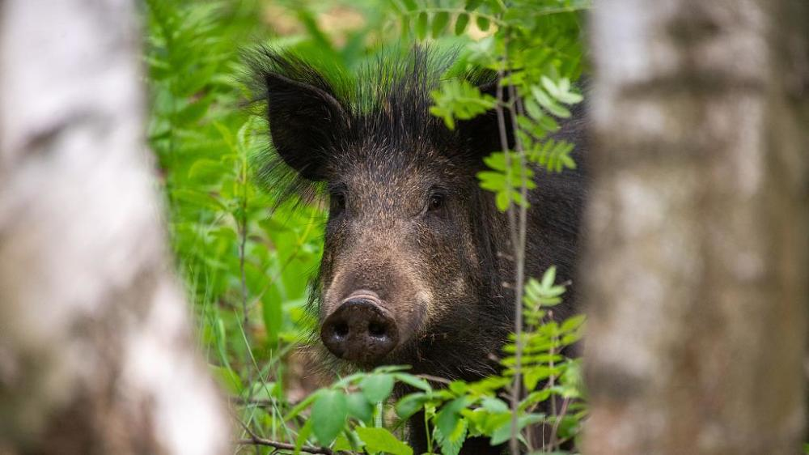

# 野猪被移出“三有名录”能否随意捕杀？相关部门：不可随意捕杀、食用

国家林业和草原局7月公布调整后的《有重要生态、科学、社会价值的陆生野生动物名录》，野猪被移出名录，这是否意味着可以捕杀？10月24日，江苏省野生动植物（湿地）保护站站长姚志刚在江苏卫视公共新闻频道《政风热线》中表示，野猪虽被调整出名录，仍不可随意捕杀、食用。

姚志刚表示，野猪的繁殖力很强，这几年随着野生动物保护力度加大，其种群数量迅速上升，超出了区域生态环境承载量，对城乡群众的生产生活带来威胁和危害，因此，“三有动物名录”将其移出。“但并不意味着可以随意捕杀。可以在基于保护的情况下进行有组织的猎杀并遵守相应程序，先要科学评估，在维持区域种群安全的情况下确定可猎捕数量；其次要遵守行政区域禁猎区的管理，包括枪支管理规定。”另外，“据全国人大常委会相关规定，野猪是不能吃的”，姚志刚表示。

澎湃新闻（www.thepaper.cn）注意到，近年来江苏南京常因野猪的新闻登上热搜。据报道，该市绿化园林局和省林业科学研究院2019年7月启动野猪监测研究，在南京8个区设置142台红外相机，发现每个监测区都有野猪的身影，浦口、江宁、溧水和紫金山附近野猪的出现频率最高。靠山的南京大学仙林校区曾出现野猪狂奔的场面，有网友戏称“野猪都上了985”。

野猪频繁“闯入”城市也给人们的生产生活带来烦恼。据澎湃新闻此前报道，南京浦口区老山附近一片100多亩的茶园常被野猪“侵扰”，大量茶苗被拱坏，只能重新栽种。

