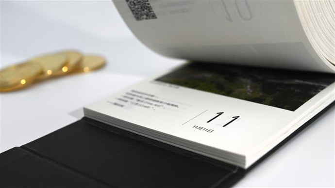

# “双11”的“全网最低价”能相信吗？“30天最低价”竟比不打折更贵

今年“双11”提前启幕，“全网最低价”成为多家电商的卖点。最近，有品牌与不同销售渠道因“定价权”引发争议，内幕如何消费者不得而知，可从消费者体验看，“全网最低价”玄机多多。

**“30天最低价”竟然比不促销更贵**

白领王先生拟在今年“双11”购买一款高端手机。他在某知名电商平台搜索该手机型号后，搜索结果的第一个选项就有鲜艳的红色促销标签“30天最低价”。点进去显示，该款手机是平台的“优选新品”，标价为“8？99元起”。但到了选购页面，王先生越看越迷糊：在这家店铺中，该款手机的实际销售价格有好几个。其中，内存最小的型号根据颜色，价格从8699元至9099元不等，而在该手机的官方线上渠道，同样内存的手机不同颜色却定价相同，都是8999元。在这家店铺里，内存大些的型号价格差距更大，以一款官方线上渠道定价10999元的产品为例，该店铺的最高定价达到12499元。

明明打出“30天最低价”优惠，为什么比不打折的官方渠道更贵？记者调查发现，这与电商平台“一品多价”现象有关。

不同于实体商店的“一品一价”， **电商平台“一品多价”现象很是普遍**
——同一个商品介绍页面其实包含了多件商品、对应不同的价格。当消费者最终选购时会发现，不同产品的价格差异很大，可页面上显示的却是某一件商品的定价，而且是最低的定价。但是，有些“低价”存在误导的嫌疑。

比如，电子产品、化妆品、日用品都是“双11”的热门品类，但有些平台呈现的商品价格可能是消费者目标商品的配件——市场价格数百上千元的电子产品，宣传页面标价只要几十元，实际对应的是该电子产品的充电器等配件，而产品本身与市场价持平；页面显示几十元的化妆品，用的照片是正品规格，但消费者选购时会发现，该价格对应的是小样或者中样……如此种种，看似明码标价，却是价格欺诈“擦边球”。

此外， **有些产品的最终定价与消费者是否熟悉平台的促销规则有关**
。近年来，“双11”的优惠规则经常被批评“比奥数题更难”，因为消费者发现，不同的优惠组合会带来不同的结算价格。今年，即使不做“奥数题”，有些优惠也很隐蔽，普通消费者不一定找得到。比如，有的商家在产品页面上提醒“直播间选购更便宜”，但当消费者进入直播间后，发现并没有优惠——原来，只有在直播间联系客服后，才能获得优惠券，使用优惠券下单，才有折扣。

**“真低价”可遇不可求**

“下单时找准‘全网低价’的闪电标识，就能买到全网最低价的商品”——这是某电商平台给出的选购诀窍。可记者注意到，这条“诀窍”有个限定条件：只能保证在消费者下单的这个时段，该商品才有“全网最低价”的优势。

深谙“双11”规则的资深“剁手族”陈小姐提醒，某个时段的“全网最低价”未必是真正的“全网最低价”，“如今的‘双11’与10多年前的完全不同，一件商品价格多变，‘最低价’可遇不可求。”

具体来看，以往“双11”的“最低价”自11月11日零时起执行，现在“双11”活动长达数周，不同平台会不断推出不同的营销活动和促销组合，同一件商品在同一个平台不同日期的价格都不一样，消费者若非全程跟踪，很难知道哪个时间点或哪场促销中价格最便宜。而且，“最便宜”可能就在某天甚至几小时中，消费者如果想等待下一次机会，又可能错过了“最便宜”。

正因为此，陈小姐认为
**平台用“闪电标识”和“特定时段”来宣传“全网最低价”，其实是玩了文字游戏——消费者只能享受到某一时间段的“全网最低价”，却不能保证这一“全网最低价”是整个“双11”活动期间的“全网最低价”**
。

那么，有没有办法能找到真正的“全网最低价”呢？

陈小姐坦言很难，“‘双11’期间的促销太多了，今天可能是平台补贴直降，明天可能是直播间领优惠券促销，后天又是跨店满减或专项品类大促……总的来说，买的没有卖的精，花大量时间精力，也未必能‘全网最低’。”

她建议，消费者可以选择那些提供“价格保护”服务的商家和店铺。“价格保护”是指在一定时间内，平台跟踪商品价格变化，承诺为买贵了的消费者提供“补差价”服务。

不过， **“价格保护”也不是万能的**
。平台跟踪的价格是商品标价，但在保价期间，有不同形式的促销，导致同一件商品标价相同但最终结算价格不同。在这种情况下，平台是否“补差价”，解释权往往在平台。

**“先涨价再促销”仍有发生**

“本以为‘双11’肯定会便宜，没想到对比了我之前的订单，还贵了几十元。”各大平台宣布启动“双11”后，白领李颖决定囤一些常用的隐形眼镜。她发现，同款产品在不同平台上都有促销，价格差不多，有的还表示“保价双11”。可当她翻出此前的订单发现，眼下购买并不划算。

根据国家发改委《禁止价格欺诈行为的规定》，“原价”是指经营者在本次促销活动前七日内在本交易场所成交，有交易票据的最低交易价格；如果前七日内没有交易，以本次促销活动前最后一次交易价格作为原价。

**为什么“双11”的价格反而比平日更高呢？核心是“原价”不清** 。

“先涨价再促销”在历年“双11”中一直被诟病，如今随着“双11”启动时间越来越早，在长达数周的活动周期中，商品的“原价”到底是哪个，别说消费者搞不清，平台也会以各种促销方式模糊。

记者查看了李颖拟购买的隐形眼镜售价，发现她上一次购买日期是在9月初，所以当时的价格已经不能算做“双11”的“原价”。如果当下促销活动中的“原价”是商家在启动“双11”前7天调整的，那么并不能说商家“先涨价再促销”。可就客观结果看，消费者不能从“双11”中获益。

再比如，同样的“原价”在不同促销条件下，会出现不同的结果。以一件定价399元的商品为例，如果按照“同店满300减50，最多减50”的促销规则，该商品的实际成交价是349。如果按照“跨店每满300元减50元”的促销规则，那么该商品经过凑单（比如加购一件标价201元的商品），实际成交价是332.5元。那么，这件商品在“双11”活动周期中，前一周先参与“跨店满减”促销，后一周则提供“同店满减”优惠，它到底是涨价了还是跌价了？这些促销中的“原价”又是什么呢？

对大部分消费者来说，“同店满300减50，最多减50”与“跨店每满300元减50元”数字相类似，且商品定价也没变，就以为不存在“先涨价再促销”的现象。可比较不同结算价格可以发现，这件商品其实涨价了。

以上种种现象显示，哪怕“双11”的促销里没有“奥数题”，优惠价也并非商家所宣传的那样唾手可得。鉴于此，不少资深“剁手族”建议，
**消费者千万不要被“全网最低价”“30天内最低价”等标签迷惑，选购时既要货比三家，更要理性消费** 。

