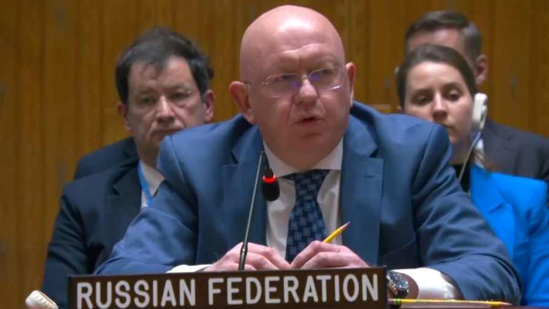

# 以色列点名指责中俄否决美国提出的草案，中俄代表当场回击

【文/观察者网 刘程辉】在中国、俄罗斯和阿联酋联合反对下，美国有关巴以问题的决议草案10月25日未获联合国安理会通过，引发以色列方面不满。

根据联合国网站发布的现场视频，在投票后的发言环节，以色列常驻联合国代表埃尔丹宣称投票结果令人“震惊”，他还点名批评中国和俄罗斯，声称反对草案的人如果遇到恐怖分子类似的袭击，将会动用比以色列更强的武力。面对此番狡辩，中俄代表当场予以反击。俄罗斯代表提到，当初俄罗斯在打击车臣恐怖分子时，会场内的不少国家还曾呼吁俄方开展对话。中国常驻联合国代表张军在回应时强调，以色列把中国当做对手，是选错了对象。

_以色列常驻联合国代表聆听中国代表发言/视频截图_

“对那些反对（美国）决议草案的人，我必须说，你们的决定让我发自内心的震惊。”埃尔丹还把矛头对准了俄罗斯提出的决议草案，“与此同时，今天（25日）俄罗斯提出的一份草案试图绑住以色列的手脚，以阻止我们消除对我们生存的威胁，并允许种族灭绝恐怖分子重整旗鼓，以便他们能够再次屠杀我们。”

埃尔丹称，“你们居然无法谴责那些恐怖分子针对平民的故意袭击？如果你们的国家遭受了类似的屠杀，我敢肯定，你们将会动用比以色列强得多的武力。”

**紧接着，他直接点名中国和俄罗斯。**

“如果自杀式恐怖分子在莫斯科毁灭了一整个社区，莫斯科会作何反应？如果圣战分子谋杀斩首你们的孩子，北京又会如何回应？”

“我会给你们点时间好好想想。”

“但我相信每个人——不只是这个房间里的人，全世界在观看此次讨论的人，都知道你们会如何回应。”

_俄罗斯常驻联合国代表涅边贾对埃尔丹作出反击_

埃尔丹发言完毕后，俄罗斯常驻联合国代表涅边贾首先做出反击。

“我有些话想回应以色列代表的说法。”涅边贾说，“以色列代表刚才提了个反问：如果俄罗斯联邦遭受恐怖分子袭击，莫斯科会怎么做？答案是很明显的，俄罗斯确实曾遇到过国际恐怖主义，比如上世纪90年代末和21世纪初的车臣恐怖分子，
**可很多如今在场的国家却说我们遇到的不是国际恐怖主义，让我们与车臣恐怖分子对话。** ”

“然后我们与车臣对话，没有与恐怖分子交谈，我们摧毁了他们。当他们杀害了无辜的儿童时，我们在电影院等地方消灭了他们。”他提到，现在的车臣已经平静下来了，是俄罗斯联邦不可缺失的一部分。

涅边贾喊话以色列代表：“我想请你注意，我们的草案表达了对恐怖主义的谴责，并且表达了对以色列遇难平民的同情。”

他补充道，我们不是阻止你们去与恐怖主义作战，而是说在打击恐怖主义的时候去打击恐怖分子，而不是打击平民。

“我们无论如何不会否认以色列面对恐怖分子袭击时的自卫权。当你评论我们的声明时，请把这些牢记在心里。”涅边贾说。

 _中国常驻联合国代表张军发言_

随后，中国常驻联合国代表张军也作出了回应。

“我只是想说，尊敬的以色列常驻代表，同以色列在这里辩论不是我的本意， **以色列把中国当做对手，也选错了对象。**
”张军说，“你应该明白，从这轮巴以冲突一开始，中国就以非常明确无误的语言谴责一切伤害平民、违反国际法的行为。我们所说的平民，既包括巴勒斯坦平民，也包括以色列平民。”

张军接着对埃尔丹说：“你就今天的决议发表了评论，但我也要提醒你，就在上周，安理会一份同样包含了谴责哈马斯攻击行为的决议，中国投了赞成票，而这项决议遭到了否决。”

张军继续强调，“我在刚才的发言中明确提到，中国绝不是否认以色列的安全关切，相反我们一直主张同等重视以色列和巴勒斯坦双方的安全关切和合法权利。当前的形势下，我们在处理好这一轮巴以冲突的同时，我们不能否认巴勒斯坦人民的权利长期以来没有得到根本的保障，我们也认为冲突的根源在于‘两国方案’没有得到很好的解决。”

“我希望我们都能够本着诚实的态度，尊重事实，坚守正义，通过我们的共同努力，既解决好当前的问题，也能够让以色列人民、巴勒斯坦人民都能够共同生活在和谐、平安、幸福之中。”张军说。

值得注意的是，美国在决议草案中谴责了“谴责一切针对平民的暴力和敌对行动”，强烈敦促所有各方充分遵守国际法，呼吁立即无条件释放所有人质，并特别强调了“谴责哈马斯和其他恐怖团体”的措辞。草案还表示，以色列拥有自卫权，并要求所有国家停止向“威胁地区和平与安全的民兵和恐怖组织，包括哈马斯”出口武器。不过，草案没有提及停火措辞，取而代之的是“呼吁采取一切措施，特别是包括人道主义暂停”。

与美国版本草案相同的是，俄罗斯提出的草案同样谴责针对平民的暴力、谴责哈马斯10月7日的袭击、呼吁释放人质，以及强烈敦促所有各方充分遵守国际法。

不同的是，俄罗斯在草案中“呼吁立即实行持久、受到充分尊重的人道主义停火”；“明确谴责针对加沙地带平民和民用物体的无差别袭击”；谴责并反对“采取行动封锁加沙地带，剥夺平民人口赖以生存的手段”；并明确敦促立即以色列取消撤离令。

在25日安理会表决巴以局势决议草案后，张军表示，中方对美国刚刚付诸表决的决议草案投了反对票。这一立场基于事实，基于法律，基于良知，基于正义，也基于来自全世界、特别是阿拉伯国家的强烈呼声。

张军指出，从内容上看，这一草案严重失衡、混淆基本是非。从做法上看，这一草案匆匆出台，缺乏应有共识。从效果上看，这一草案没有反映全世界关于停火止战等最强烈呼声，无助于解决问题。基于此，这一草案显然不具备获得通过的条件。

在26日的例行记者会上，外交部发言人毛宁介绍说，中国常驻联合国代表张军大使已经在安理会表决巴以局势决议草案之后的解释性发言中全面阐述了中方的立场。中方的立场基于事实和正义，响应了国际社会特别是阿拉伯国家的强烈呼声。在巴勒斯坦问题上中国没有私利，只要有利于和平，中方都坚定支持，只要有助于巴以和解，中方都尽力而为。

毛宁表示，巴以冲突升级以来，中方积极主张安理会尽快就巴以局势采取有意义的行动，作出有约束力的决定。同时，安理会的行动和决定必须尊重历史和事实，把握正确方向，体现应有的责任和担当，必须听取和尊重广大阿拉伯国家的立场和呼声。

“中方愿意继续同安理会成员和国际社会一道，为停火止战，保护平民，避免更大的人道主义灾难，为实现巴勒斯坦问题的全面公正持久解决，发挥负责任和建设性的作用。”她说。

过去十天，四份有关巴以冲突的决议草案均未获得安理会通过。在此之前，美国曾两次否决了分别由俄罗斯和巴西在安理会提出的呼吁停火的决议草案。

截至10月25日，本轮巴以冲突已造成双方超8000人死亡。巴勒斯坦卫生部25日发布消息称，本轮冲突已造成巴方6651人死亡，其中加沙地带6547人死亡，约旦河西岸104人死亡。此前据以色列媒体援引以色列卫生部数据，截至18日下午，已有超过1400名以色列人和外国人死亡。

**本文系观察者网独家稿件，未经授权，不得转载。**

