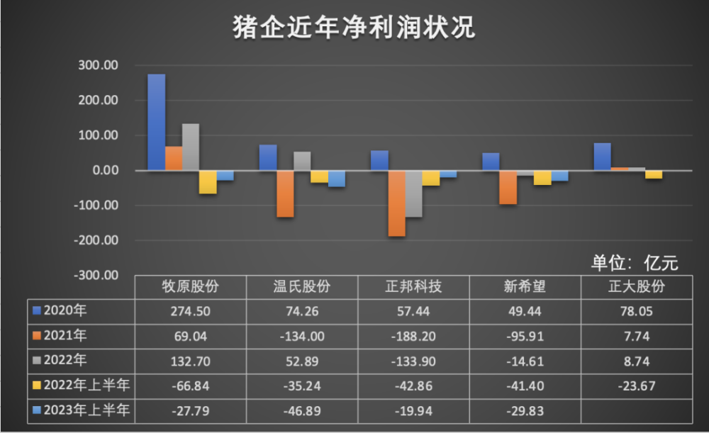
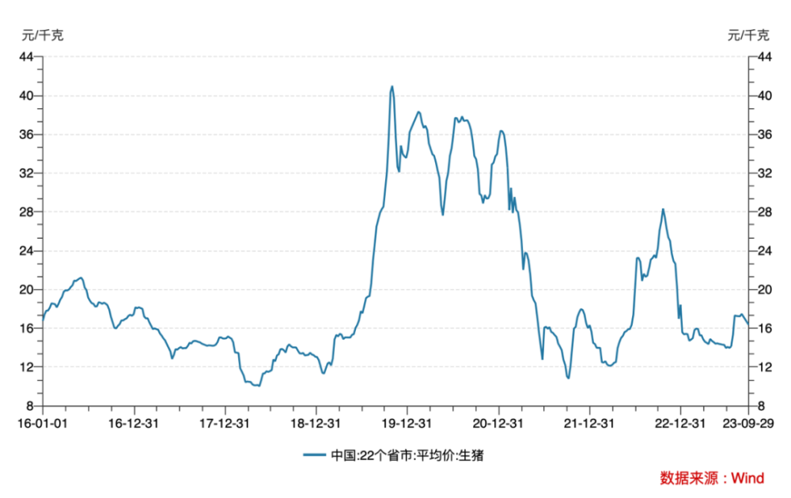

# 养猪把首富们坑惨了：泰国首富上市梦碎，河南首富身家缩水上千亿

 _图源：视觉中国_

作者 | 肖望

编辑 | 陈弗也

出品 | 棱镜·腾讯小满工作室

养猪曾经成就了多位首富，但如今，首富们却被养猪坑惨了。

拉锯两年多后，泰国首富谢氏家族旗下的正大股份A股上市梦碎。

10月8日，上交所终止对正大投资股份有限公司的上市审核。此前的9月份，正大股份知难而退，主动撤回了IPO申请。主要原因与养猪正陷入全行业亏损不无关系，且这一次亏损持续的时间超过以往。

近期，一张正大股份高管爆粗口的对话截图也在网络流传。有媒体求证公司为何主动撤回上市申请时被该高管怒怼：“全中国猪价都在大跌，你让猪价涨啊？你能吗？”

不止是泰国首富家族，因为养猪，河南首富秦英林家族旗下的牧原股份、四川首富刘永好家族旗下的新希望、原江西首富林印孙旗下的正邦科技、广东云浮首富温鹏程旗下的温氏股份等今年上半年均出现亏损。上半年26家猪产业上市公司合计亏损超150亿元。

最惨的莫过于曾经的江西首富林印孙，其正邦科技2021年和2022年分别巨亏188亿和134亿元，将过去十多年积累的利润赔光还不止，公司当下正在破产清算和可能退市的边缘。

**泰国首富A股上市梦碎**

正大股份于1996年成立，起初主要经营饲料加工业务，经过近三十年发展，成为国内规模最大的饲料生产商和生猪养殖企业之一。

招股书显示，正大集团通过正大畜牧投资、卜蜂中国投资以及正大秦皇岛食品间接控股正大股份。正大股份法定代表人是正大集团董事长谢吉人，谢吉人是谢国民之子。

福布斯2023泰国富豪榜显示，正大集团谢氏家族蝉联泰国首富，家族财富达到创纪录的340亿美元。

正大集团的业务以农牧食品、批发零售及电信电视为核心，同时涉足金融、地产、制药及机械加工等行业和领域，业务遍及全球21个国家及地区。

正大集团主要股东为谢氏四兄弟家族：谢正民家族、谢大民家族、谢中民家族和谢国民家族。但招股书指出，上述四家族之间不存在一致行动关系，正大集团任一股东持有或控制的股份比例均不超过
13%。

在中国，正大集团冠名的《正大综艺》成为一代人的记忆。

泰国首富家族旗下的产业到A股上市颇受市场关注。早在2021年5月，正大投资就递交了招股书。

上市的底气正来自于上一轮猪周期带来的泼天富贵：2019年其净利润为20.11亿元，2020年净利润飚增达到75.71亿元。

但今年3月份更新的招股书显示，公司2021年净利润为7.74亿元，同比大跌九成。2022年上半年净利润更是亏损23.91亿元。

正大股份选择的上市标准为预计市值不低于80亿元，且最近一年净利润为正，最近一年营业收入不低于8亿元。

业绩大变脸令人担忧，上交所要求模拟测算其2022年业绩，分析公司是否符合发行上市条件。正大股份及保荐券商回复，正大股份2022年度净利润为8.74亿元，模拟测算后，公司扣非净利润为6.37亿元，符合“最近一年净利润为正”的上市标准。

正大股份原本拟募集150亿元，其中107.63亿元用于17个生猪产业链项目，42.37亿元用于补充流动资金。正大股份指出，在猪肉需求量大的地区，土地成本较高，建设猪舍需要大量资金支持。过去主要通过自有资金和银行贷款作为资金来源，较为单一的融资渠道增加了财务成本，限制了公司快速发展。

但在9月份，正大股份还是主动撤回了IPO申请。尽管正大股份没有更新的财务数据披露，但正大股份高管怒怼媒体的信息或可以佐证，养猪亏损或是拖累其上市的主要原因。

**卖一头亏三百，养猪陷入全线亏损**

当前，生猪养殖行业再次陷入全行业亏损。作者据Wind统计，猪产业上市公司上半年合计亏损154.58亿元。其中温氏股份、新希望、牧原股份、ST正邦亏损规模居前。

_主要猪企近年净利润情况，作者制图_

多家养猪上市公司的销售简报显示，今年上半年商品猪销售价格都在15元/公斤以下。而去年下半年时，商品猪销售价格普遍高于20元/公斤，国庆和中秋假期所在的9、10月份平均价格更是达到23.06元/公斤和26.05元/公斤。

大多数养猪企业的综合成本线在16元/公斤左右，当商品猪供大于求时，猪价跌破成本线，卖的越多亏得越多。

生猪产能供大于求。国家统计局数据显示，上半年猪肉产量3032万吨、同比增长3.2%。在7月21日的国新办会议上，农业农村部畜牧兽医局负责人陈光华介绍，上半年生猪价格低位震荡，1—6月份生猪平均价格15.1元。7月份第2周，生猪出栏价格为每公斤14.2元，出栏一头生猪亏损约200元。市场供应充足之外，春节后猪肉消费处于淡季，消费增幅低于市场预期。

“生猪价格持续低位运行，时间超过一些人的预期。”陈光华表示。

不过与去年上半年相比，养猪亏损幅度有所收窄。

在8月末的投资者交流中，新希望方面指出，上半年猪产业亏损33.8亿元，但同比去年减亏12亿元。猪产业去年头均亏损660多元，今年收窄到头均亏损300多元。

在2019年及2020年的超级行情中，养猪上市公司利润和股价齐飞。但从2020年9月至今，猪肉上市公司板块已整体下跌超35%。

2021年初最高峰时，秦英林夫妇持股牧原股份市值一度超过2500亿元，如今持股市值跌到1000亿元左右，两年多间缩水超1500亿元。在10月24日发布的胡润百富榜上，秦英林夫妇以1450亿元身家排名第13位，尽管名次有所滑落和身家缩水，但仍是河南首富。

新希望的股价则从上一轮周期的2020年9月开始坠落，至今已跌去七成，市值不足500亿元。

而由于赌输“猪周期”，曾经的江西首富林印孙旗下的正邦科技正处于破产重整中，且股票存在可能被终止上市的风险。

正邦科技在对深交所的问询函中袒露：在2019年非洲猪瘟发生后，基于对以往猪周期的经验判断，几大养殖企业集体错判，认为本轮行情可以持续到 2022
年甚至更长时间，故在 2019 年和 2020 年迅速上产能，结果经济环境和肉价过高导致消费严重不足，猪价在 2021 年 3
月份开始急转直下，造成历史性的巨额亏损。

**母猪存栏量居高不下，杀进来的资本难退出**

养猪赚大钱的喜悦仿佛还在昨日。2020年，养猪上市公司净利润达到史无前例的652亿元，其中牧原股份更是达到274亿元，由此站稳了“猪中茅台”的称号。

这轮超级赚钱行情，是在非洲猪瘟高发、环保核查更为严格的背景下，养殖户大量清栏退出，到2019年9月末，能繁母猪存栏量下跌至1913万头的历史低点。

猪肉供给严重短缺，导致猪价暴涨。养猪进入“暴利时期”，在2019年下半年到2020年，一头猪的利润能高达3000元，而正常行情下，一头猪赚300元-500元就已经很不错了。

随后，做金融的、做钢贸的、做房地产的各路资本纷纷介入养猪，赚到钱的养猪上市公司也纷纷扩大产能，生猪产能、能繁母猪存栏量快速恢复，猪价开始步入下行通道。

通常，此时养殖户大量退出，生猪产能实现去化，猪价逐步回到上行通道。但这一轮猪周期与以往有所不同。

“养猪的周期比较长，面临的风险和波动更多。”重庆某养猪大户孙斌（化名）对作者介绍，从建设猪舍，到购买母猪、繁育小猪、再到育肥出栏，即便当下判断失误遇到养猪亏本，但建设猪舍等成本都已经投入，短时间很难抽身。

新一轮进入的资本也更具实力。银河期货指出，本轮生猪产能去化缓慢，主要在于行业内看好下半年行情。此外，具备一定规模的养殖场出栏占比提升，受制于其前期资金投入、生产计划，难以像散户一样灵活调整出栏节奏，行业的产能调整灵活度降低。

能繁母猪存栏量决定了未来10-12个月的生猪出栏量，可以作为观察生猪产能的先行指标。该指标在2021年6月达到4500万的高点后开启产能去化过程，但到2022年4月回落到4177万头的阶段低点后，便再度回升。

联合资信评级公司指出，随着2022年三、四季度养殖企业盈利改善，农户母猪补栏积极性提高，能繁母猪存栏数直到2022年12月末才开始下行。

农业农村部设定全国能繁母猪正常保有量约为 4100
万头。本轮猪周期中，母猪存栏量始终未低于这一水平，截至7月末，能繁母猪存栏约4271万头。这意味着，2023年生猪供应仍将保持充足。

_能繁母猪存栏数变化趋势，据Wind_

**猪企能否熬过寒冬？**

作者据wind统计，上市猪企上半年总负债规模为4749亿元，负债规模基本与去年同期持平，但这一负债规模也处于历史高位，主要上市猪企的负债率均有不同程度地上升。

其中牧原股份、新希望、温氏股份总负债规模靠前，分别达到1152亿、970亿和583亿元，其负债率分别为60.06%、71.79%和61.32%。

中信建投证券农业分析师王明琦曾对作者表示，在猪周期底部，养殖企业首先必须要有充足的现金流和资金储备情况；其次要保持适度规模的扩张，避免大跃进式盲目发展；最后，要不断推进成本端的精细化管理。

正邦科技的债务危机敲响了警钟，猪企现金流安全被投资者高度关注。作者梳理，已有7家上市猪企的负债率超过70%。

温氏股份指出，今年行业亏损时间较长，部分企业资金压力较大，且现阶段资本市场融资政策有所收紧，企业对于扩张速度整体呈现较为谨慎的态度。

半年报显示，牧原股份上半年短期借款达453.33亿元，增幅达55%。短期债务快速上升引发投资者关注。对此，公司表示，新增短期债务主要来源于国有银行、股份制商业银行等金融机构，新增银行贷款成本基本在4%以下。短期债务的增加不会影响公司现金流的安全。

中诚信报告指出，在2022年和2023年一季度，牧原股份累计获得股东借款约149亿元和21亿元，股东支持力度大。此外，截至3月末，牧原股份获得金融机构授信约900亿元，尚未使用额度约350亿元，备用流动性充足。

新希望则在2021年中开始放慢猪场建设，并表示金融机构授信仍然超千亿，未来两年会改善负债率。

这一轮猪周期的底部行情还将持续多久？新希望高管在和投资者交流中指出，当前市场上博弈的主体非常多，对猪周期的底部判断有难度。但总体说下半年会好于上半年，随着节假日和消费的恢复，猪价会有所好转。今年的产能去化还在继续，核心竞争力还是主要靠降低成本。

“行业里都是聪明人，当大家都押注逆周期布局的时候，就成了顺周期。”一位银行业人士对作者评价称。

另一个行业共识则是，养猪像2019年、2020年那样的超级赚钱行情很难再发生了。

