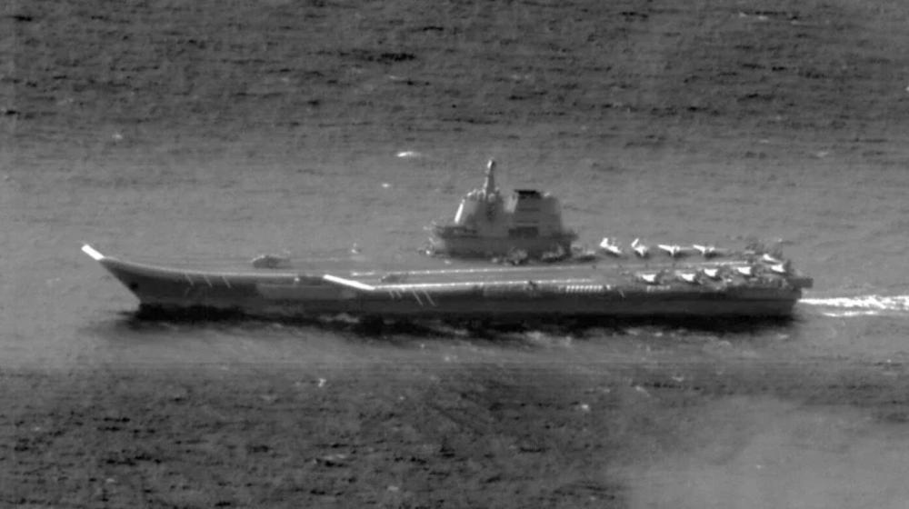
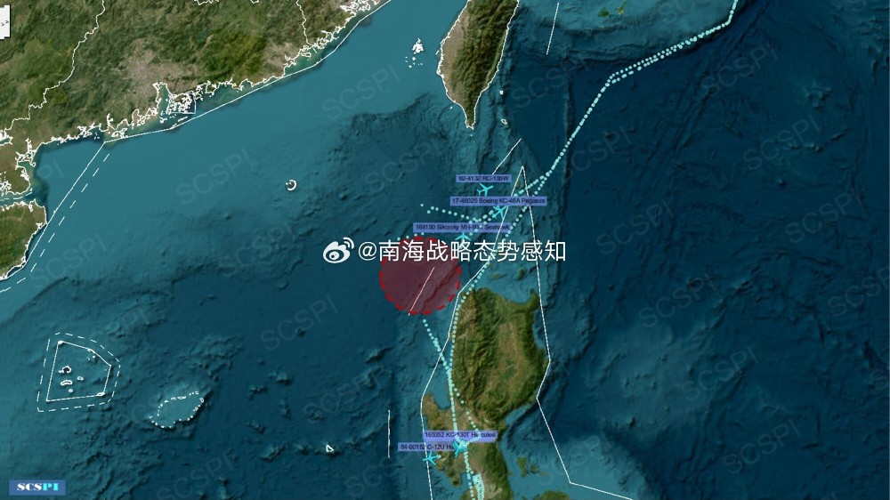
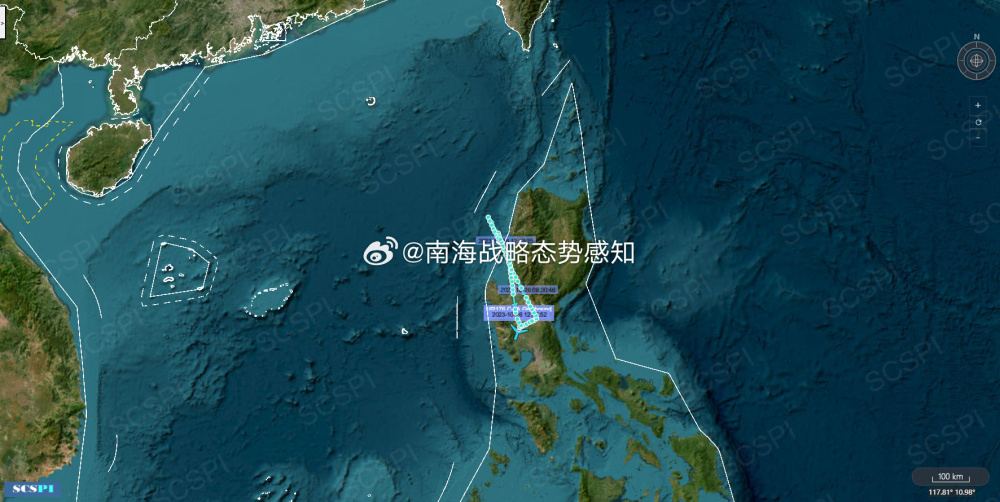

# 台军：山东舰时隔一个月再次东出巴士海峡

10月26日晚间，台湾防务部门发布消息，解放军“山东舰”航母编队当天穿越巴士海峡，进入西太平洋，这是时隔一个月“山东舰”再次东出巴士海峡。台防务部门还公布了一张“山东舰”航空照片，并称台军已严密掌控海空域动态。

26日稍早前，台防务部门也曾发布消息称，侦获解放军轰6、空警500、歼10、歼11、歼16、歼轰7、运8、运9及无人机等各式机种出海活动，其中15架次逾越所谓“台海中线”及其“延伸线”。

另一方面，“南海战略态势感知”智库26日称，综合“里根”号航母舰载运输机C-2A灰狗（AE045E）、舰载直升机MH-60R海鹰（AE4FE6）、舰载预警机E-2D（AE5BA3）的飞行轨迹和活动情况，美海军“里根”号航母打击群已经由巴士海峡再次进入南海，当前活动区域推测如图。在该空域，还有美国空军一架RC-135W电子侦察机（AE01CF）活动。

该智库还提到，美国空军当日也从关岛安德森空军基地出动两架B-52轰炸机，经苏拉威西海-苏禄海-巴拉巴克海峡，进入南海活动。

**本文系观察者网独家稿件，未经授权，不得转载。**

