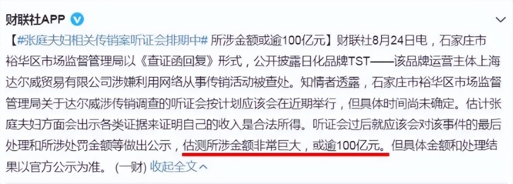

# 张庭夫妇案已撤销，96套房产及6亿存款全部解封，上个月低调复出

据《法治日报·法治周末》10月26日报道，[张庭、林瑞阳一案已被人民法院撤案，两人名下的96套房产及银行账号全部解冻。](https://new.qq.com/rain/a/20231026A03U5000)

据了解，石家庄市裕华区人民法院于2021年7月20日裁定查封了张庭和林瑞阳名下的96套房产，该房产位于两人经营的达尔威公司新大楼，价值逾17亿人民币。当时，法院是以涉嫌“组织策划传销违法行为”查封两人的房产，指出两人公司通过传销方式在3年内营收91.71亿，利润逾1927万元，有关部门没收违法所得1927.99万元，罚款170万元。

对于撤案的裁定，《法治日报·法治周末》在文中引述了知名律师的回应：

此案在去年发酵轰动一时，张庭本人在22年5月曾于微博发文回应，否认涉嫌传销，而此案也被台媒大肆渲染，张庭在声明中打脸个别台媒“始终对大陆法治和投资环境抱有信心”。

疑似张庭的律师曾在朋友圈发布，称受到张庭委托向法院申诉，追回被冻结的20亿人民币资产。律师认为起诉张庭夫妇涉嫌传销的应该是个人，监管局不可以做原告，同时表示虚心接受当局的调查。文中指出，张庭被冻结的资产包括96套房产（17亿）及公司名下账号6亿的金额，共计23亿元。

然而这23亿也只是张庭夫妇财富王国的冰山一角，媒体曾指出，该案涉及的金额或超过100亿，坐实了二人身家百亿的传言。

两人资产被查封后低调飞回台湾省，然后到新马泰旅行，林瑞阳还到大马举行招商活动放言要赚下13个亿，透露张庭已经带着孩子回到中国大陆，否认举家跑路传言。

9月22日，有员工透露张庭回到公司复工，主持中秋节活动，受到员工的欢迎和支持。

另外，张庭好友陶虹被曝从公司分红4.2亿，此案在去年11月举行听证会，张庭、陶虹没有到场，他们的律师认为不构成传销并建议撤案。

据悉，张庭与林瑞阳在2000年进入商圈，从房地产拓展到美容行业，近年通过自媒体疯狂捞金，21年遭到加盟商投诉涉嫌传销，同年7月被法院查封名下23亿的资产。两人一直否认涉嫌传销，历时2年终于等来了结果，具体情况还是等待二人及相关部门的回应。

