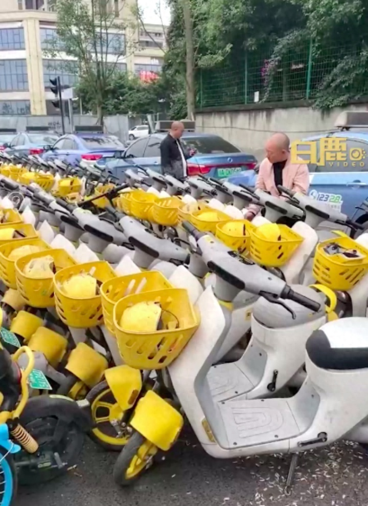
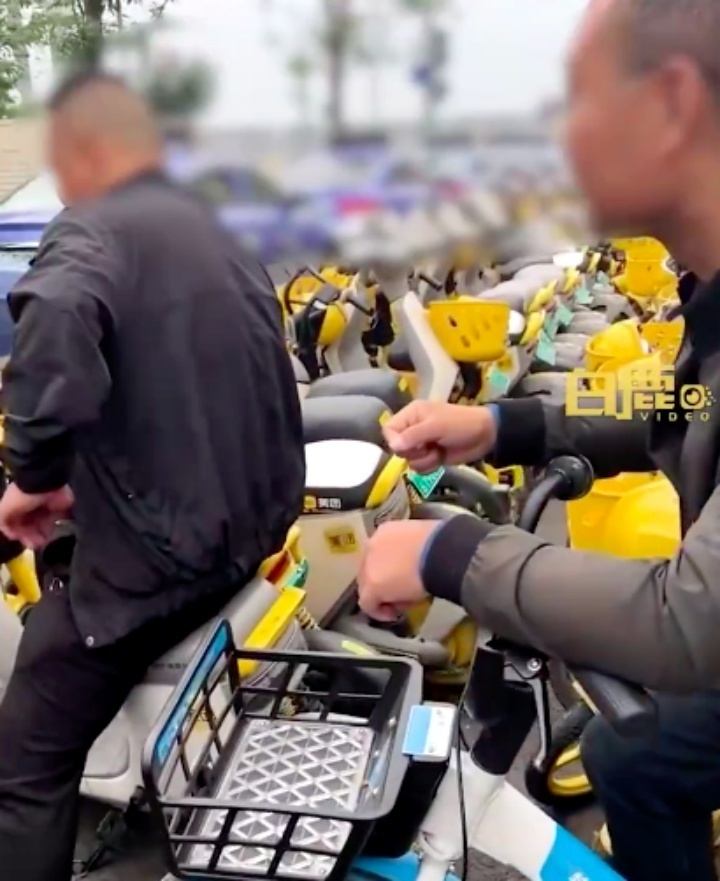
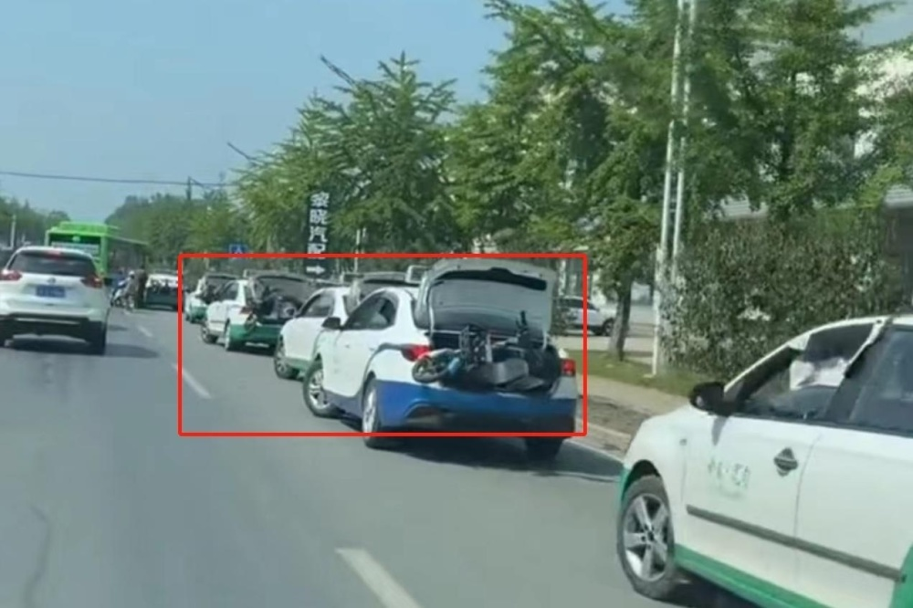

# 成都多名出租司机驾车围堵百辆共享电单车？交通局：双方有竞争矛盾

10月26日，据白鹿视频报道，近日，在四川成都，有网友发布视频称邛崃市一中学附近，约百辆共享电单车被出租车司机驾车围堵，致共享电单车无法被正常使用。

对此，邛崃市交通运输局工作人员回应，出租车和共享电单车之间确存在竞争矛盾，目前正在处理这件事情。

此前也有类似的事情在辽宁丹东发生，2023年6月，有网友爆料称，辽宁丹东宽甸县有多辆出租车将共享电动车拉出城区。

据媒体报道，共享电动车品牌方哈啰公司回应者称，被扔的车有100辆左右，对方抵制新生事物。

目前，被扔车辆已拉回公司仓库。

【来源：综合白鹿视频、九派新闻此前报道】

