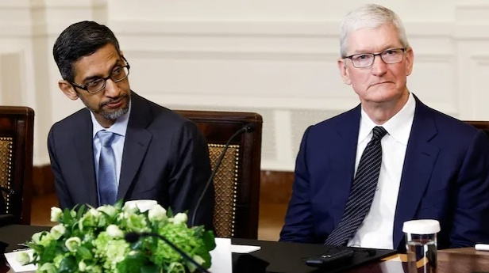

# 每年从谷歌手里躺赚40亿至70亿美元的苹果，也曾在搜索领域雄心勃勃

**划重点**

  * _1_ 2002年，苹果首次同意将谷歌搜索作为其浏览器上的默认搜索引擎，但该公司从未停止在搜索领域的探索。
  * _2_ 2014年，苹果浏览器的一项新功能引起谷歌担忧，因为其可能转移在谷歌搜索上的查询，从而对其收入造成冲击。
  * _3_ 2016年，苹果和谷歌改变了合作关系，苹果在搜索领域的勃勃雄心也多次被打回了原形。

腾讯科技讯
在美国司法部诉谷歌垄断案中，苹果与谷歌之间的关系成为该案的核心所在。早在2002年，两家公司就达成了实现“双赢”的默认搜索引擎协议。每年，谷歌从苹果设备上的广告中赚取巨额利润，苹果也能从中获得不菲的分成。不过，苹果似乎并不满足于在一棵树上吊死，它也从未放弃在搜索领域的雄心，只是每次尝试都被与谷歌签署的协议打回原形。

**01 苹果新推功能引发谷歌担忧，修改合作协议**

2014年，谷歌高管对苹果推出的一项新功能深感担忧，该功能为苹果网络浏览器Safari的用户提供访问网站的建议，而不是将其转链到谷歌搜索上。在此前十多年间，谷歌每年都会向苹果付钱，以便保持其在苹果设备上的默认搜索引擎地位。

根据美国司法部最新公布的反垄断诉讼庭审文件显示，谷歌预计苹果的这项新功能将对其收入造成重大打击。为此谷歌立即采取行动，到2016年，谷歌和苹果修改了合作协议，以确保苹果的搜索产品与2016年9月时“大体相似”。

内部通信显示，谷歌试图利用与苹果达成的协议，阻止后者扩大在搜索领域的足迹，并保护谷歌在苹果设备用户的查询中所占据的优势地位，这每年为谷歌带来了巨额的广告销售收入。法庭记录显示，负责监管该交易的谷歌高管丹尼尔·阿雷格里（Daniel
Alegre）在2016年6月的一封电子邮件中写道：“我们正在努力构建一种结构，防止苹果转移查询和破坏业务价值。”

这些文件有助于解释，为什么苹果只对Safari和iOS上的网络搜索功能做了渐进式的改进，并将其称之为“Siri建议”，尽管后者已经在该领域投资收购技术和人才。在过去十年中，苹果收购了两家开发搜索技术的初创公司Topsy和Laserlike。2018年，该公司聘请了负责搜索业务的谷歌前高管约翰·詹南德里亚(John
Giannandrea)领导其机器学习和人工智能项目。

这些证据可能有助于司法部证明，谷歌与苹果等公司签订的收入分成协议阻碍了搜索领域的创新，损害了消费者的利益。但谷歌辩称，苹果将谷歌作为其设备上的默认选择，是因为它提供了比其他选择更好的用户体验，而不是因为支付限制了苹果与其他公司合作或开发竞争产品的动力。

随着审判进入新阶段，美国司法部上周传唤了最后一位证人出庭作证。在过去的六周里，检方律师已经询问了包括微软首席执行官萨蒂亚·纳德拉（Satya
Nadella）、苹果服务业务主管埃迪·库伊（Eddy Cue）和谷歌广告主管杰里·迪什勒（Jerry
Dischler）在内的多位证人。大部分证词都集中在一个关键问题上，即谷歌在搜索领域的主导地位，以及它与其他企业达成的协议是否像美国司法部所说的那样阻碍了竞争。

**02 默认搜索引擎协议或被废除，苹果或再尝试**

如果美国司法部胜诉，这可能会迫使谷歌修改或废除与苹果、三星以及其他公司签署的默认搜索引擎协议，并可能让用户更容易选择其他搜索引擎，从而带走大量搜索流量。庭审预计将于11月中旬结束。

2002年，苹果首次同意将谷歌搜索作为其浏览器上的默认搜索引擎。法庭记录显示，有一段时间，Safari一度会绕过谷歌搜索结果，将用户的查询发送给维基百科。不过，从2015年左右开始，苹果越来越多地将Safari用户引导到网站、应用程序或苹果地图页面，这加剧了这两家科技巨头之间的紧张关系。

谷歌负责搜索合作的高管琼·布拉迪（Joan
Braddi）在2018年8月提交的一封电子邮件中写道，当这两家公司在2016年修改协议时，新的协议允许苹果提供“Siri建议”，也就是苹果在Safari中的搜索功能，这“完全是为了提高查询质量，而不是因为他们想给Siri带来流量”。布拉迪本月早些时候在作证时表示，尽管签署有协议，但苹果此后扩大了对“Siri建议”的使用。

波士顿大学法学院反垄断法教授戴维·奥尔森(David
Olson)表示：“苹果可能对如此依赖谷歌搜索感到紧张，并一直想看看他们是否能做出更好的替代产品，或者最终能让一切都留在苹果内部。”

当Safari用户在浏览器中输入查询时，苹果继续向他们提供非谷歌网站的建议。不过，法庭记录显示，苹果最终同意不大幅扩展其搜索功能，以保留其与谷歌达成的、利润丰厚的收入分成协议。

詹南德里亚在9月份作证说，苹果提供搜索功能的部分原因是为了保护客户的隐私，并提供更好的用户体验。他还称，近年来，苹果扩大了其网络索引，以便提供更好的搜索结果。

“我们的总体思路是，我们认为我们的设备用户是在寻找答案，所以如果我们能提供答案，我们就会这样做，而不是把他们转链到通用的搜索引擎上，”詹南德里亚说。他还称，苹果从未说过不开发自己的搜索引擎。

谷歌和美国司法部的发言人对此不予置评。在法庭证词中，谷歌搜索合作伙伴主管布拉迪表示，幻灯片中预计苹果搜索功能对收入的影响只是“单方观点”。苹果没有回复置评请求。

随着大语言模型的进步，苹果加大投资提升语音助手的功能，“Siri建议”可能会在未来几年再次成为争论的焦点。大语言模型可以让用户使用自然语言自动完成软件任务。其中有些任务可能涉及网络搜索，因此会受到苹果与谷歌协议的限制。

**03 苹果每年躺赚40亿至70亿美元**

这场审判提供了一个史无前例的机会，让人们得以窥探科技业最重要的商业关系之一。据美国司法部称，谷歌每年向苹果支付约40亿至70亿美元费用，以成为苹果设备上的默认搜索引擎。这份合同是美国政府起诉谷歌垄断案的核心，它属于非法协议，滥用了谷歌在网络搜索领域的垄断权力。谷歌坚决否认这些指控。

美国地区法院法官阿米特·梅塔（Amit P.
Mehta）将在没有陪审团的情况下审理此案，尽管《纽约时报》和彭博社等新闻机构提出了扩大庭审范围的动议，但梅塔法官裁定，审判中提供的大部分证据和证词都不应向公众公开。司法部的许多证人都是在闭门听证会上作证的，因为谷歌和其他公司担心审判可能会泄露专有信息。司法部在网上公布了部分庭审证据，但这只是六个星期法庭诉讼中所讨论证据的一小部分。

已经公开的文件揭示了谷歌对待与苹果交易细节的保密态度，包括在内部通信中使用“Andes”和“NYC”等代号来称呼苹果。尽管如此，由于发送者没有征求法律意见，有些标有“律师-
客户特权”的内部邮件还是出现在了诉讼中，其中包括100多名作为收件人的律师。

**04 谷歌及时封堵漏洞，三星也曾中招**

2016年改变与苹果的协议并不是谷歌唯一一次重新拟定与其他公司签订的协议，以防止其他搜索引擎破坏谷歌搜索在其他平台上的默认地位。

今年9月，美国司法部提交的证据表明，谷歌还利用与三星的默认搜索协议阻止来自Branch的竞争。Branch是一家初创公司，曾开发出一种搜索引擎，可以从应用程序而不是网络中索引页面。三星曾与Branch合作，以改善其设备上的搜索功能。

庭审证据显示，负责监督与三星合作的谷歌高管在2020年开始担心，Branch的产品已经从显示联系人、设置和照片扩展到在Yelp或亚马逊等应用程序中搜索页面。谷歌认为这一功能违反了它与三星签订的协议，因为该产品使用互联网提供搜索结果。谷歌与三星签订了与苹果类似的收入分成协议，以换取三星设备上的默认搜索引擎地位。

根据Branch前首席执行官亚历克斯·奥斯汀(Alex
Austin)的证词，谷歌同年开始讨论扩大与三星的协议覆盖范围，以防止三星预装任何其他连接到互联网的搜索产品。奥斯汀说，这一举措迫使Branch大幅缩减了其产品的搜索范围。

谷歌的竞争对手DuckDuckGo的前律师梅根·格雷(Megan
Gray)在接受采访时表示：“美国司法部之所以提起诉讼，是因为谷歌阻止了任何试图以任何方式在设备上成为通用搜索服务提供商的公司。”（文/金鹿）

