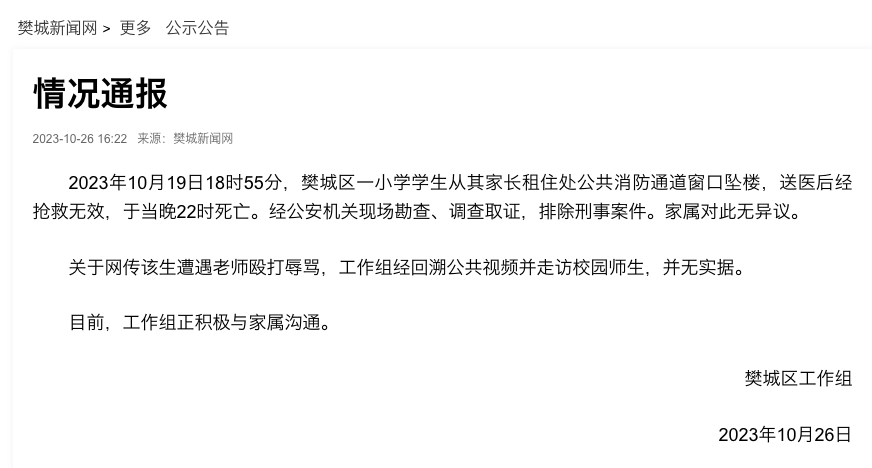

# 湖北襄阳通报“一小学生坠楼身亡”：网传该生遭老师殴打辱骂并无实据

据樊城新闻网，10月26日，湖北襄阳樊城区工作组通报，10月19日18时55分，樊城区一小学学生从其家长租住处公共消防通道窗口坠楼，送医后经抢救无效，于当晚22时死亡。经公安机关现场勘查、调查取证，排除刑事案件。家属对此无异议。关于网传该生遭遇老师殴打辱骂，工作组经回溯公共视频并走访校园师生，并无实据。目前，工作组正积极与家属沟通。

