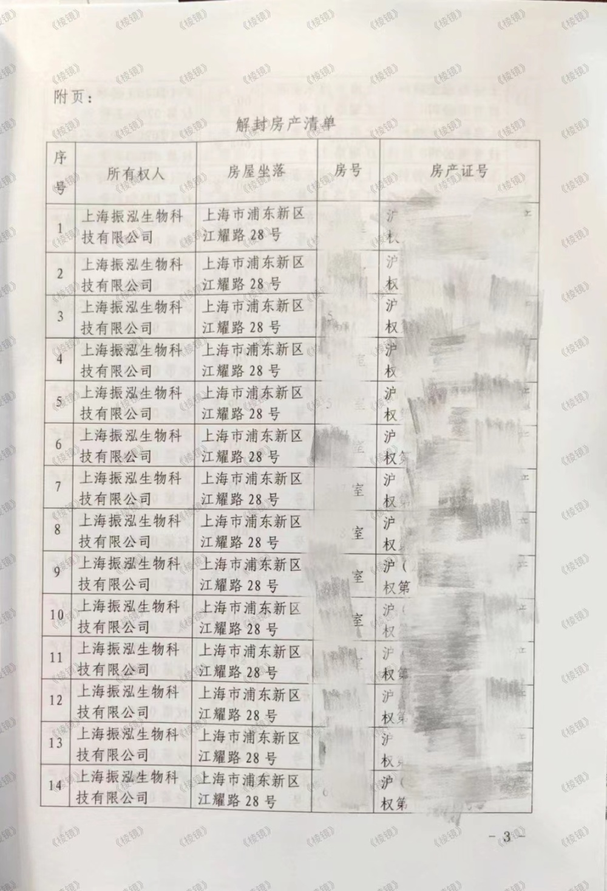

# 独家：知情人解析“张庭案”撤销原因，漏洞出在举报人身上

特约作者|王仄逊

编辑|陈弗也

出品|棱镜·腾讯小满工作室

持续了两年的“张庭案”最终迎来反转，10月26日，《法治日报·法治周末》报道，该案已被石家庄市裕华区人民法院撤销，同时解除查封被申请人的96套房产，并解除冻结被申请人名下多笔银行存款，银行帐户也全部解封。

撤案的理由是，按照国家相关法律要求，“县市级工商、市场监管部门查处网络传销案件，应在立案前或立案同时逐级报备至省级工商、市场监管部门。现该报备已撤销，本院对本案涉嫌网络传销资金继续实施保全措施的条件已不具备”。

该报道发出后，“96套房产”成为了网友们关注的一个焦点。

作者获得的民事裁定书显示，这96套房产均位于上海市浦东新区江耀路28号，而这个地址正是TST庭秘密的总部所在地，96套房位于这座大楼的5-17层。

一位参与本案的律师告诉《棱镜》，民事裁定书里信息量最大就是“撤销”两字，从司法实践的惯例来看，这里用的是撤销而不是撤回，意味着备案大概率是被上级部门撤销的，而不是裕华区市监局的主动“撤回”。尽管还没有收到裕华区市监局的撤案通知书，撤销报备之后，不排除后续撤案处理的可能。

笔者发现，这份民事裁定书落款日期是2023年7月26日，也就说早在三个月前，张庭夫妇就已经拿回了财产，一向高调的张庭夫妇硬是整整憋了三个月。

至于解封的原因，接近本案的知情人士提供了律师在裕华区市监局听证会上展示的证据。这些证据显示该案的举报人、管辖等问题出现问题，这可能是撤销备案的原因。

《行政处罚法》规定“行政处罚由违法行为发生地的行政机关管辖。法律、行政法规、部门规章另有规定的，从其规定”。通俗说就是，裕华区只能管裕华区内的行政违法行为。

不过，《市场监督管理行政处罚程序规定》也明确了几种情况，属于辖区内的违法行为：

第一种情况，“网络交易平台经营者和通过自建网站、其他网络服务销售商品或者提供服务的网络交易经营者的违法行为由其住所地县级以上市场监督管理部门管辖”。张庭的达尔威公司是一个类似的平台公司，总部在上海，但通过互联网把生意做到了全国，其注册地即可处理。

第二种情况是，“平台内经营者的违法行为由其实际经营地县级以上市场监督管理部门管辖”。这意味着，即便公司总部在外地，但是通过互联网在某个县城违法了，那么该县也能管。

第三种情况是，“网络交易平台经营者住所地县级以上市场监督管理部门先行发现违法线索或者收到投诉、举报的，也可以进行管辖”。这意味着，总部在外地的公司，其违法行为发生在其他地方，但本地监管部门可以受理本地市民的举报。

在达尔威涉网络传销案听证会上，裕华区市监局称案件来源是“辖区内群众举报”，也就是最后一种情况。

不过，张庭律师团队提供的证据却显示，举报人A某的户籍地、工作单位、收件地址都在河北省保定市。

A某与裕华区的唯一关联，就是他自称在裕华区某小区租房，但又没有给出租房合同和支付流水。而他工作的地方，与裕华区相隔165公里，每天通勤需要4小时。一个在保定人，每天开车四个小时来裕华的出租房里居住生活，这有些太不寻常。

张庭代理律师还找到了举报人与达尔威合作期间的快递信息，这些快递都是寄往保定市，而不是裕华区。该举报人此前和达威尔合作注册的公司以及在微信群里登记的地址都在。另一个举报人B某，也同样如此，工作单位在保定。

另据律师介绍，他们是否在裕华区租房子对案件影响不大，原因是举报人属于平台内经营者，即使租住在裕华区，但并无登陆IP等证据证实其在裕华区实际从事经营。相反，目前证据显示，举报人实际经营地在保定市。

若举报人在裕华辖区内有违法经营行为，裕华区市监局可对二人在辖区内的经营行为进行查处。

此外，此案还有一个关键因素，早在2021年9月3日湖北省保康县市场监督管理局已经对TST做过行政处罚决定。

《中华人民共和国行政处罚法》第25条、第29条有关于“在先管辖”和“一事不再罚”的规定，《工商总局关于进一步做好查处网络传销工作的通知》也有规定，涉及多个地域或者违法行为发生地不易确定的网络传销案件，由最先立案的工商、市场监管部门或者主要违法行为发生地工商、市场监管部门负责查处。

不过，TST的模式是不是传销，有没有违法行为，这是另一个更为复杂的法律问题。

