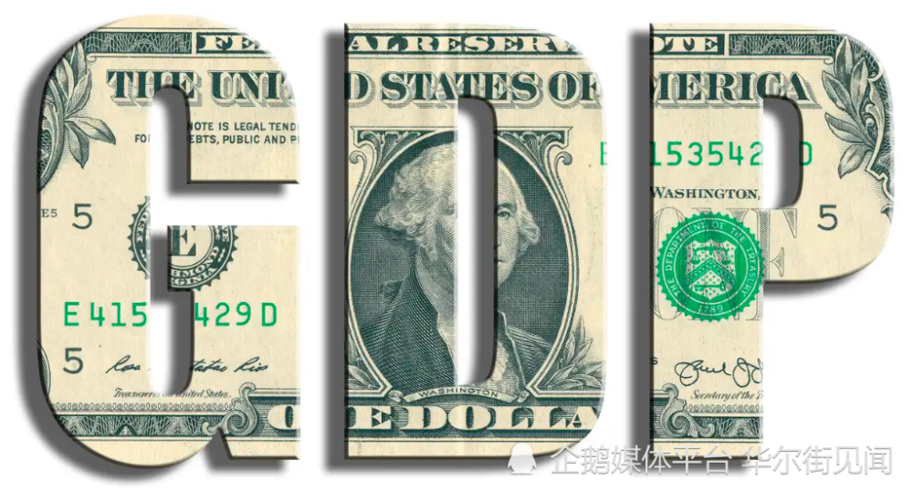
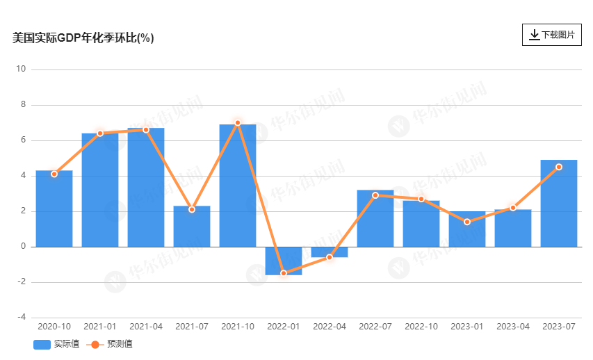
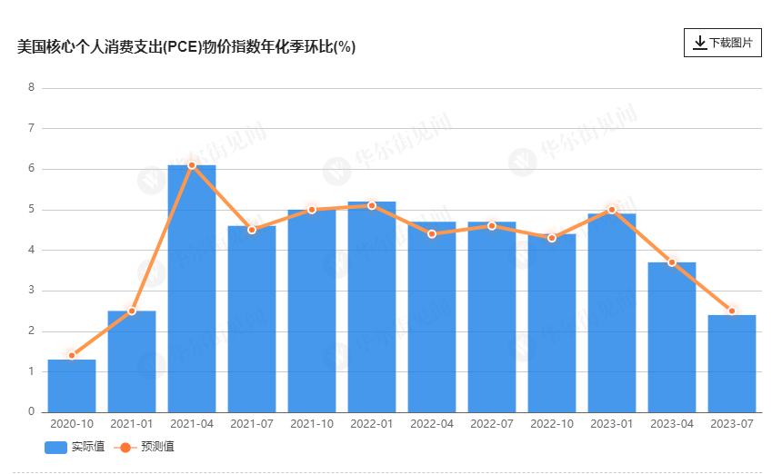

# 美国三季度实际GDP增长4.9%，创近两年来最快增速，消费支出强劲

在消费支出激增的推动下，美国上季度经济增速创下近两年来的最快纪录。

周四，美国商务部发布的数据显示， **美国第三季度实际GDP年化季环比初值按年增长4.9%，增幅是上季度2.1%的两倍多，超出市场预期的4.7%。**

同时发布的季度通胀数据PCE指数有所降温，个人消费支出（PCE）价格指数同比上涨2.9%，去年同期涨幅为2.5%；
**不含食品和能源的核心PCE价格指数增长2.4%，较前值3.7%显著放缓，略微低于经济学家预期2.5%。**

数据发布后，美股股指期货跌幅收窄，美元保持强势，而国债反弹。美元指数短线波动不大，报106.77；美国10年期国债收益率短线下行，报1.945%。美股期货短线小幅拉升，纳斯达克100指数期货跌幅收窄至0.6%。

消费支出强劲 推高经济增速

消费支出推高整体经济增速， **消费支出同比增长了4%，也创下自2021年以来的最高增幅。其中服务支出的增幅为两年来最大，而商品支出也有所加快。**

消费支出强劲是多种因素共同作用的结果，其中包括强劲的招聘、稳健的工资增长以及家庭财富在今年创纪录地激增。这一韧性的主要驱动力是就业市场强劲，支撑家庭继续消费。

同时数据显示，第三季度个人可支配收入增长2683亿美元，即6.0%，相比第二季度的数据有所增加；
**第三季度个人储蓄为6261亿美元，较第二季度的6290亿美元有所减少。**

虽然消费支出的大幅增长是经济增长的主要动力，但库存也为第三季度的经济增长贡献了 1.3
个百分点，政府支出也为经济增长做出了贡献，与此同时，由于设备支出减少，商业投资两年来首次出现下降，净出口也拉低了GDP，住宅投资则两年多来首次出现增长。

**剔除库存、政府支出和贸易，国内私人购买者的最终销售额（衡量基本需求的重要指标）经通胀调整后增长了 3.3%。**

美联储更棘手了

在下周的会议上，决策者们普遍预计将维持基准利率不变，一些人指出，借贷成本的快速飙升是谨慎行事的一个原因。本周早些时候，10年期美债收益率16年来首次飙升至5%以上。

鲍威尔也在此前暗示，政策制定者可能会在下周的会议上维持利率不变，同时为未来再次加息敞开大门。

展望未来，第四季度经济增长如何表现将为美联储判断是否加息提供参考。 **许多经济学家对四季度增长“持续性”存疑，**
其预计随着借贷成本限制了大件商品的购买，以及恢复联邦学生贷款，今年最后几个月的经济增长将放缓。标普全球初步预计，第四季度经济增长或将落到1.7%。

**但是分析指出，如果经济持续过热，需求后续保持强劲，就有可能使通胀率保持2%之上，那么可能就有必要加息。**

