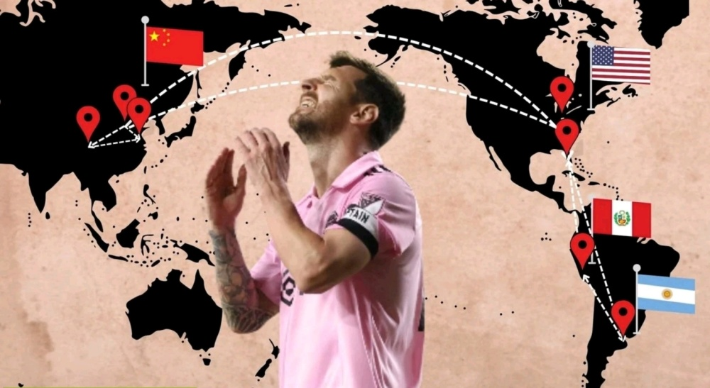

# 迈阿密官宣！梅西如期对阵青岛海牛+成都蓉城 首战改为海口

北京时间10月26日，迈阿密国际官方确认了11月中国行两场比赛的赛程，11月5日在海口对阵青岛海牛，11月8日在成都对阵成都蓉城。

10月15日，迈阿密国际官方宣布将在11月初来中国踢两场比赛，11月5日在青春足球场对阵青岛海牛，11月8日在凤凰山体育公园对阵成都蓉城，这也是将是梅西一年内第二次来中国。

然而之后有消息称，迈阿密国际与青岛海牛的比赛没有得到青岛方面的审批，已经“凉了”，而迈阿密国际不愿意只踢一场比赛，所以有可能不会来中国。

不过今天，迈阿密国际官方宣布与青岛海牛的比赛照常进行，但是由青岛改为海口，地点在五源河文体中心举行。

至于票价和开票日期，目前还没有确定。今年6月，阿根廷和澳大利亚在新工体的比赛，一共分为六个档次，最低是580元，接着是1380元、2800元、3200元、3800元，最高是4800元。

